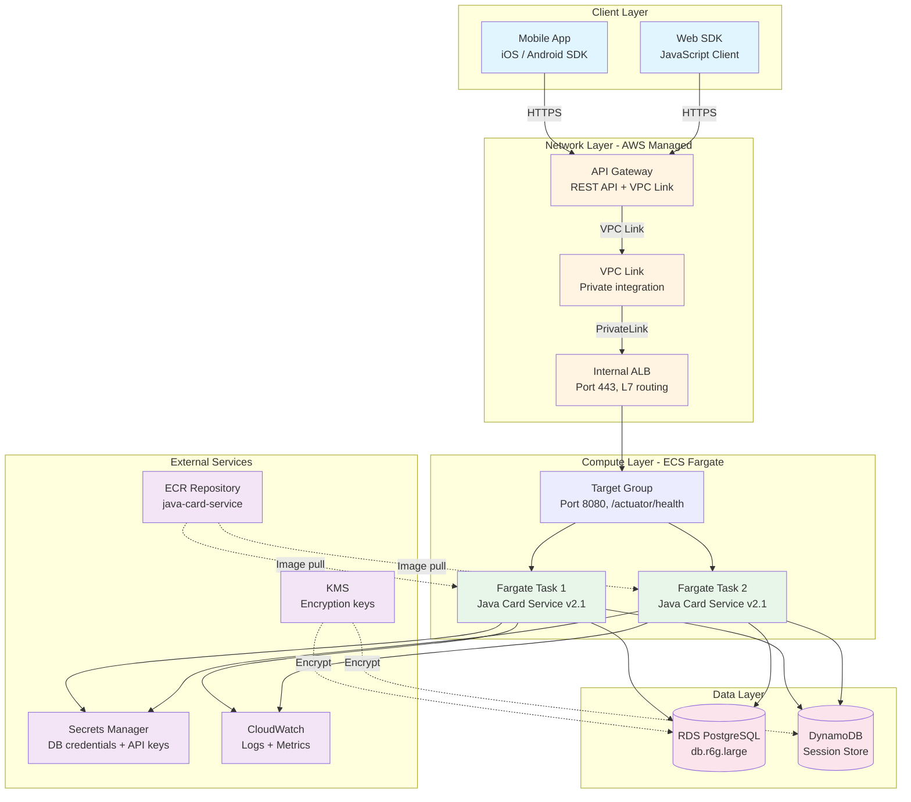
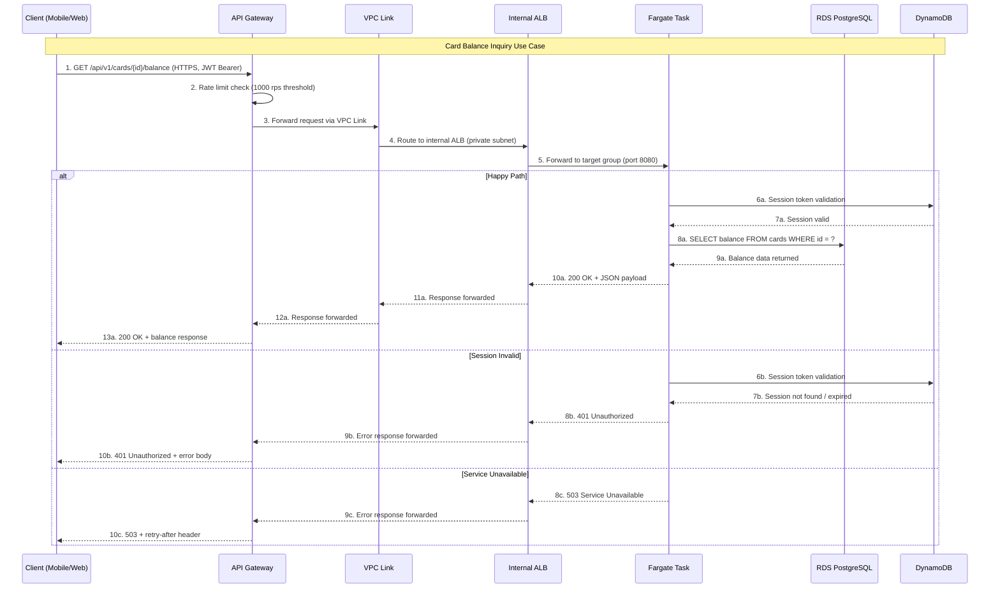
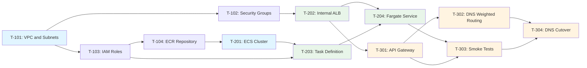

# 功能实现计划 - Java Card 服务的 ALB + Fargate 基础设施

**文档 ID**: FIP_ALB_Fargate_java_service

**议题**: #1880 - Java 容器部署的 ALB + Fargate 基础设施

**创建日期**: 2025-02-01

**分支**: feature/1880-alb-fargate-java-card-service

**状态**: Approved

**作者**: arthurren

**评审人**: platform-architect, devops-lead

---

## 概述

### 概览

Java Card 服务的 ALB + Fargate 基础设施实现了一个基于 AWS ECS Fargate 的全托管容器托管平台，前端使用内部 Application Load Balancer，并通过 API Gateway 与 VPC Link 集成对外暴露。该功能旨在将传统的 Java Card 服务从基于 EC2 的 Classic Load Balancer 基础设施迁移到现代化的、自动扩缩容的、无服务器容器平台。该实现横跨 5 个组件，覆盖 dev、staging 和 prod 环境，目标交付日期为 2025-03-15。

### 关键技术决策

| 决策 | 考虑的方案 | 选定方案 | 理由 |
|------|-----------|---------|------|
| 计算平台 | EC2 Auto Scaling, ECS Fargate, EKS, Lambda | ECS Fargate | Fargate 消除了服务器管理开销。鉴于单服务范围，选择 ECS 而非 EKS 以简化运维。Lambda 因 Java 冷启动延迟和长时间运行进程需求而被排除。 |
| 负载均衡器 | Classic LB, ALB, NLB | ALB（内部） | ALB 提供基于路径规则的 L7 路由、内置健康检查以及原生 ECS 目标组集成。NLB 因仅支持 L4 路由，无法满足基于路径的 API 路由需求而被排除。 |
| API 暴露方式 | 直接 ALB（公共）, API Gateway + VPC Link, CloudFront + ALB | API Gateway + VPC Link | API Gateway 提供速率限制、身份认证、请求节流和 API 密钥管理。VPC Link 无需公共暴露即可访问私有 ALB。直接 ALB 因缺乏这些能力而被排除。 |
| 部署策略 | 滚动更新, 蓝绿部署（CANARY）, 金丝雀发布 | 滚动更新 | 滚动更新提供更简单的实现和更低的成本。蓝绿部署需要双倍基础设施。金丝雀发布增加了 API Gateway 金丝雀复杂度，对内部服务迁移不必要。 |
| 基础设施即代码 | Terraform, CloudFormation, CDK, Pulumi | Terraform | 团队已具备成熟的 Terraform 专业能力和现有模块库。Terraform 状态管理与当前 CI/CD 流水线一致。 |
| 容器镜像仓库 | ECR, Docker Hub, GHCR | ECR | ECR 提供原生 IAM 集成、漏洞扫描和生命周期策略。AWS 内部无跨区域拉取延迟。 |
| 密钥管理 | AWS Secrets Manager, SSM Parameter Store, HashiCorp Vault | AWS Secrets Manager | Secrets Manager 提供自动轮换、通过 RAM 的跨账户访问以及原生 ECS 任务定义集成。 |
| 会话存储 | ElastiCache Redis, DynamoDB, RDS 后端 | DynamoDB | DynamoDB 提供可预测的单位数毫秒延迟、通过按需模式的自动扩缩容，并消除了 Redis 集群管理开销。 |

### 风险评估摘要

| 风险 | 严重程度 | 缓解措施 | 状态 |
|------|----------|---------|------|
| Classic LB 迁移在切换期间导致流量丢失 | CRITICAL | 并行部署配合 DNS 加权路由；60 秒内回滚 | Mitigated |
| Fargate 冷启动延迟首次请求超过 SLA | HIGH | 保持最少 2 个任务的最低健康数量；通过计划扩缩容维持预热池 | Mitigated |
| API Gateway VPC Link 传播延迟导致 5xx 错误 | HIGH | 30 秒间隔的健康检查探测；VPC Link 预热 | Mitigated |
| 自动扩缩容突发情况下 RDS 连接耗尽 | MEDIUM | HikariCP 连接池每个任务最多 20 个连接；RDS Proxy 作为后备方案 | Mitigated |
| 手动控制台变更导致 Terraform 状态漂移 | MEDIUM | 通过 S3 + DynamoDB 状态锁定；仅通过 CI/CD 执行部署 | Accepted |

---

## 第 1 节：架构设计

### 1.1 系统架构



### 1.2 组件架构

```
+-------------------------------------------------------------+
|                Java Card Service (Fargate)                   |
|                                                              |
|  +----------------+  +----------------+  +----------------+ |
|  | API Controller |  | Card Handler   |  | Session Manager| |
|  | REST endpoints |  | CRUD operations|  | Token validation| |
|  +-------+--------+  +-------+--------+  +-------+--------+ |
|          |                    |                    |          |
|          +----------+---------+----------+---------+          |
|                     |                    |                    |
|                     v                    v                    |
|          +----------------+   +------------------+            |
|          | Data Access    |   | Session Adapter  |            |
|          | Layer (JPA)    |   | (DynamoDB SDK)   |            |
|          +-------+--------+   +--------+---------+            |
|                  |                      |                     |
|         +--------+--------+    +--------+--------+            |
|         |                 |    |                 |            |
|         v                 v    v                 |            |
|  +--------------+  +-----------+                 |            |
|  | PostgreSQL   |  | HikariCP  |                 |            |
|  | Adapter      |  | Pool      |                 |            |
|  +--------------+  +-----------+                 |            |
|                                                  |            |
|                                    +-------------v--------+  |
|                                    | DynamoDB Enhanced    |  |
|                                    | Client               |  |
|                                    +----------------------+  |
+-------------------------------------------------------------+
```

### 1.3 数据流



### 1.4 API 设计

| 方法 | 路径 | 描述 | 认证方式 | 幂等性 |
|------|------|------|---------|--------|
| GET | `/api/v1/cards` | 列出已认证用户的所有卡片 | JWT Bearer | 是 |
| GET | `/api/v1/cards/{id}` | 获取单张卡片详情 | JWT Bearer | 是 |
| GET | `/api/v1/cards/{id}/balance` | 获取卡片余额 | JWT Bearer | 是 |
| POST | `/api/v1/cards` | 发行新卡片 | JWT Bearer + API Key | 否 |
| PUT | `/api/v1/cards/{id}` | 更新卡片详情 | JWT Bearer + API Key | 是 |
| PATCH | `/api/v1/cards/{id}/status` | 激活/停用卡片 | JWT Bearer + API Key | 否 |
| POST | `/api/v1/cards/{id}/topup` | 卡片充值 | JWT Bearer + API Key | 否 |
| GET | `/api/v1/cards/{id}/transactions` | 列出卡片交易历史 | JWT Bearer | 是 |

#### POST /api/v1/cards/{id}/topup
**请求**: `{"amount": "DECIMAL", "currency": "STRING(3)", "reference": "STRING(UUID)"}`
**响应 200**: `{"transaction_id": "UUID", "card_id": "UUID", "new_balance": "DECIMAL", "timestamp": "ISO8601"}`
**响应 400**: `{"error": "INVALID_AMOUNT", "message": "Amount must be positive", "code": "CARD_4001"}`

---

## 第 2 节：详细设计

### 2.1 Application Load Balancer 设计

#### 配置

```yaml
# ALB Configuration - Internal
alb:
  name: "java-card-service-alb"
  scheme: "internal"
  ip_address_type: "ipv4"

  # Listener configuration
  listeners:
    - port: 443
      protocol: "HTTPS"
      ssl_policy: "ELBSecurityPolicy-TLS13-1-2-2021-06"
      certificate_arn: "arn:aws:acm:region:account:certificate/xxx"
      default_action:
        type: "forward"
        target_group_arn: "${aws_lb_target_group.java_card.arn}"

    - port: 80
      protocol: "HTTP"
      default_action:
        type: "redirect"
        redirect_port: 443
        redirect_protocol: "HTTPS"
        status_code: "HTTP_301"

  # Health check configuration
  health_check:
    enabled: true
    path: "/actuator/health"
    port: 8080
    protocol: "HTTP"
    interval_seconds: 30
    timeout_seconds: 5
    healthy_threshold: 3
    unhealthy_threshold: 3
    success_codes: "200"

  # Access logs
  access_logs:
    enabled: true
    bucket: "s3-alb-access-logs"
    prefix: "java-card-service"
```

#### 错误处理

| 错误码 | 描述 | 恢复操作 | 升级处理 |
|--------|------|---------|---------|
| `HTTP_502` | 目标组没有健康目标 | 通过 ECS 任务替换自动恢复；告警触发调查 | 持续超过 5 分钟则升级 |
| `HTTP_503` | 目标组已显式注销 | 检查部署流水线状态；验证任务定义 | 升级给值班 DevOps |
| `HTTP_504` | 目标响应超时（> 60 秒） | 检查 RDS 连接池饱和度；审查慢查询 | RDS CPU > 80% 则升级 |

**错误处理模式**:
- ALB 重试：内置连接级重试，60 秒空闲超时
- 目标注销延迟：300 秒用于优雅排空
- 熔断：应用层通过 Spring Cloud Circuit Breaker (Resilience4j) 实现

### 2.2 ECS Fargate 集群设计

#### 接口定义

```
Interface: ECSFargateService

Configuration Parameters:
  cluster_name: java-card-service-cluster
    Description: ECS cluster hosting the Java Card Service
    Constraints: Must be unique within AWS account

  capacity_provider: FARGATE
    Description: Serverless compute capacity
    Constraints: No EC2 instances to manage

  task_definition: java-card-service-task
    Description: Container specification for the Java service
    CPU: 1024 (1 vCPU)
    Memory: 2048 (2 GB)
    Constraints: Must match Fargate supported combinations

  desired_count: 2
    Description: Minimum running tasks at steady state
    Constraints: Min 1, Max 10 (auto-scaling ceiling)

  deployment_controller: ECS
    Description: Rolling update deployment strategy
    Constraints: Min healthy percent 50%, Max percent 200%
```

#### 状态管理

- **状态类型**：无状态（应用状态已外部化）
- **持久化**：DynamoDB 用于会话，RDS PostgreSQL 用于业务数据
- **一致性模型**：卡片操作使用强一致性（RDS），会话缓存使用最终一致性（DynamoDB）
- **状态转换**：

```mermaid
stateDiagram-v2
    [*] --> Pending: Task Started
    Pending --> Running: Health Check Pass
    Pending --> Stopped: Image Pull Error
    Running --> Healthy: 3x Health Check Success
    Running --> Unhealthy: 3x Health Check Failure
    Healthy -> Running: Continuous Health Checks
    Unhealthy --> Running: Health Check Recovery
    Unhealthy --> Stopped: Replacement Triggered
    Running --> Stopped: Deployment / Scale In
    Stopped --> [*]
```

### 2.3 API Gateway 设计

#### 配置

```yaml
# API Gateway REST API Configuration
api_gateway:
  name: "java-card-service-api"
  description: "Java Card Service Public API"
  endpoint_type: "REGIONAL"

  # VPC Link integration
  vpc_link:
    name: "java-card-service-vpc-link"
    description: "Private link to internal ALB"
    target_arn: "${aws_lb.java_card.arn}"

  # Throttling configuration
  throttling:
    rate_limit: 1000        # requests per second
    burst_limit: 500        # burst capacity

  # Stage configuration
  stages:
    - name: "dev"
      variables:
        alb_dns: "${aws_lb.java_card.dns_name}"
    - name: "staging"
      variables:
        alb_dns: "${aws_lb.java_card.dns_name}"
    - name: "prod"
      variables:
        alb_dns: "${aws_lb.java_card.dns_name}"

  # Logging and tracing
  logging:
    access_logging: true
    execution_logging: true
    log_level: "INFO"
    xray_tracing: true
```

#### 错误处理

| 错误码 | 描述 | 恢复操作 | 升级处理 |
|--------|------|---------|---------|
| `429 Too Many Requests` | 超出速率限制 | 客户端使用指数退避重试；审查节流阈值 | 持续超出阈值则升级 |
| `502 Bad Gateway` | VPC Link 连接失败 | 验证 ALB 健康；检查 VPC Link 目标状态 | 升级给网络团队 |
| `504 Gateway Timeout` | 后端响应超过 29 秒限制 | 审查 Fargate 任务响应时间；检查 RDS 查询性能 | 平均延迟 > 5 秒则升级 |

---

## 第 3 节：安全设计

### 3.1 身份认证与授权

- **认证方式**：由 Cognito User Pool 签发的 JWT Bearer 令牌；API Gateway 通过 Lambda Authorizer 原生验证令牌
- **授权模型**：三级 RBAC（只读、操作员、管理员）
- **令牌管理**：JWT 采用 15 分钟访问令牌 + 24 小时刷新令牌；每次刷新时轮换
- **服务间认证**：每个 Fargate 任务使用 IAM 任务执行角色；无共享凭证

**角色定义**：

| 角色 | 权限 | 范围 |
|------|------|------|
| `card-reader` | GET /cards, GET /cards/{id}, GET /cards/{id}/balance, GET /cards/{id}/transactions | 移动端应用用户、Web SDK 用户 |
| `card-operator` | 所有 card-reader 权限 + POST /cards, PATCH /cards/{id}/status | 内部服务账户、合作伙伴 API |
| `card-admin` | 所有 card-operator 权限 + PUT /cards/{id}, DELETE /cards/{id} | 平台管理员 |

### 3.2 数据保护

- **传输中数据**：所有连接强制 TLS 1.2+；ALB 使用 ACM 证书终止 TLS；VPC Link 与 ALB 通信使用 TLS
- **静态数据**：通过 AWS KMS 托管密钥进行 AES-256 加密；启用 RDS 加密；启用 DynamoDB 静态加密；推送时进行 ECR 镜像扫描
- **个人身份信息（PII）处理**：卡号在应用层进行令牌化；日志中不存储原始卡片数据；PII 字段使用专用 KMS 密钥加密
- **数据保留**：交易日志保留 7 年（金融合规要求）；会话数据 TTL 24 小时；访问日志保留 90 天
- **数据分类**：卡片数据 = 受限（Restricted）；会话数据 = 机密（Confidential）；API 元数据 = 内部（Internal）；健康检查数据 = 公开（Public）

### 3.3 密钥管理

- **密钥存储**：AWS Secrets Manager，使用按环境分隔的密钥路径（`/java-card-service/prod/db-credentials`）
- **轮换策略**：数据库凭证 30 天自动轮换；API 密钥 90 天轮换；检测到泄露时立即轮换
- **访问模式**：Fargate 任务执行角色通过任务定义引用密钥；应用代码不进行运行时 Secrets Manager API 调用
- **审计跟踪**：所有 Secrets Manager API 调用启用 CloudTrail 日志；异常角色访问密钥时发送 SNS 通知

### 3.4 安全检查清单

| 检查项 | 状态 | 备注 |
|--------|------|------|
| 所有端点的输入验证 | Done | 所有请求 DTO 上使用 Bean Validation (JSR-380) 注解 |
| 输出编码以防止注入攻击 | Done | Jackson JSON 序列化启用 HTML 转义 |
| 所有受保护路由的身份认证 | Done | API Gateway Lambda Authorizer 应用于所有 /api/v1/* 路由 |
| 每个操作的授权检查 | Done | 通过 Spring Security 注解实现基于角色的访问控制 |
| 所有网络通信使用 TLS | Done | 强制 TLS 1.2+；生产环境无 HTTP 端点 |
| 敏感数据的静态加密 | Done | RDS、DynamoDB、ECR 使用 KMS 托管加密 |
| 源代码中无密钥 | Done | 所有密钥存储在 Secrets Manager；tfvars 已从 git 中排除 |
| 公共端点的速率限制 | Done | API Gateway 节流设置为每个 stage 1000 rps |
| 安全事件日志记录 | Done | 结构化 JSON 日志带有关联 ID；CloudWatch |
| 依赖漏洞扫描 | Done | 推送时进行 ECR 镜像扫描；Maven 依赖使用 Dependabot |
| 最小权限 IAM 策略 | Done | 独立的任务执行角色和任务角色；无通配符操作 |
| 网络分段已应用 | Done | Fargate 使用私有子网；ALB 仅限内部访问；安全组规则限制流量 |

---

## 第 4 节：性能设计

### 4.1 性能要求

| 指标 | 目标值 | 测量方法 | 验收标准 |
|------|--------|---------|---------|
| API 响应时间 (p50) | < 100ms | CloudWatch ALB 延迟指标 | 99% 的请求 |
| API 响应时间 (p99) | < 500ms | CloudWatch ALB 延迟指标 | 99% 的请求 |
| 吞吐量 | 1000 请求/秒 | k6 对 API Gateway 进行负载测试 | 持续 10 分钟 |
| 数据库查询时间 | < 50ms | RDS Performance Insights | 95 百分位 |
| 冷启动时间 | < 30 秒 | CloudWatch ECS 任务启动时长 | 首次健康检查通过 |
| 内存使用 | < 1.5 GB / 任务 | CloudWatch Container Insights | 正常负载下 |
| CPU 使用率（稳态） | < 40% | CloudWatch Container Insights | 1 小时平均值 |

### 4.2 缓存策略

- **缓存层**：DynamoDB DAX 用于会话查询；内存级 Caffeine 缓存用于参考数据
- **缓存数据**：会话令牌、卡片类型元数据、汇率转换比率
- **失效策略**：基于 TTL 的过期机制，配合卡片状态变更时的事件驱动失效
- **TTL 值**：会话缓存 15 分钟，参考数据 1 小时，汇率 5 分钟

| 缓存键模式 | 数据 | TTL | 失效触发条件 |
|------------|------|-----|-------------|
| `session:{token_hash}` | 用户会话和 JWT 声明 | 15 分钟 | 用户登出、令牌撤销 |
| `card-type:{type_id}` | 卡片类型元数据和限额 | 1 小时 | 管理员更新卡片类型 |
| `fx-rate:{from}:{to}` | 货币转换比率 | 5 分钟 | 定时汇率刷新 |

### 4.3 优化模式

- **连接池**：HikariCP 每个 Fargate 任务最大 20 个连接；空闲超时 300 秒；取出时验证连接
- **批处理**：对账任务使用批量大小 100 进行批量交易插入
- **异步操作**：卡片状态变更事件通过 SNS 通知；通过异步 appender 进行非阻塞日志写入
- **分页**：基于游标的分页，默认页大小 50；最大页大小 200
- **压缩**：ALB 对超过 1024 字节的响应启用 gzip
- **索引**：在 `cards.user_id` 上建立 B-tree 索引用于用户卡片列表查询；在 `transactions.card_id, transactions.created_at` 上建立复合索引用于交易历史查询

---

## 第 5 节：风险评估

### 5.1 风险登记册

#### RISK-001：Classic Load Balancer 迁移流量丢失

| 字段 | 值 |
|------|-----|
| **风险 ID** | RISK-001 |
| **描述** | 在从 Classic LB 到 ALB 的 DNS 切换期间，流量可能被丢弃或路由到非功能目标，导致终端用户的卡片服务中断 |
| **影响** | 卡片余额查询和交易服务完全不可用；基于交易量估算，财务影响约为每小时 $50K |
| **概率** | 高 |
| **严重程度** | CRITICAL |
| **缓解措施** | 与现有 Classic LB 并行部署 ALB 基础设施；使用 Route 53 加权路由（90/10 分配）进行渐进式流量迁移；每次流量变更前进行自动化健康检查验证；回滚脚本已测试并文档化 |
| **应急方案** | 通过 Route 53 立即 DNS 回退到 Classic LB（TTL 60 秒）；联系 AWS Support 获取优先协助；启动事件响应流程 |
| **负责人** | arthurren (platform-architect) |
| **状态** | Mitigated |

#### RISK-002：Fargate 冷启动延迟

| 字段 | 值 |
|------|-----|
| **风险 ID** | RISK-002 |
| **描述** | 新的 Fargate 任务可能需要 20-30 秒启动并通过健康检查，在此期间自动扩缩容事件无法处理流量，可能导致请求排队或超时 |
| **影响** | 扩容事件期间 p99 延迟升高；如果部署期间所有健康任务同时被替换，可能出现 503 错误 |
| **概率** | 中 |
| **严重程度** | HIGH |
| **缓解措施** | 始终保持最少 2 个任务的最低健康数量；配置部署最低健康百分比为 50%；使用 Application Auto Scaling 的目标追踪（CPU 60%）；在计划的高流量时段预热任务 |
| **应急方案** | 将非关键工作负载切换到 Fargate Spot 以降低成本；评估使用 Fargate + EC2 混合的 ECS 容量提供商应对突发场景 |
| **负责人** | devops-lead |
| **状态** | Mitigated |

#### RISK-003：API Gateway VPC Link 传播延迟

| 字段 | 值 |
|------|-----|
| **风险 ID** | RISK-003 |
| **描述** | API Gateway VPC Link 配置变更可能需要最多 5 分钟才能传播到所有边缘节点，在部署或配置更新期间导致间歇性 502 错误 |
| **影响** | VPC Link 重新配置期间客户端出现间歇性 5xx 错误；每次部署后 5-10 分钟用户体验下降 |
| **概率** | 中 |
| **严重程度** | HIGH |
| **缓解措施** | VPC Link 创建一次并在部署间复用；ALB 目标组变更即时传播，不影响 VPC Link；每 30 秒进行健康检查探测以尽早发现传播问题 |
| **应急方案** | 在客户端 SDK 上部署熔断器模式，配置 3 次重试和指数退避；保留直接 ALB DNS 端点作为紧急旁路 |
| **负责人** | platform-architect |
| **状态** | Mitigated |

---

## 第 6 节：实施计划

### 阶段 1：基础基础设施

| 任务 ID | 任务描述 | 依赖 | 工作量 | 负责人 | 状态 |
|---------|---------|------|--------|--------|------|
| T-101 | 创建 VPC、子网（3 个可用区）和 ECS 的路由表 | 无 | 2 天 | arthurren | Done |
| T-102 | 配置安全组：ALB-SG、Fargate-SG、RDS-SG | T-101 | 1 天 | arthurren | Done |
| T-103 | 创建 IAM 角色：任务执行角色、任务角色、ALB 访问日志角色 | 无 | 1 天 | arthurren | Done |
| T-104 | 配置 ECR 仓库，启用镜像扫描和生命周期策略 | T-103 | 1 天 | arthurren | Done |

### 阶段 2：计算与负载均衡

| 任务 ID | 任务描述 | 依赖 | 工作量 | 负责人 | 状态 |
|---------|---------|------|--------|--------|------|
| T-201 | 创建 ECS 集群，配置 Fargate 容量提供商 | T-104 | 1 天 | arthurren | Done |
| T-202 | 配置内部 ALB，包含 HTTPS 监听器和目标组 | T-102 | 2 天 | arthurren | Done |
| T-203 | 创建 ECS 任务定义，包含容器配置 | T-201, T-103 | 2 天 | arthurren | Done |
| T-204 | 部署 ECS Fargate 服务，配置自动扩缩容策略 | T-202, T-203 | 2 天 | arthurren | Done |

### 阶段 3：路由、验证与切换

| 任务 ID | 任务描述 | 依赖 | 工作量 | 负责人 | 状态 |
|---------|---------|------|--------|--------|------|
| T-301 | 创建 API Gateway REST API，集成 VPC Link | T-202 | 2 天 | arthurren | Done |
| T-302 | 配置 Route 53 DNS 加权路由用于迁移 | T-301 | 1 天 | arthurren | Done |
| T-303 | 执行冒烟测试，验证所有端点的健康状况 | T-204, T-301 | 2 天 | arthurren | Done |
| T-304 | DNS 切换：将 100% 流量切换到 ALB，停用 Classic LB | T-302, T-303 | 1 天 | arthurren | Done |

### 依赖关系图



### 工作量估算

| 阶段 | 任务数 | 总工作量 | 关键路径 |
|------|--------|---------|---------|
| 阶段 1：基础设施 | 4 | 5 天 | 是：T-101, T-102 |
| 阶段 2：计算 | 4 | 7 天 | 是：T-201, T-203, T-204 |
| 阶段 3：路由与切换 | 4 | 6 天 | 是：T-301, T-303, T-304 |
| **合计** | **12** | **18 天** | **T-101 到 T-104 到 T-203 到 T-204 到 T-303 到 T-304** |

**关键路径**：T-101 -> T-102 -> T-202 -> T-204 -> T-301 -> T-303 -> T-304

**预估时间线**：2025-02-03 至 2025-03-14（6 周）

---

## 第 7 节：测试策略

### 单元测试

- **范围**：所有公共 Controller 方法、服务层业务逻辑、数据访问层 Mapper、DTO 验证
- **工具**：JUnit 5, Mockito, Spring Boot Test
- **覆盖率目标**：80% 行覆盖率，卡片交易和余额操作 90% 分支覆盖率
- **Mock 策略**：使用 Mockito 模拟 RDS Repository、DynamoDB Mapper 和 Secrets Manager 客户端；使用 WireMock 模拟外部 API 调用

### 集成测试

- **范围**：API 端点契约、RDS 数据库操作、DynamoDB 会话操作、ALB 健康检查行为
- **工具**：Testcontainers（PostgreSQL）、LocalStack（DynamoDB、Secrets Manager）、Spring Boot Test
- **环境**：本地开发使用 Docker Compose；CI 流水线使用 GitHub Actions

**关键集成场景**：

1. 通过 POST 端点创建卡片，验证 RDS 中的记录，通过 GET 端点检索
2. 认证会话，在 DynamoDB 中验证令牌，执行余额查询，验证会话已更新
3. API Gateway 到 VPC Link 到 ALB 的路由，有效 JWT 返回 200；缺少 JWT 返回 401

### 端到端（E2E）测试

- **范围**：完整卡片生命周期（创建、激活、充值、余额查询、停用）、认证流程、错误场景
- **工具**：k6 用于 API 级别 E2E 测试；Postman 集合用于手动验证
- **环境**：使用完整基础设施镜像的 Staging 环境

### 性能测试

- **范围**：所有 API 端点在负载下的表现；自动扩缩容行为验证；RDS 连接池饱和测试
- **工具**：k6 配合 CloudWatch 指标导出
- **基线指标**：p50 < 100ms，p99 < 500ms，1000 rps 持续（参见第 4.1 节）

**负载测试场景**：

| 场景 | 并发用户数 | 持续时间 | 成功标准 |
|------|-----------|---------|---------|
| 基线负载 | 200 | 10 分钟 | p99 < 500ms，0 错误 |
| 峰值负载 | 1000 | 10 分钟 | p99 < 800ms，< 0.1% 错误率 |
| 压力测试 | 2000 | 5 分钟 | 优雅降级，触发自动扩缩容，无数据损坏 |

### 测试覆盖率摘要

| 组件 | 单元测试 | 集成测试 | E2E 测试 | 性能测试 |
|------|---------|---------|---------|---------|
| API Controllers | Done | Done | Done | Done |
| 服务层 | Done | Done | Done | N/A |
| 数据访问层（RDS） | Done | Done | Done | Done |
| 会话管理器（DynamoDB） | Done | Done | Done | N/A |
| API Gateway 路由 | N/A | Done | Done | Done |
| ALB / 目标组 | N/A | Done | Done | Done |
| 自动扩缩容 | N/A | N/A | Done | Done |

---

## 第 8 节：监控与可观测性

### 追踪指标

**RED 指标（面向请求）**：

| 指标 | 类型 | 来源 | 告警阈值 |
|------|------|------|---------|
| 请求速率 | Counter | ALB 访问日志通过 CloudWatch | 5 分钟内下降 > 50% |
| 错误率（5xx） | Counter | ALB 指标 + 应用日志 | 5 分钟内占总请求 > 1% |
| 延迟 p50/p99 | Histogram | CloudWatch ALB 延迟指标 | p99 持续超过 500ms 达 5 分钟 |

**USE 指标（面向资源）**：

| 指标 | 类型 | 来源 | 告警阈值 |
|------|------|------|---------|
| CPU 利用率 | Gauge | CloudWatch Container Insights | 持续超过 80% 达 10 分钟 |
| 内存利用率 | Gauge | CloudWatch Container Insights | 持续超过 85% 达 10 分钟 |
| 磁盘 I/O | Gauge | CloudWatch Container Insights | 利用率持续超过 90% |
| HikariCP 连接池 | Gauge | 应用指标（Micrometer） | > 80% 连接在使用中 |

**业务指标**：

| 指标 | 类型 | 来源 | 告警阈值 |
|------|------|------|---------|
| 卡片交易量 | Counter | 应用日志 | 15 分钟内下降 > 70% |
| 充值成功率 | Gauge | 应用指标 | 5 分钟内成功率 < 95% |

### 告警规则

| 告警名称 | 条件 | 严重程度 | 通知渠道 | 响应时间 |
|---------|------|---------|---------|---------|
| JavaCardService-Critical-5xx | 5xx 错误率 > 5% 持续 3 分钟 | P1 | PagerDuty: on-call-platform | 15 分钟 |
| JavaCardService-High-Latency | p99 延迟 > 500ms 持续 5 分钟 | P2 | Slack: #platform-alerts | 1 小时 |
| JavaCardService-High-CPU | CPU > 80% 持续 10 分钟 | P2 | Slack: #platform-alerts | 1 小时 |
| JavaCardService-Medium-PoolExhaust | HikariCP 连接池利用率 > 80% 持续 5 分钟 | P3 | Slack: #platform-alerts | 下一个工作日 |
| JavaCardService-Medium-TaskRestart | 任何 Fargate 任务被自动扩缩容替换 | P3 | Slack: #platform-alerts | 下一个工作日 |

**运维手册：JavaCardService-Critical-5xx**
1. **症状**：Java Card Service 的请求中超过 5% 返回 5xx 错误。
2. **调查**：检查 CloudWatch 仪表板中 ALB 目标健康状况；审查 ECS 任务状态是否有崩溃；检查应用日志中的堆栈跟踪；验证 RDS 连接性。
3. **解决**：如果目标不健康，检查健康检查端点 `/actuator/health`；如果是 RDS 问题，验证连接池和故障转移状态；如果是部署问题，执行回滚到之前的任务定义。
4. **升级**：30 分钟内未解决则联系 platform-architect；如怀疑是基础设施层面问题则联系 AWS Support。

### 仪表板设计

**仪表板**：Java Card Service - 服务健康

**组件布局**：
- **第 1 行**：请求速率（5 分钟平均折线图）| 错误率（堆叠面积图，含 1% 阈值线）
- **第 2 行**：延迟 p50/p99（双线图）| 每任务 CPU/内存（堆叠面积图）
- **第 3 行**：活跃 CloudWatch 告警列表 | 最近的 ECS 部署时间线
- **第 4 行**：前 10 个错误响应码（柱状图）| HikariCP 连接池利用率（仪表盘）

---

## 第 9 节：依赖项

### 内部依赖

| 依赖项 | 类型 | 路径 / 位置 | 负责团队 | 状态 |
|--------|------|-------------|---------|------|
| VPC Terraform 模块 | 基础设施 | `infrastructure/terraform/modules/vpc/` | platform-team | Ready |
| ALB Terraform 模块 | 基础设施 | `infrastructure/terraform/modules/alb/` | platform-team | Ready |
| ECS Terraform 模块 | 基础设施 | `infrastructure/terraform/modules/ecs-fargate/` | platform-team | Ready |
| RDS 实例（PostgreSQL） | 基础设施 | `infrastructure/terraform/environments/staging/rds/` | database-team | Ready |
| Java Card Service Docker 镜像 | 容器 | `docker/java-card-service/Dockerfile` | backend-team | Ready |
| CI/CD 流水线 | 流水线 | `.github/workflows/deploy-java-card.yml` | devops-team | Ready |

### 外部依赖

| 依赖项 | 版本 | 用途 | 备选方案 | 许可证 |
|--------|------|------|---------|--------|
| AWS ECS Fargate | N/A（托管服务） | 无服务器容器托管 | 基于 EC2 的 ECS 后备方案 | 专有 |
| AWS ALB | N/A（托管服务） | L7 负载均衡 | NLB（功能减少） | 专有 |
| AWS API Gateway | N/A（托管服务） | REST API 管理和 VPC Link | 直接暴露 ALB（安全性降低） | 专有 |
| PostgreSQL（RDS） | 15.4 | 卡片和交易数据的主数据存储 | 读副本提升 | PostgreSQL License |
| Spring Boot | 3.2.x | Java 应用框架 | N/A - 必需 | Apache 2.0 |
| HikariCP | 5.x | JDBC 连接池 | N/A - 必需 | Apache 2.0 |
| AWS SDK for Java v2 | 2.x | AWS 服务集成 | N/A - 必需 | Apache 2.0 |

---

## 第 10 节：发布计划

### 分阶段发布

| 阶段 | 目标 | 进入条件 | 验证内容 | 持续时间 |
|------|------|---------|---------|---------|
| 1 | Dev 环境 | 单元测试通过，代码评审已批准，Docker 镜像已构建 | 所有 8 个端点的冒烟测试；健康检查通过 | 2 天 |
| 2 | Staging 环境 | Dev 验证完成，集成测试通过，安全扫描无问题 | 完整 E2E 测试套件（50 个场景）；500 rps 负载测试；安全检查清单已验证 | 3 天 |
| 3 | 生产金丝雀（10% 流量） | Staging 签核完成，仪表板已就绪，运维手册已审查 | 错误率 < 0.1%；p99 < 500ms；4 小时内无 ALB 5xx 错误 | 24 小时 |
| 4 | 生产全量（100% 流量） | 金丝雀指标健康持续 24 小时，无告警触发 | 持续错误率在 SLA 内；业务指标正常；Classic LB 准备停用 | 永久 |

### 回滚策略

| 触发条件 | 回滚操作 | 执行时间 | 数据影响 |
|---------|---------|---------|---------|
| 错误率 > 5% 持续 5 分钟 | Route 53 加权路由将 100% 流量切回 Classic LB | < 2 分钟 | 无 |
| p99 延迟 > 1 秒持续 10 分钟 | Route 53 加权路由将 100% 流量切回 Classic LB | < 2 分钟 | 无 |
| 卡片交易中检测到数据损坏 | RDS 时间点恢复到部署前快照；Route 53 回退 | < 30 分钟 | 故障窗口期间的交易可能丢失 |
| 依赖项故障（RDS、DynamoDB） | 激活熔断器；读操作返回缓存响应；写操作排队异步处理 | 自动 | 降级模式，读取陈旧数据 |

**回滚流程**：

1. 执行 Route 53 加权路由变更：将 Classic LB 权重设为 100，ALB 权重设为 0
2. 使用 `dig` 和 `nslookup` 从多个位置验证 DNS 传播
3. 在 Classic LB 仪表板上监控错误率 10 分钟，确认恢复
4. 在 Slack #incidents 频道通知团队，附带回滚摘要和时间线
5. 24 小时内安排事后复盘；记录根因和预防措施

### 功能开关

| 开关名称 | 用途 | 默认值 | 类型 | 移除计划 |
|---------|------|--------|------|---------|
| `enable-vpc-link-routing` | 控制 API Gateway 是通过 VPC Link 路由到 ALB 还是返回模拟数据 | false | 布尔值 | 全量发布 + 2 周后移除 |
| `traffic-alb-percentage` | 控制路由到 ALB 与 Classic LB 的流量百分比 | 0 | 百分比 | 全量发布 + 2 周后移除 |

---

## 相关文档

- **GAP 分析**：`devops/docs/gap-analysis/FIP_1880_gap_analysis.md`
- **需求文档**：`devops/docs/requirements/FIP_1880_requirements.md`
- **架构决策记录**：`devops/docs/adr/ADR_016_alb_fargate_java_service.md`
- **GitHub Issue**：#1880 - https://github.com/org/BE_Infra/issues/1880
- **AWS ECS Fargate 文档**：https://docs.aws.amazon.com/AmazonECS/latest/developerguide/AWS_Fargate.html
- **API Gateway VPC Link**：https://docs.aws.amazon.com/apigateway/latest/developerguide/set-up-private-integration.html

---

**文档版本**：3.0
**最后更新**：2025-03-10
**变更说明**：实施完成。交付后更新：所有任务标记为 Done；风险状态更新为 Mitigated；测试覆盖率矩阵已更新结果；发布已于 2025-03-14 成功完成。

### 评审历史

| 版本 | 日期 | 评审人 | 结果 | 备注 |
|------|------|--------|------|------|
| 1.0 | 2025-02-03 | platform-architect | Approved | 架构设计确认；对 ALB 健康检查间隔有少量反馈 |
| 1.0 | 2025-02-04 | devops-lead | Changes Requested | 要求补充 Terraform 模块结构和 CI/CD 集成的详细信息 |
| 1.1 | 2025-02-07 | devops-lead | Approved | 已更新 Terraform 模块路径和流水线配置详情 |
| 2.0 | 2025-02-15 | platform-architect | Approved | 设计评审完成，批准进入实施。已更新风险缓解措施。 |
| 3.0 | 2025-03-10 | platform-architect, devops-lead | Approved | 交付后评审。所有阶段完成。Classic LB 已停用。 |
