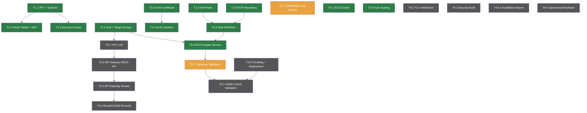

# ALB + Fargate Java Card 服务基础设施任务清单

## 项目信息

- **项目名称**：ALB + Fargate Java Card 服务基础设施
- **分支**：feature/1880-alb-fargate-java-card-service
- **Issue**：#1880 - 配置 ALB + Fargate 基础设施用于 Java 容器部署
- **目标**：在 dev/test/staging/prod 环境中部署包含 ALB、API Gateway 和 Route53 的 ECS Fargate 集群，用于 Java Card 服务
- **优先级**：高优先级任务优先执行
- **文档编号**：TASK_LIST_1880_alb_fargate_java_service
- **创建日期**：2025-02-05
- **作者**：arthurren
- **参考文档**：
  - DIP：`devops/docs/design/DIP_1880_alb_fargate_java_service.md`
  - 需求文档：`devops/docs/requirements/FIP_1880_alb_fargate_java_service.md`

---

## 执行规则

1. 按优先级（HIGH > MEDIUM > LOW）和依赖顺序执行任务
2. 所有阶段必须按顺序完成：阶段 1 -> 阶段 2 -> 阶段 3 -> 阶段 4
3. 每个任务在标记为 COMPLETED 之前，必须对照验收标准进行验证
4. 每个任务完成后使用约定式提交格式提交代码
5. 如遇到无法解决的问题，立即将任务标记为 BLOCKED，并在 4 小时内上报至 #devops-infra Slack 频道
6. 所有基础设施变更在执行 `terraform apply` 之前必须经过 `terraform plan` 审查
7. 按以下顺序部署环境：dev -> test -> staging -> prod

---

## 任务状态说明

- COMPLETED：已完成并通过验证
- IN_PROGRESS：当前正在执行
- PENDING：等待执行
- BLOCKED：已阻塞，需要手动干预
- CANCELLED：已取消或已降低优先级

## 优先级说明

- HIGH：高优先级，影响核心功能
- MEDIUM：中优先级，重要但不紧急
- LOW：低优先级，优化和增强功能

---

## 依赖关系图



---

## 阶段 1：网络和基础基础设施

### 任务 1.1：创建跨 3 个可用区的 VPC 及公有/私有子网
**状态**：COMPLETED
**优先级**：HIGH
**预估时间**：1 天
**完成日期**：2025-02-06
**描述**：创建一个 VPC（10.50.0.0/16），在 3 个可用区（eu-central-1a、eu-central-1b、eu-central-1c）中配置 6 个子网。公有子网用于 ALB 和 NAT Gateway 部署。私有子网用于 ECS 任务和数据库。每个子网标注 Name、Environment 和 Service 标识符。

**验收标准**：
- [x] VPC 已创建，CIDR 为 10.50.0.0/16，DNS 主机名已启用
- [x] 3 个公有子网已启用自动分配公有 IP
- [x] 3 个私有子网未配置公有 IP
- [x] 所有子网分布在不同可用区
- [x] 子网标签遵循命名规范：`{env}-card-{public|private}-{az}`

**相关文件**：
- `infrastructure/terraform/java-fargate-alb/modules/vpc/main.tf`（创建）
- `infrastructure/terraform/java-fargate-alb/modules/vpc/variables.tf`（创建）
- `infrastructure/terraform/java-fargate-alb/modules/vpc/outputs.tf`（创建）

**提交信息**：`feat(vpc): create VPC with public/private subnets across 3 AZs`

**依赖**：无

---

### 任务 1.2：配置路由表、IGW、NAT Gateway
**状态**：COMPLETED
**优先级**：HIGH
**预估时间**：1 天
**完成日期**：2025-02-07
**描述**：将 Internet Gateway 附加到 VPC 用于公有子网出站。在每个公有可用区部署 NAT Gateway 用于私有子网的出站连接。配置路由表，使私有子网的 0.0.0.0/0 流量通过 NAT Gateway 路由，公有子网的流量通过 Internet Gateway 路由。

**验收标准**：
- [x] Internet Gateway 已附加到 VPC
- [x] NAT Gateway 已在每个公有子网中部署（共 3 个）
- [x] 弹性 IP 已分配给每个 NAT Gateway
- [x] 公有路由表将 0.0.0.0/0 路由到 IGW
- [x] 私有路由表将 0.0.0.0/0 路由到对应的 NAT Gateway
- [x] 所有 6 个子网的路由表关联正确

**相关文件**：
- `infrastructure/terraform/java-fargate-alb/modules/vpc/routing.tf`（创建）
- `infrastructure/terraform/java-fargate-alb/modules/vpc/nat.tf`（创建）

**提交信息**：`feat(networking): configure route tables, IGW, and NAT Gateways`

**依赖**：任务 1.1

---

### 任务 1.3：创建安全组（ALB、ECS、DB）
**状态**：COMPLETED
**优先级**：HIGH
**预估时间**：0.5 天
**完成日期**：2025-02-07
**描述**：创建三个具有最小权限入站规则的安全组。ALB 安全组允许来自企业 CIDR 和 API Gateway VPC Link 的 HTTPS（443）流量。ECS 安全组仅允许来自 ALB 安全组的容器端口（8080）流量。数据库安全组仅允许来自 ECS 安全组的 PostgreSQL（5432）流量。

**验收标准**：
- [x] ALB 安全组：允许来自 10.0.0.0/8 和 API Gateway VPC Link CIDR 的 443 端口入站
- [x] ECS 安全组：仅允许来自 ALB 安全组的 8080 端口入站（安全组引用）
- [x] DB 安全组：仅允许来自 ECS 安全组的 5432 端口入站（安全组引用）
- [x] 所有安全组允许所有出站流量（0.0.0.0/0）
- [x] 安全组名称遵循 `{env}-card-{component}-sg` 命名规范

**相关文件**：
- `infrastructure/terraform/java-fargate-alb/modules/security-groups/main.tf`（创建）
- `infrastructure/terraform/java-fargate-alb/modules/security-groups/variables.tf`（创建）

**提交信息**：`feat(security): create ALB, ECS, and DB security groups`

**依赖**：任务 1.1

---

### 任务 1.4：创建 IAM 角色（任务执行角色、任务角色、CI/CD 角色）
**状态**：COMPLETED
**优先级**：HIGH
**预估时间**：1 天
**完成日期**：2025-02-08
**描述**：创建 ECS Fargate 运行所需的 IAM 角色。任务执行角色用于 ECR 镜像拉取和 CloudWatch 日志写入。任务角色用于应用级别的 AWS API 调用（SSM Parameter Store、Secrets Manager）。CI/CD 角色用于 GitHub Actions 承担以执行 terraform 部署和 ECR 推送。

**验收标准**：
- [x] 任务执行角色已附加 AmazonECSTaskExecutionRolePolicy
- [x] 任务执行角色允许 ECR 拉取、CloudWatch Logs 创建、Secrets Manager 读取
- [x] 任务角色具有 SSM 和 Secrets Manager 的最小权限策略
- [x] CI/CD 角色已配置 GitHub Actions OIDC 信任策略
- [x] 所有角色已标注 Service=CardService 和 Environment 变量标签

**相关文件**：
- `infrastructure/terraform/java-fargate-alb/modules/iam/main.tf`（创建）
- `infrastructure/terraform/java-fargate-alb/modules/iam/policies.tf`（创建）

**提交信息**：`feat(iam): create ECS task execution, task, and CI/CD roles`

**依赖**：无

---

### 任务 1.5：创建带生命周期策略的 ECR 仓库
**状态**：COMPLETED
**优先级**：HIGH
**预估时间**：0.5 天
**完成日期**：2025-02-08
**描述**：为 Java Card 服务容器镜像创建 ECR 仓库。配置生命周期策略以保留最近 10 个带标签的镜像，并在 7 天后过期未标记的镜像。启用推送时的镜像扫描以检测安全漏洞。

**验收标准**：
- [x] ECR 仓库已创建，名称为 `card-service`
- [x] 生命周期策略保留最近 10 个带标签的镜像
- [x] 未标记的镜像在 7 天后过期
- [x] 推送时镜像扫描已启用
- [x] 仓库策略允许 CI/CD 角色推送访问

**相关文件**：
- `infrastructure/terraform/java-fargate-alb/modules/ecr/main.tf`（创建）
- `infrastructure/terraform/java-fargate-alb/modules/ecr/lifecycle-policy.json`（创建）

**提交信息**：`feat(ecr): create ECR repository with lifecycle and scan policies`

**依赖**：无

---

### 任务 1.6：配置带 DNS 验证的 ACM 证书
**状态**：COMPLETED
**优先级**：HIGH
**预估时间**：0.5 天
**完成日期**：2025-02-09
**描述**：为 `card-service.dev.malai.cloud`（及各环境特定的 SAN）请求 ACM TLS 证书。在 Route53 中配置 DNS 验证记录。证书必须签发并验证通过后，ALB HTTPS 监听器才能引用它。

**验收标准**：
- [x] 已为 `card-service.{env}.malai.cloud` 请求 ACM 证书
- [x] SAN 包含通配符 `*.card-service.{env}.malai.cloud`
- [x] DNS 验证 CNAME 记录已在 Route53 中创建
- [x] 证书状态为 ISSUED
- [x] 证书续期设置为自动

**相关文件**：
- `infrastructure/terraform/java-fargate-alb/modules/acm/main.tf`（创建）
- `infrastructure/terraform/java-fargate-alb/modules/acm/dns-validation.tf`（创建）

**提交信息**：`feat(acm): provision TLS certificate with DNS validation`

**依赖**：无

---

### 任务 1.7：创建 CloudWatch 日志组
**状态**：IN_PROGRESS
**优先级**：MEDIUM
**预估时间**：0.5 天
**描述**：为 ECS 任务容器日志创建 CloudWatch 日志组。配置 dev/test 环境的日志保留期为 30 天，staging/prod 环境为 90 天。设置与任务定义族名称匹配的日志流前缀。

**验收标准**：
- [ ] 日志组 `/ecs/card-service` 已创建并配置正确的保留期
- [ ] 保留期：30 天（dev/test），90 天（staging/prod）
- [ ] 日志组已标注 Service 和 Environment 标签
- [ ] IAM 任务执行角色具有 logs:CreateLogStream 和 logs:PutLogEvents 权限

**相关文件**：
- `infrastructure/terraform/java-fargate-alb/modules/cloudwatch/main.tf`（创建）
- `infrastructure/terraform/java-fargate-alb/modules/cloudwatch/variables.tf`（创建）

**提交信息**：`feat(logs): create CloudWatch log groups with retention policies`

**依赖**：任务 1.4

---

### 阶段 1 检查点

**验证标准**：
- [x] VPC 和子网已在 3 个可用区中配置完成
- [x] 路由和 NAT Gateway 运行正常
- [x] 安全组已实施最小权限访问控制
- [x] IAM 角色已创建并配置最低所需权限
- [x] ECR 仓库已激活并配置生命周期策略
- [x] ACM 证书已签发并验证通过
- [ ] CloudWatch 日志组待完成保留期配置

**风险审查问题**：
1. 所有 VPC 资源是否均无错误创建？是
2. NAT Gateway 是否处于健康状态？是
3. ACM 证书是否处于 ISSUED 状态？是
4. 是否可以进入阶段 2？是（任务 1.7 可并行完成）

---

## 阶段 2：计算层

### 任务 2.1：创建带 Fargate 容量提供者的 ECS 集群
**状态**：COMPLETED
**优先级**：HIGH
**预估时间**：0.5 天
**完成日期**：2025-02-10
**描述**：创建名为 `card-service-{env}` 的 ECS 集群，以 Fargate 作为默认容量提供者。在非生产环境中启用 Fargate Spot 以降低成本。配置集群设置以启用 CloudWatch Container Insights 增强可观测性。

**验收标准**：
- [x] ECS 集群已创建并配置 Fargate 容量提供者
- [x] 生产环境默认容量提供者设为 FARGATE，dev/test/staging 设为 FARGATE_SPOT
- [x] Container Insights 已启用
- [x] 集群已标注 Service=CardService 标签

**相关文件**：
- `infrastructure/terraform/java-fargate-alb/modules/ecs/cluster.tf`（创建）

**提交信息**：`feat(ecs): create Fargate cluster with capacity provider strategy`

**依赖**：无

---

### 任务 2.2：创建带目标组和健康检查的 ALB
**状态**：COMPLETED
**优先级**：HIGH
**预估时间**：1 天
**完成日期**：2025-02-11
**描述**：在公有子网中配置 Application Load Balancer，为 Java Card 服务创建目标组。目标组使用健康检查路径 `/actuator/health`，端口 8080，间隔 30 秒，健康阈值计数为 3。ALB 为面向互联网模式以接收 API Gateway VPC Link 的流量。

**验收标准**：
- [x] ALB 已在 3 个可用区的公有子网中配置
- [x] 目标组配置目标类型为 `ip`，协议为 `HTTP`
- [x] 健康检查路径设置为 `/actuator/health`
- [x] 健康检查间隔：30 秒，健康阈值：3，不健康阈值：3
- [x] 取消注册延迟设置为 60 秒
- [x] ALB 安全组已应用（来自任务 1.3）

**相关文件**：
- `infrastructure/terraform/java-fargate-alb/modules/alb/main.tf`（创建）
- `infrastructure/terraform/java-fargate-alb/modules/alb/target-groups.tf`（创建）
- `infrastructure/terraform/java-fargate-alb/modules/alb/variables.tf`（创建）

**提交信息**：`feat(alb): create ALB with target group and health check config`

**依赖**：任务 1.1，任务 1.3

---

### 任务 2.3：创建 ALB 监听器（HTTPS 443 端口，HTTP 80 端口重定向）
**状态**：COMPLETED
**优先级**：HIGH
**预估时间**：0.5 天
**完成日期**：2025-02-11
**描述**：在 443 端口创建 HTTPS 监听器，使用任务 1.6 中配置的 ACM 证书，将流量转发到目标组。在 80 端口创建 HTTP 监听器，将所有流量以 301 状态码重定向到 HTTPS。这确保所有入站请求都强制使用 TLS。

**验收标准**：
- [x] 443 端口 HTTPS 监听器已配置 ACM 证书 ARN
- [x] HTTPS 监听器转发到 card-service 目标组
- [x] 80 端口 HTTP 监听器配置重定向到 HTTPS（301）
- [x] 没有明文流量到达 ECS 任务

**相关文件**：
- `infrastructure/terraform/java-fargate-alb/modules/alb/listeners.tf`（创建）

**提交信息**：`feat(alb): add HTTPS listener with HTTP-to-HTTPS redirect`

**依赖**：任务 1.6，任务 2.2

---

### 任务 2.4：创建 ECS 任务定义（1 vCPU，2GB，Java 容器）
**状态**：COMPLETED
**优先级**：HIGH
**预估时间**：1 天
**完成日期**：2025-02-12
**描述**：为 Java Card 服务容器定义 ECS Fargate 任务，配置 1 vCPU 和 2GB 内存。配置容器使用任务 1.5 中创建的 ECR 镜像，暴露 8080 端口，并将 JVM 堆内存限制设置为 1536MB。包含指向 CloudWatch 日志组的日志配置。引用任务 1.4 中创建的 IAM 角色。

**验收标准**：
- [x] 任务定义使用 `FARGATE` 网络模式和 `LINUX` 操作系统系列
- [x] CPU：1024（1 vCPU），内存：2048（2 GB）
- [x] 容器镜像引用 ECR 仓库 URI
- [x] 容器端口映射：8080（TCP）
- [x] JVM 堆选项：`-Xms768m -Xmx1536m`
- [x] 日志配置指向 `/ecs/card-service` 日志组
- [x] 任务执行角色和任务角色已附加（来自任务 1.4）
- [x] 环境变量从 SSM Parameter Store 获取

**相关文件**：
- `infrastructure/terraform/java-fargate-alb/modules/ecs/task-definition.tf`（创建）
- `infrastructure/terraform/java-fargate-alb/modules/ecs/container-definitions.json`（创建）

**提交信息**：`feat(ecs): create task definition for Java Card Service container`

**依赖**：任务 1.4，任务 1.5

---

### 任务 2.5：创建带 ALB 集成的 ECS Fargate 服务
**状态**：COMPLETED
**优先级**：HIGH
**预估时间**：1 天
**完成日期**：2025-02-13
**描述**：创建 ECS Fargate 服务，在私有子网中启动任务定义中的任务。与 ALB 目标组集成，使服务自动将容器注册为目标。配置部署断路器并启用回滚。设置期望任务数为 2 以实现高可用。

**验收标准**：
- [x] ECS 服务已在私有子网中创建，使用 Fargate 启动类型
- [x] 服务在 ALB 目标组中注册目标
- [x] 部署断路器已启用并配置回滚
- [x] 期望任务数：2（高可用最低要求）
- [x] 健康检查宽限期：90 秒
- [x] 服务关联到任务 2.1 中的 ECS 集群

**相关文件**：
- `infrastructure/terraform/java-fargate-alb/modules/ecs/service.tf`（创建）

**提交信息**：`feat(ecs): create Fargate service with ALB integration and circuit breaker`

**依赖**：任务 2.2，任务 2.4

---

### 任务 2.6：配置自动伸缩策略（CPU 60%，内存 70%）
**状态**：COMPLETED
**优先级**：MEDIUM
**预估时间**：0.5 天
**完成日期**：2025-02-14
**描述**：使用目标跟踪策略配置 ECS 服务自动伸缩。当 CPU 利用率超过 60% 或内存利用率超过 70% 时进行扩容。生产环境最小任务数设为 2，最大为 8；非生产环境最大为 4。伸缩事件之间的冷却时间为 300 秒。

**验收标准**：
- [x] 自动伸缩目标已注册，最小值=2，最大值=8（生产环境），最大值=4（非生产环境）
- [x] CPU 目标跟踪策略：在 60% 利用率时扩容
- [x] 内存目标跟踪策略：在 70% 利用率时扩容
- [x] 缩容冷却时间：300 秒，扩容冷却时间：300 秒
- [x] 自动伸缩角色已附加正确权限

**相关文件**：
- `infrastructure/terraform/java-fargate-alb/modules/ecs/autoscaling.tf`（创建）

**提交信息**：`feat(ecs): configure auto-scaling with CPU and memory target tracking`

**依赖**：任务 2.5

---

### 任务 2.7：端到端验证容器部署
**状态**：IN_PROGRESS
**优先级**：HIGH
**预估时间**：1 天
**描述**：在 dev 环境中执行容器部署的端到端验证。推送测试容器镜像到 ECR，验证 ECS 服务启动任务，确认 ALB 健康检查通过，并验证应用程序在预期端点上正常响应。记录遇到的任何问题。

**验收标准**：
- [ ] 测试容器镜像已成功推送到 ECR
- [ ] ECS 任务在 5 分钟内达到 RUNNING 状态
- [ ] ALB 健康检查对所有目标返回健康
- [ ] 应用程序在 `/actuator/health` 路径响应 HTTP 200
- [ ] CloudWatch 日志显示应用程序启动无错误
- [ ] Container Insights 指标在 ECS 控制台中可见

**相关文件**：
- `infrastructure/terraform/java-fargate-alb/environments/dev/terraform.tfvars`（更新）
- `devops/scripts/validate-deployment.sh`（创建）

**提交信息**：`test(ecs): validate end-to-end container deployment in dev`

**依赖**：任务 2.5

---

### 阶段 2 检查点

**验证标准**：
- [x] ECS 集群运行正常，Fargate 容量提供者已配置
- [x] ALB 已创建，目标组和监听器工作正常
- [x] 任务定义正确配置 Java 容器
- [x] ECS 服务运行中，有 2 个健康任务
- [x] 自动伸缩策略已激活
- [ ] 端到端验证进行中（任务 2.7）

**风险审查问题**：
1. ECS 任务是否稳定达到 RUNNING 状态？是
2. ALB 健康检查是否通过？是（初步验证）
3. 服务自动伸缩配置是否正确？是
4. 是否可以进入阶段 3？是（任务 2.7 可并行完成）

---

## 阶段 3：API Gateway 和路由

### 任务 3.1：创建指向内部 NLB 的 VPC Link
**状态**：PENDING
**优先级**：HIGH
**预估时间**：1 天
**描述**：创建 API Gateway VPC Link，连接到内部 Network Load Balancer，后者将流量转发到阶段 2 中创建的 ALB。VPC Link 允许 API Gateway 将请求路由到 VPC 内的私有资源，而无需将 ALB 直接暴露到互联网。

**验收标准**：
- [ ] VPC Link 已创建并指向内部 NLB
- [ ] NLB 将流量转发到 ALB 目标组
- [ ] VPC Link 状态为 AVAILABLE
- [ ] 网络路径：API Gateway -> VPC Link -> NLB -> ALB -> ECS

**相关文件**：
- `infrastructure/terraform/java-fargate-alb/modules/api-gateway/vpc-link.tf`（创建）
- `infrastructure/terraform/java-fargate-alb/modules/nlb/main.tf`（创建）

**提交信息**：`feat(api-gateway): create VPC Link targeting internal NLB`

**依赖**：任务 2.2

---

### 任务 3.2：创建带 VPC Link 集成的 API Gateway REST API
**状态**：PENDING
**优先级**：HIGH
**预估时间**：1 天
**描述**：创建 API Gateway REST API，使用 VPC Link 集成类型。集成连接到任务 3.1 中创建的 VPC Link，并将请求转发到 ALB 端点。配置集成使用代理模式，使所有路径和查询参数透传到后端服务。

**验收标准**：
- [ ] API Gateway REST API 已创建
- [ ] VPC Link 集成已配置代理类型
- [ ] 集成转发到 ALB DNS 名称的 443 端口
- [ ] 请求/响应透传已配置
- [ ] API Gateway 日志已启用并输出到 CloudWatch

**相关文件**：
- `infrastructure/terraform/java-fargate-alb/modules/api-gateway/rest-api.tf`（创建）
- `infrastructure/terraform/java-fargate-alb/modules/api-gateway/integrations.tf`（创建）

**提交信息**：`feat(api-gateway): create REST API with VPC Link integration`

**依赖**：任务 3.1

---

### 任务 3.3：配置 API Gateway 路由（/card/v1/*）
**状态**：PENDING
**优先级**：HIGH
**预估时间**：0.5 天
**描述**：为 Card 服务 API 配置 API Gateway 资源路径和方法。在 `/card/v1/*` 下定义路由，使用 ANY 方法代理所有 HTTP 方法到后端。添加请求验证器并配置 CORS 头，以支持前端应用的跨域访问。

**验收标准**：
- [ ] 资源路径 `/card/v1` 已创建，带 `{proxy+}` 通配符
- [ ] ANY 方法已附加到 VPC Link 集成
- [ ] CORS 头已配置（Access-Control-Allow-Origin、Methods、Headers）
- [ ] OPTIONS 预检方法返回 200 并带有 CORS 头
- [ ] 请求参数正确转发

**相关文件**：
- `infrastructure/terraform/java-fargate-alb/modules/api-gateway/routes.tf`（创建）
- `infrastructure/terraform/java-fargate-alb/modules/api-gateway/cors.tf`（创建）

**提交信息**：`feat(api-gateway): configure /card/v1/* routes with CORS`

**依赖**：任务 3.2

---

### 任务 3.4：创建 Route53 DNS 记录（别名指向 API Gateway）
**状态**：PENDING
**优先级**：MEDIUM
**预估时间**：0.5 天
**描述**：创建 Route53 DNS A 记录（别名），将 `card-service.{env}.malai.cloud` 指向 API Gateway 区域端点。使用别名记录而非 CNAME 以支持根域名。验证 DNS 解析返回正确的 API Gateway IP 地址。

**验收标准**：
- [ ] Route53 别名 A 记录已在托管区域中创建
- [ ] 记录指向 API Gateway 区域域名
- [ ] DNS 解析返回 API Gateway 端点 IP
- [ ] TTL 设为 60 秒以支持故障转移灵活性
- [ ] 使用 `dig` 或 `nslookup` 验证记录

**相关文件**：
- `infrastructure/terraform/java-fargate-alb/modules/route53/main.tf`（创建）

**提交信息**：`feat(dns): create Route53 alias record to API Gateway`

**依赖**：任务 3.3

---

### 任务 3.5：配置 API Gateway 限流和部署
**状态**：PENDING
**优先级**：MEDIUM
**预估时间**：1 天
**描述**：配置 API Gateway 限流以保护后端服务免受流量突增影响。设置速率限制为每秒 100 个请求，突发上限为 200。将 API 部署到命名阶段（`v1`）并创建部署资源。启用访问日志输出到 CloudWatch 用于审计和调试。

**验收标准**：
- [ ] 限流：速率限制 100 rps，突发 200
- [ ] API 已部署到 `v1` 阶段
- [ ] 阶段变量已配置环境特定端点
- [ ] 访问日志已启用，使用 JSON 格式
- [ ] 部署已触发，阶段 URL 返回 200

**相关文件**：
- `infrastructure/terraform/java-fargate-alb/modules/api-gateway/throttling.tf`（创建）
- `infrastructure/terraform/java-fargate-alb/modules/api-gateway/deployment.tf`（创建）

**提交信息**：`feat(api-gateway): configure throttling and deploy to v1 stage`

**依赖**：任务 3.3

---

### 阶段 3 检查点

**验证标准**：
- [ ] VPC Link 运行正常，已连接到 NLB
- [ ] API Gateway REST API 正常响应请求
- [ ] 路由正确代理到后端服务
- [ ] DNS 解析到 API Gateway 端点
- [ ] 限流策略已激活

**风险审查问题**：
1. VPC Link 连接是否稳定？待定
2. API Gateway 延迟是否在 100ms 开销以内？待定
3. 是否可以进入验证和加固阶段？待定

---

## 阶段 4：验证和加固

### 任务 4.1：运行端到端健康检查验证
**状态**：PENDING
**优先级**：HIGH
**预估时间**：0.5 天
**描述**：在完整请求路径上执行全面的端到端健康检查：DNS -> API Gateway -> VPC Link -> NLB -> ALB -> ECS。验证完整路由链路功能正常，响应时间满足 SLA 目标，错误率在可接受阈值内。

**验收标准**：
- [ ] 全路径请求在 2 秒内返回 HTTP 200
- [ ] 健康检查通过所有组件
- [ ] 所有组件日志中无 5xx 错误
- [ ] 延迟分解：DNS <50ms，API Gateway <100ms，ALB <50ms，ECS <500ms
- [ ] 验证结果已记录在部署检查清单中

**相关文件**：
- `devops/scripts/e2e-health-check.sh`（创建）

**提交信息**：`test: run end-to-end health check validation`

**依赖**：任务 2.7，任务 3.5

---

### 任务 4.2：验证 TLS 证书和 HTTPS 强制执行
**状态**：PENDING
**优先级**：HIGH
**预估时间**：0.5 天
**描述**：验证 TLS 是否端到端强制执行。确认 ACM 证书有效且在 ALB 上正确配置。验证 HTTP 到 HTTPS 重定向是否正常工作。检查 TLS 版本（最低 1.2）和密码套件配置。验证证书链完整性。

**验收标准**：
- [ ] 证书有效且在 30 天内不会过期
- [ ] HTTPS 返回有效的证书链
- [ ] HTTP 请求重定向到 HTTPS（301）
- [ ] TLS 1.0 和 1.1 被拒绝，TLS 1.2+ 被接受
- [ ] SSL Labs 测试达到 A 或 A+ 评级

**相关文件**：
- `devops/scripts/verify-tls.sh`（创建）

**提交信息**：`test(security): verify TLS certificate and HTTPS enforcement`

**依赖**：任务 2.3

---

### 任务 4.3：运行安全组审计（tfsec/checkov）
**状态**：PENDING
**优先级**：HIGH
**预估时间**：1 天
**描述**：使用 tfsec 和 checkov 对 Terraform 代码库运行自动化安全扫描。审查是否存在过于宽松的安全组规则、IAM 策略和资源配置。修复所有 HIGH 或 CRITICAL 级别的发现。记录已接受的 MEDIUM/LOW 风险并附上理由。

**验收标准**：
- [ ] tfsec 扫描返回 0 个 HIGH/CRITICAL 发现
- [ ] checkov 扫描返回 0 个 HIGH/CRITICAL 发现
- [ ] 所有安全组已审查最小权限原则
- [ ] IAM 策略已审查最低权限要求
- [ ] 已接受的风险已记录并附上理由

**相关文件**：
- `infrastructure/terraform/java-fargate-alb/.tfsec.yml`（创建）
- `infrastructure/terraform/java-fargate-alb/.checkov.yml`（创建）

**提交信息**：`test(security): run tfsec and checkov security audit`

**依赖**：无（可与阶段 4 其他任务并行运行）

---

### 任务 4.4：配置 CloudWatch 告警和仪表板
**状态**：PENDING
**优先级**：MEDIUM
**预估时间**：1 天
**描述**：为关键基础设施指标创建 CloudWatch 告警。配置告警动作通过 SNS 通知 #devops-oncall Slack 频道。构建 CloudWatch 仪表板，展示 ALB 请求计数、目标响应时间、ECS CPU/内存利用率和 5xx 错误率。

**验收标准**：
- [ ] 告警：ALB 5xx 率 > 5% 持续 5 分钟
- [ ] 告警：ECS CPU 利用率 > 80% 持续 10 分钟
- [ ] 告警：ECS 内存利用率 > 85% 持续 10 分钟
- [ ] 告警：目标健康检查失败 > 1 持续 3 分钟
- [ ] 仪表板已创建，包含 4 个指标小组件
- [ ] SNS 主题通知 #devops-oncall Slack 频道

**相关文件**：
- `infrastructure/terraform/java-fargate-alb/modules/cloudwatch/alarms.tf`（创建）
- `infrastructure/terraform/java-fargate-alb/modules/cloudwatch/dashboard.json`（创建）
- `infrastructure/terraform/java-fargate-alb/modules/sns/main.tf`（创建）

**提交信息**：`feat(monitoring): create CloudWatch alarms and operational dashboard`

**依赖**：任务 2.5

---

### 任务 4.5：创建运维手册和回滚流程
**状态**：PENDING
**优先级**：MEDIUM
**预估时间**：1 天
**描述**：创建覆盖常见运维场景的运维手册：部署、扩缩容、故障转移和回滚。使用 terraform 状态管理记录分步回滚流程。包含升级路径、联系信息和事后复盘模板。

**验收标准**：
- [ ] 包含分步流程的部署运维手册
- [ ] 包含确切 terraform 命令的回滚流程
- [ ] 常见故障场景的故障排除指南
- [ ] 升级路径和联系信息已记录
- [ ] 运维手册已由团队负责人审查

**相关文件**：
- `devops/docs/runbooks/card-service-runbook.md`（创建）
- `devops/docs/runbooks/card-service-rollback.md`（创建）

**提交信息**：`docs: add operational runbook and rollback procedure`

**依赖**：任务 4.4

---

### 阶段 4 检查点

**验证标准**：
- [ ] 端到端健康检查通过
- [ ] TLS 强制执行已验证
- [ ] 安全审计通过，无 HIGH/CRITICAL 发现
- [ ] CloudWatch 告警已激活并路由到值班人员
- [ ] 运维手册已审查并批准

---

## 汇总统计

| 阶段 | 任务数 | 预估时间 | 实际时间 | 状态 |
|------|--------|----------|----------|------|
| 阶段 1：网络和基础 | 7 | 4.5 天 | 4 天 | IN_PROGRESS（6/7） |
| 阶段 2：计算层 | 7 | 5 天 | 4.5 天 | IN_PROGRESS（6/7） |
| 阶段 3：API Gateway 和路由 | 5 | 4 天 | - 天 | PENDING |
| 阶段 4：验证和加固 | 5 | 4 天 | - 天 | PENDING |
| **合计** | **24** | **17.5 天** | **8.5 天** | **IN_PROGRESS** |

---

## 关键路径

1. 任务 1.1：VPC + 子网 -> 任务 1.2：路由表 + NAT
2. 任务 1.1：VPC + 子网 -> 任务 1.3：安全组 -> 任务 2.2：ALB + 目标组
3. 任务 1.6：ACM 证书 -> 任务 2.3：ALB 监听器
4. 任务 1.4：IAM 角色 -> 任务 2.4：任务定义 -> 任务 2.5：ECS Fargate 服务
5. 任务 2.2：ALB -> 任务 2.5：ECS Fargate 服务 -> 任务 2.7：容器验证
6. 任务 2.2：ALB -> 任务 3.1：VPC Link -> 任务 3.2：API Gateway -> 任务 3.3：路由 -> 任务 3.4：DNS
7. 任务 3.5：限流 + 部署 -> 任务 4.1：健康检查验证
8. 任务 2.7：容器验证 -> 任务 4.1：健康检查验证

**关键路径时长**：15 个工作日（含 20% 缓冲：约 18 天）

---

## 环境晋升

| 环境 | 进入条件 | 验证方式 | 审批人 |
|------|----------|----------|--------|
| dev | 阶段 1-2 完成 | 健康检查 + 冒烟测试 | 开发人员 |
| test | dev 环境已验证 | 完整集成测试套件 | QA 工程师 |
| staging | test 环境已验证 | 生产同等配置，50% 负载测试 | 团队负责人 |
| prod | staging 环境已验证 | 冒烟测试 + 监控验证 | 工程经理 |

---

## 风险缓解

### 高风险任务

1. **任务 2.7：端到端验证容器部署**
   - **风险**：容器因 JVM 内存配置错误或缺少环境变量而无法启动
   - **概率**：MEDIUM
   - **影响**：HIGH
   - **缓解措施**：在推送到 ECR 之前使用 docker-compose 在本地测试容器镜像；验证 SSM Parameter Store 中的环境变量
   - **备用方案**：将任务定义回滚到上一个可用版本，隔离排查问题
   - **负责人**：arthurren

2. **任务 3.1：创建指向内部 NLB 的 VPC Link**
   - **风险**：VPC Link 创建可能需要长达 30 分钟，如果 NLB 配置不正确可能会失败
   - **概率**：MEDIUM
   - **影响**：HIGH
   - **缓解措施**：在创建 VPC Link 之前验证 NLB 监听器和目标组；独立测试 NLB
   - **备用方案**：使用直接 ALB 集成作为替代方案，在初始发布中绕过 API Gateway
   - **负责人**：arthurren

3. **任务 4.3：运行安全组审计**
   - **风险**：tfsec/checkov 可能发现功能所需但被标记为过于宽松的安全组规则
   - **概率**：HIGH
   - **影响**：MEDIUM
   - **缓解措施**：在修复之前与安全团队一起审查发现；记录有正当理由的例外
   - **备用方案**：在安全团队签字确认后接受已记录的风险；安排在下一个迭代中修复
   - **负责人**：arthurren

### 中等风险任务

1. **任务 2.6：配置自动伸缩策略**
   - **风险**：目标跟踪阈值可能导致过早扩缩容或在负载下延迟扩容
   - **缓解措施**：从保守阈值（CPU 60%，内存 70%）开始，根据负载测试结果调整
   - **负责人**：arthurren

2. **任务 3.5：配置 API Gateway 限流**
   - **风险**：限流限制可能对峰值流量过于激进，或对成本控制过于宽松
   - **缓解措施**：根据预期流量模式设置初始限制；1 周后审查 CloudWatch 指标
   - **负责人**：arthurren

3. **任务 4.5：运维手册**
   - **风险**：在积极开发期间文档可能随基础设施演进而过时
   - **缓解措施**：在每个迭代边界安排运维手册审查；将其纳入基础设施变更的完成定义
   - **负责人**：arthurren

---

## 自动执行统计

- **总任务数**：24
- **已完成**：12
- **进行中**：2
- **待执行**：10
- **已阻塞**：0
- **已取消**：0
- **预估总时间**：17.5 天（140 小时）
- **实际已用时间**：8.5 天（68 小时）
- **当前进度**：50%（按任务数），56%（按预估时间）

---

## 快速参考命令

### 日常工作流
```bash
cd /Users/arthurren/projects/BE_Infra
terraform -chdir=infrastructure/terraform/java-fargate-alb/environments/dev init
terraform -chdir=infrastructure/terraform/java-fargate-alb/environments/dev plan
terraform -chdir=infrastructure/terraform/java-fargate-alb/environments/dev apply
aws ecs describe-services --cluster card-service-dev --services card-service
aws elbv2 describe-target-health --target-group-arn $(terraform -chdir=infrastructure/terraform/java-fargate-alb/environments/dev output -raw target_group_arn)
```

### 调试
```bash
terraform -chdir=infrastructure/terraform/java-fargate-alb/environments/dev plan -destroy
aws ecs describe-tasks --cluster card-service-dev --tasks $(aws ecs list-tasks --cluster card-service-dev --query 'taskArns[*]' --output text)
aws logs tail /ecs/card-service --since 1h
```

### Git 工作流
```bash
git add infrastructure/terraform/java-fargate-alb/
git commit -m "feat(component): descriptive conventional commit message"
git push origin feature/1880-alb-fargate-java-card-service
```

---

*最后更新：2025-02-14*
*项目状态：IN_PROGRESS*
*自动执行模式：已启用*
*下一个里程碑：阶段 2 检查点 - 完成任务 2.7 容器验证*
