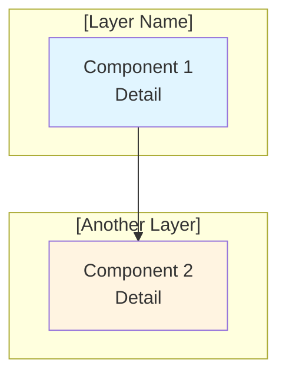
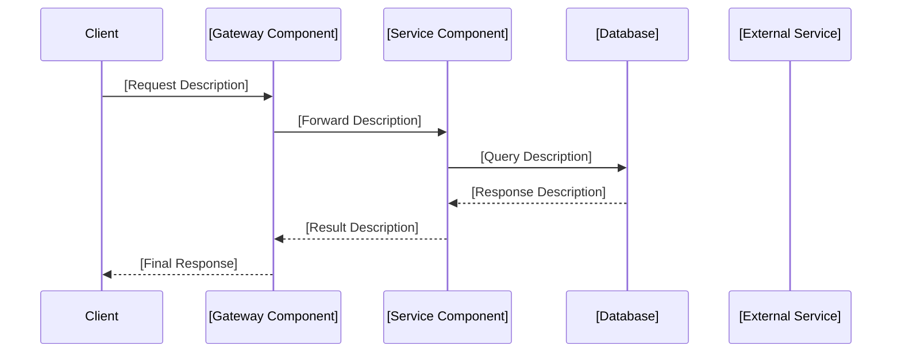

# GAP 差距分析 - [项目标题]

<!-- ==============================================================================
     指令：SPEC 编码模板 - GAP 差距分析
     ==============================================================================
     本模板专为基础设施和平台工程项目设计。
     它记录当前状态（基线），识别当前状态与目标状态之间的差距，
     评估实施方案，并提供结构化的建议与迁移路径。

     如何使用本模板：
     1. 将所有 [PLACEHOLDER] 标记替换为项目特定的内容。
     2. 删除或调整不适用于您项目的章节。
     3. 遵循内联注释（<!-- 指令：... -->）的指导。
     4. 保持严重等级评定体系的一致性：
        - 🔴 严重  = 阻碍交付；必须在推进之前解决
        - 🟡 高    = 必需但不立即阻碍；计划解决
        - 🟢 中    = 重要但可推迟或增量处理
     5. 使用 ✅ 表示已有资产，❌ 表示缺失项。
     ============================================================================ -->

**文档 ID**: GAP_[项目名称]
<!-- 指令：使用简短的大写下划线分隔标识符。
     示例：GAP_ALB_Fargate_java_service, GAP_1928_pipeline_improvement -->

**Issue**: #[ISSUE_NUMBER] - [Issue 标题]
<!-- 指令：引用 GitHub/Jira issue 编号及其标题。
     示例：#1880 - ALB + Fargate Java 容器部署基础设施 -->

**创建日期**: [DATE]
<!-- 指令：使用本文档首次创建的日期。
     示例：2025-01-15 -->

**分支**: [BRANCH_NAME]
<!-- 指令：实施工作所在的功能分支名称。
     示例：feature/1880-alb-fargate-java-card-service -->

**状态**: 基线评估与差距分析
<!-- 指令：跟踪文档生命周期：
     - "基线评估与差距分析"（初始阶段）
     - "分析阶段"（审查中）
     - "决策已定 - [方案名称] 已选定"（决策后）
     - "实施进行中"（构建期间）
     - "已完成"（交付后） -->

**依赖项**: #[ISSUE_NUMBER]（[依赖项描述]）
<!-- 指令：列出所有前置 issue 或相关工作。
     如果没有依赖项，请删除本章节。
     示例：#1843（PostgreSQL 集群基础设施） -->

---

## 执行摘要

<!-- 指令：本章节应使技术负责人或工程经理在 2 分钟内可读完。
     仅包含理解范围、差距和方向所需的最关键信息。 -->

### 当前基线状态: [EMOJI] **[整体状态描述]**

<!-- 指令：对每个主要能力领域进行百分比评估。使用适当的表情符号指标：
     - 🟢 = 完全就绪 / 80-100%
     - 🟡 = 部分就绪 / 20-79%
     - 🔴 = 未就绪 / 0-19%
     - ✅ = 已存在（100%）
     以下为示例： -->

- **[能力领域 1]**: [PERCENTAGE]%（[简要状态说明]）
- **[能力领域 2]**: [PERCENTAGE]%（[简要状态说明]）
- **[能力领域 3]**: 0%（[简要状态说明]）
- **[能力领域 4]**: 0%（[简要状态说明]）
- **[能力领域 5]**: 0%（[简要状态说明]）

### 关键发现

<!-- 指令：为每个发现编号。使用 ✅ 表示可利用的已有资产，
     使用 ❌ 表示需要构建的缺失项。先列出优势（已有的），
     再列出差距（缺失的）。 -->

1. ✅ **[已有资产名称]**: [描述已有内容及其帮助]
2. ✅ **[已有资产名称]**: [描述已有内容及其帮助]
3. ✅ **[已有资产名称]**: [描述已有内容及其帮助]
4. ❌ **[缺失能力名称]**: [描述缺失的内容]
5. ❌ **[缺失能力名称]**: [描述缺失的内容]
6. ❌ **[缺失能力名称]**: [描述缺失的内容]
7. ❌ **[缺失能力名称]**: [描述缺失的内容]
8. ❌ **[缺失能力名称]**: [描述缺失的内容]

### 关键差距: [差距标题]

<!-- 指令：用一句话陈述核心差距。然后描述需求要求和可选方案。 -->

**需求** (Issue #[ISSUE_NUMBER]): [一句话描述所需内容]。

<!-- 指令：如果考虑了多个方案，请将每个方案作为子章节记录在下方。
     如果只有一个方案，仍然描述它，但省略"未选择"的表述。 -->

#### 方案 A: [方案名称]（已考虑但未选择）
- **[关键特征]**: [描述]
- **优势**: [列出主要优势]
- **未选择原因**: [说明为什么未选择此方案]

#### 方案 B: [方案名称] ✅ **已选定**

<!-- 指令：如果决策已做出，使用 ✅ **已选定** 标记并描述所选方案。
     如果尚未做出决策，请中立地展示所有方案。 -->

**[方案重点]**:
- **[组件 1]**: [描述]
- **[组件 2]**: [描述]
- **[组件 3]**: [描述]
- **[组件 4]**: [描述]

**优势**:
- ✅ [优势 1]
- ✅ [优势 2]
- ✅ [优势 3]

**✅ 决策已定**: 已选择 [方案名称] 进行实施

---

## 第 0 节：架构对比

<!-- 指令：本章节提供当前状态与各拟议方案的可视化架构图对比。
     使用 ASCII 图表便于快速阅读，使用 Mermaid 图表展示详细流程。
     两种格式均可接受；根据受众需求选择：
     - ASCII：随处可用，无需渲染
     - Mermaid：适合带样式的复杂图表（需要渲染器） -->

### 0.1 当前架构（[当前架构名称]）

<!-- 指令：绘制当前系统架构的 ASCII 图。使用方框（┌────┐）、
     箭头（│, ▼, →）和标签。确保图表在标准终端宽度（约 80 字符）
     的等宽字体中可读。 -->

```
┌─────────────────────────────────────────────────────────────┐
│                    [Component 1 Name]                        │
│              [Component 1 Detail / Endpoint]                 │
└───────────────────────┬─────────────────────────────────────┘
                        │
                        ▼
        ┌───────────────────────────────┐
        │   [Component 2 Name]         │
        │   - [Detail 1]               │
        │   - [Detail 2]               │
        └───────────────┬───────────────┘
                        │
        ┌───────────────┴───────────────┐
        │                               │
        ▼                               ▼
┌───────────────┐              ┌───────────────┐
│  [Service A]  │              │  [Service B]  │
│  [Detail]     │              │  [Detail]     │
└───────────────┘              └───────────────┘
```

### 0.2 方案 A: [方案名称] 架构

<!-- 指令：如果考虑了此方案，请提供展示拟议架构的图表。
     如适用，包含多环境隔离（dev、test、staging、prod）。 -->

<!-- 指令：Mermaid 图表示例（如偏好此格式，取消注释）：


-->

```
┌─────────────────────────────────────────────────────────────┐
│                    [Proposed Component 1]                    │
│              [Proposed Component 1 Detail]                   │
└───────────────────────┬─────────────────────────────────────┘
                        │
                        ▼
        ┌───────────────────────────────┐
        │   [Proposed Component 2]     │
        │   [Detail]                   │
        └───────────────┬───────────────┘
                        │
                        ▼
        ┌───────────────────────────────┐
        │   [Proposed Component 3]     │
        │   [Detail]                   │
        └───────────────┬───────────────┘
                        │
        ┌───────────────┴───────────────┐
        │                               │
        ▼                               ▼
┌───────────────┐              ┌───────────────┐
│  [Data Store] │              │  [External]   │
│  [Detail]     │              │  [Detail]     │
└───────────────┘              └───────────────┘
```

<!-- 指令：如果项目支持多个环境（dev、test、staging、prod），
     请在此处包含环境隔离图，展示各环境的分离方式。示例：

**环境隔离架构**:

```
┌───────────────────────────────────────────────────────┐
│         [Component]                                    │
│                                                        │
│  Environment Isolation:                               │
│  ┌─────────┐  ┌─────────┐  ┌─────────┐  ┌─────────┐ │
│  │   dev   │  │  test   │  │ staging │  │   prod  │ │
│  └─────────┘  └─────────┘  └─────────┘  └─────────┘ │
└───────────────────────────────────────────────────────┘
```
-->

### 0.3 方案 B: [方案名称] 架构

<!-- 指令：如适用，重复方案 B 的图表模式。
     如果只有一个方案，请完全删除此子章节。 -->

```
[方案 B 的架构图 - 格式与 0.2 相同]
```

**数据流** (请求 -> 响应):

<!-- 指令：序列图有助于展示数据在系统中的流转方式。
     使用 Mermaid sequenceDiagram 来实现。


-->

---

## 第 1 节：当前架构基线

<!-- 指令：这是 GAP 分析的核心。将当前系统分解为逻辑组件。
     对每个组件：
     1. 展示已有的内容（附代码库中的实际代码片段）
     2. 列出缺失的内容（使用 ❌ 标记的要点）
     3. 分配 GAP 严重等级

     以下子章节为示例。请根据项目中的实际组件进行调整。
     常见基础设施组件包括：API Gateway、Lambda、ALB、ECS/Fargate、
     网络/VPC、安全组、IAM 角色、监控、CI/CD、数据库等。 -->

### 1.1 [组件 1 名称] 配置

<!-- 指令：示例组件 - 请根据实际组件名称进行调整或替换。常见示例：
     - API Gateway 配置
     - Lambda 函数基线
     - Application Load Balancer 基础设施
     - ECS Fargate 基础设施
     - Java 容器实现
     - VPC / 网络配置 -->

#### ✅ 已有资产

<!-- 指令：展示代码库中的实际代码。在括号中包含文件路径，
     以便审查者定位源文件。使用带有相应语言标签的围栏代码块。 -->

**[配置/设置名称]** (`[relative/file/path]`):
```[language]
# [描述此代码的功能]
[actual or representative code snippet]
```

**[组件] 特性**:
- ✅ [特性 1 - 附简要说明]
- ✅ [特性 2 - 附简要说明]
- ✅ [特性 3 - 附简要说明]

#### ❌ 缺失 [组件名称]

<!-- 指令：使用 ❌ 列出每个缺失项。具体说明缺失的内容。
     将相关项分组在一起。 -->

```bash
# [组件名称] (严重等级 GAP)
- ❌ No [specific missing item 1]
- ❌ No [specific missing item 2]
- ❌ No [specific missing item 3]
- ❌ No [specific missing item 4]
- ❌ No [specific missing item 5]
```

**GAP 严重等级**: 🔴 **严重** - [严重等级的简要理由]
<!-- 指令：使用以下三个严重等级之一：
     - 🔴 严重  - 阻碍交付；无替代方案
     - 🟡 高    - 必需但存在替代方案或参考实现
     - 🟢 中    - 重要但可推迟或增量处理 -->

### 1.2 [组件 2 名称]

#### ✅ 已有参考实现（[参考项目名称]）

<!-- 指令：如果另一个项目或模块已实现了所需功能，
     将其记录为"参考实现"。展示实际代码，
     让实施者知道需要适配什么。 -->

**[参考项目] 设置** (`[relative/file/path]`):
```hcl
# [组件] 配置
resource "aws_[resource_type]" "[name]" {
  [configuration block]
}
```

**[参考项目] 特性**（可供参考）:
- ✅ [可复用的特性]
- ✅ [可复用的特性]
- ✅ [可复用的特性]

#### ❌ 缺失 [目标组件名称]

```bash
# [目标组件名称] (严重等级 GAP)
- ❌ No [specific missing item 1]
- ❌ No [specific missing item 2]
- ❌ No [specific missing item 3]
- ❌ No [specific missing item 4]
```

**GAP 严重等级**: 🟡 **高** - [简要理由]

### 1.3 [组件 3 名称]

#### ✅ 已有 [实现名称]

**当前 [组件] 结构**:
```
[path/to/directory]/
├── [file1.ext]           # [Description]
├── [file2.ext]           # [Description]
├── [subdirectory]/
│   ├── [file3.ext]       # [Description]
│   └── [file4.ext]       # [Description]
└── [config.ext]          # [Description]
```

**[组件] 特性**:
- ✅ [特性 1]
- ✅ [特性 2]
- ✅ [特性 3]

#### ❌ 缺失 [目标组件]

```bash
# [目标组件] (严重等级 GAP)
- ❌ No [specific missing item 1]
- ❌ No [specific missing item 2]
- ❌ No [specific missing item 3]
```

**GAP 严重等级**: 🔴 **严重** - [简要理由]

### 1.4 [组件 4 名称] - 集成层

#### ✅ 已有集成

**当前集成**:
- [当前集成点的描述]
- [当前各组件连接方式的描述]

#### ❌ 缺失 [集成组件]

```bash
# [集成组件] (严重等级 GAP)
- ❌ No [specific missing item 1]
- ❌ No [specific missing item 2]
- ❌ No [specific missing item 3]
```

<!-- 指令：如果有多种集成方案，请将其作为子项列出并附简要描述。 -->

**集成方案**:

**方案 1: [集成方式名称]**
- [简要描述]
- [权衡说明]

**方案 2: [集成方式名称]**
- [简要描述]
- [权衡说明]

**GAP 严重等级**: 🔴 **严重** - [简要理由]

---

## 第 2 节：[方案] 分析

<!-- 指令：提供实施方案的详细对比。如果只采用一种方案，
     请将本章节框架化为该方案的"详细分析"而非对比。 -->

### 2.1 [方案] 特性分析

#### ✅ [能力领域]

**[特性类别]**:
- ✅ [能力 1 - 附详情]
- ✅ [能力 2 - 附详情]
- ✅ [能力 3 - 附详情]
- ✅ [能力 4 - 附详情]

#### ❌ 缺失 [能力领域]

```bash
# [能力领域] (严重等级 GAP)
- ❌ No [specific missing item 1]
- ❌ No [specific missing item 2]
- ❌ No [specific missing item 3]
```

**GAP 严重等级**: 🔴 **严重** - [简要理由]

### 2.2 对比分析

<!-- 指令：在评估多个方案时使用对比表。每行应代表一个独立的评估维度。
     在底部包含明确的建议行。 -->

| 方面 | [方案 A 名称] | [方案 B 名称] |
|------|---------------|---------------|
| **基础设施复杂度** | [低/中/高] - [详情] | [低/中/高] - [详情] |
| **[集成类型]** | [描述] | [描述] |
| **性能** | [描述] | [描述] |
| **成本（低流量）** | [描述] | [描述] |
| **成本（高流量）** | [描述] | [描述] |
| **扩展性** | [描述] | [描述] |
| **实施时间** | [更快/更慢] - [详情] | [更快/更慢] - [详情] |

**建议**: [附理由的简要建议]。

### 2.3 [方案] 实施差距

<!-- 指令：将所选方案的差距分解为子类别。
     始终如一地使用严重等级评定体系。 -->

#### [子类别 1]（例如：ECR 仓库、Terraform 模块）
```bash
# [子类别名称] ([严重等级] GAP)
- ❌ No [specific missing item 1]
- ❌ No [specific missing item 2]
- ❌ No [specific missing item 3]
```

#### [子类别 2]（例如：容器镜像、Java 项目）
```bash
# [子类别名称] ([严重等级] GAP)
- ❌ No [specific missing item 1]
- ❌ No [specific missing item 2]
- ❌ No [specific missing item 3]
```

#### [子类别 3]（例如：VPC 配置、安全组）
```bash
# [子类别名称] ([严重等级] GAP)
- ❌ No [specific missing item 1]
- ❌ No [specific missing item 2]
- ❌ No [specific missing item 3]
```

#### [子类别 4]（例如：数据库集成、连接池）
```bash
# [子类别名称] ([严重等级] GAP)
- ❌ No [specific missing item 1]
- ❌ No [specific missing item 2]
- ❌ No [specific missing item 3]
```

#### [子类别 5]（例如：CI/CD 配置、流水线）
```bash
# [子类别名称] ([严重等级] GAP)
- ❌ No [specific missing item 1]
- ❌ No [specific missing item 2]
- ❌ No [specific missing item 3]
```

---

## 第 3 节：基础设施差距分析

<!-- 指令：分析跨领域关注点的基础设施级差距。
     这些通常是支撑主要组件的非功能性需求。 -->

### 3.1 网络基础设施

#### ✅ 已有网络

**VPC 配置**（来自 [参考来源]）:
- ✅ [已有网络组件 1]
- ✅ [已有网络组件 2]
- ✅ [已有网络组件 3]

#### ❌ 缺失 [网络组件]

```bash
# [网络组件] ([严重等级] GAP)
- ❌ No [specific missing item 1]
- ❌ No [specific missing item 2]
- ❌ No [specific missing item 3]
```

**GAP 严重等级**: 🟡 **高** - [简要理由]

### 3.2 安全配置

#### ✅ 已有安全模式

**[参考项目] 安全**（参考）:
- ✅ [已有安全模式 1]
- ✅ [已有安全模式 2]
- ✅ [已有安全模式 3]

#### ❌ 缺失 [安全组件]

```bash
# [安全组件] ([严重等级] GAP)
- ❌ No [specific missing item 1]
- ❌ No [specific missing item 2]
- ❌ No [specific missing item 3]
```

**GAP 严重等级**: 🟡 **高** - [简要理由]

### 3.3 IAM 角色与权限

#### ✅ 已有 IAM 模式

**[当前系统] IAM**（当前）:
- ✅ [已有权限 1]
- ✅ [已有权限 2]
- ✅ [已有权限 3]

**[参考项目] IAM**（参考）:
- ✅ [已有权限 4]
- ✅ [已有权限 5]

#### ❌ 缺失 [IAM 组件]

```bash
# [IAM 组件] ([严重等级] GAP)
- ❌ No [specific missing item 1]
- ❌ No [specific missing item 2]
- ❌ No [specific missing item 3]
```

**GAP 严重等级**: 🟡 **高** - [简要理由]

### 3.4 监控与日志

#### ✅ 已有监控

**[当前系统] 监控**:
- ✅ [已有监控 1]
- ✅ [已有监控 2]
- ✅ [已有监控 3]

#### ❌ 缺失 [监控组件]

```bash
# [监控组件] ([严重等级] GAP)
- ❌ No [specific missing item 1]
- ❌ No [specific missing item 2]
- ❌ No [specific missing item 3]
```

**GAP 严重等级**: 🟢 **中** - [简要理由]

### 3.5 自动扩展配置

<!-- 指令：如果项目涉及容器编排或自动扩展，请包含此章节。
     如不适用，请删除。 -->

#### ✅ 已有自动扩展模式

**[参考项目] 自动扩展**（参考）:
- ✅ [已有自动扩展模式 1]
- ✅ [已有自动扩展模式 2]
- ✅ [已有自动扩展模式 3]

#### ❌ 缺失 [自动扩展组件]

```bash
# [自动扩展组件] ([严重等级] GAP)
- ❌ No [specific missing item 1]
- ❌ No [specific missing item 2]
- ❌ No [specific missing item 3]
```

**GAP 严重等级**: 🟢 **中** - [简要理由]

---

## 第 4 节：实施差距分析

<!-- 指令：分析实施工具链中的差距：Terraform、CI/CD、配置管理等。 -->

### 4.1 Terraform 基础设施代码

#### ✅ 已有 Terraform 模块

**参考模块**:
- ✅ `[path/to/reference/module/]` - [描述其提供的功能]
- ✅ `[path/to/another/module/]` - [描述]

#### ❌ 缺失 [Terraform 组件]

```bash
# [Terraform 组件] ([严重等级] GAP)
- ❌ No [specific missing item 1]
- ❌ No [specific missing item 2]
- ❌ No [specific missing item 3]
```

**GAP 严重等级**: 🔴 **严重** - [简要理由]

### 4.2 CI/CD 流水线

#### ✅ 已有 CI/CD 模式

**当前部署**:
- ✅ [已有流水线步骤 1]
- ✅ [已有流水线步骤 2]
- ✅ [已有流水线步骤 3]

#### ❌ 缺失 [CI/CD 组件]

```bash
# [CI/CD 组件] ([严重等级] GAP)
- ❌ No [specific missing item 1]
- ❌ No [specific missing item 2]
- ❌ No [specific missing item 3]
```

**GAP 严重等级**: 🟡 **高** - [简要理由]

### 4.3 配置管理

#### ✅ 已有配置

**当前配置**:
- ✅ [已有配置机制 1]
- ✅ [已有配置机制 2]
- ✅ [已有配置机制 3]

#### ❌ 缺失 [配置组件]

```bash
# [配置组件] ([严重等级] GAP)
- ❌ No [specific missing item 1]
- ❌ No [specific missing item 2]
- ❌ No [specific missing item 3]
```

**GAP 严重等级**: 🟢 **中** - [简要理由]

---

## 第 5 节：迁移路径分析

<!-- 指令：为每个考虑的方案提供分阶段实施计划。每个阶段应包含
     具体的、有序的步骤。使用 ✅ 标记步骤（表示"这是需要完成的
     必要步骤"），而非表示完成状态。 -->

### 5.1 方案 A: [方案名称] 迁移路径

**阶段 1: 基础设施搭建**
1. ✅ [步骤 1 描述]
2. ✅ [步骤 2 描述]
3. ✅ [步骤 3 描述]
4. ✅ [步骤 4 描述]
5. ✅ [步骤 5 描述]

**阶段 2: [服务/应用] 开发**
1. ✅ [步骤 1 描述]
2. ✅ [步骤 2 描述]
3. ✅ [步骤 3 描述]
4. ✅ [步骤 4 描述]
5. ✅ [步骤 5 描述]

**阶段 3: 集成**
1. ✅ [步骤 1 描述]
2. ✅ [步骤 2 描述]
3. ✅ [步骤 3 描述]
4. ✅ [步骤 4 描述]

**阶段 4: 测试与验证**
1. ✅ [步骤 1 描述]
2. ✅ [步骤 2 描述]
3. ✅ [步骤 3 描述]
4. ✅ [步骤 4 描述]
5. ✅ [步骤 5 描述]

**阶段 5: 优化**
1. ✅ [步骤 1 描述]
2. ✅ [步骤 2 描述]
3. ✅ [步骤 3 描述]
4. ✅ [步骤 4 描述]

### 5.2 方案 B: [方案名称] 迁移路径

<!-- 指令：重复方案 B 的阶段结构。如果只采用一种方案，
     请删除此子章节，并将 5.1 重命名为"迁移路径"，
     不带方案 A 前缀。 -->

### 5.3 当前状态 -> 目标状态

<!-- 指令：提供简单的前后架构对比，使迁移方向明确。 -->

**当前架构**:
```
[Component A]
    |
    v
[Component B]
    |
    v
[Component C]
```

**目标架构**:
```
[Component A]
    |
    v
[NEW Component X]
    |
    v
[Component C (modified)]
```

### 5.4 迁移步骤（详细）

<!-- 指令：为所选方案提供详细的步骤序列。这些应是可执行的、
     有序的任务。 -->

#### 阶段 1: 基础设施搭建
1. ✅ [包含具体文件路径或资源名称的步骤]
2. ✅ [包含具体文件路径或资源名称的步骤]
3. ✅ [包含具体文件路径或资源名称的步骤]
4. ✅ [包含具体文件路径或资源名称的步骤]
5. ✅ [包含具体文件路径或资源名称的步骤]

#### 阶段 2: 服务开发
1. ✅ [包含具体交付物的步骤]
2. ✅ [包含具体交付物的步骤]
3. ✅ [包含具体交付物的步骤]
4. ✅ [包含具体交付物的步骤]

#### 阶段 3: 集成
1. ✅ [包含具体集成点的步骤]
2. ✅ [包含具体集成点的步骤]
3. ✅ [包含具体集成点的步骤]
4. ✅ [包含具体集成点的步骤]

#### 阶段 4: 部署与测试
1. ✅ [包含具体测试或部署操作的步骤]
2. ✅ [包含具体测试或部署操作的步骤]
3. ✅ [包含具体测试或部署操作的步骤]
4. ✅ [包含具体测试或部署操作的步骤]
5. ✅ [包含具体测试或部署操作的步骤]

#### 阶段 5: 迁移与清理
1. ✅ [包含具体切换操作的步骤]
2. ✅ [包含具体监控操作的步骤]
3. ✅ [包含具体下线操作的步骤]
4. ✅ [包含具体清理操作的步骤]

---

## 第 6 节：风险评估

<!-- 指令：识别风险并为每个风险配备具体的缓解策略。
     分为高风险和中等风险类别。高风险项可能延误交付或导致生产事故。
     中等风险项令人担忧但可管理。 -->

### 6.1 高风险领域

1. **[风险领域 1 名称]**
   - **风险**: [可能出现问题的具体描述]
   - **缓解措施**: [预防或从风险中恢复的具体行动]

2. **[风险领域 2 名称]**
   - **风险**: [可能出现问题的具体描述]
   - **缓解措施**: [预防或从风险中恢复的具体行动]

3. **[风险领域 3 名称]**
   - **风险**: [可能出现问题的具体描述]
   - **缓解措施**: [预防或从风险中恢复的具体行动]

4. **[风险领域 4 名称]**
   - **风险**: [可能出现问题的具体描述]
   - **缓解措施**: [预防或从风险中恢复的具体行动]

### 6.2 中等风险领域

1. **[风险领域 5 名称]**
   - **风险**: [可能出现问题的具体描述]
   - **缓解措施**: [预防或从风险中恢复的具体行动]

2. **[风险领域 6 名称]**
   - **风险**: [可能出现问题的具体描述]
   - **缓解措施**: [预防或从风险中恢复的具体行动]

3. **[风险领域 7 名称]**
   - **风险**: [可能出现问题的具体描述]
   - **缓解措施**: [预防或从风险中恢复的具体行动]

---

## 第 7 节：建议

<!-- 指令：清晰陈述最终建议，如果已做出决策，使用
     ✅ 决策已定 标记。提供编号的理由要点和按优先级排序的
     实施计划。 -->

### 7.1 选定方案: [方案名称] ✅ **决策已定**

<!-- 指令：如果尚未做出决策，将标记替换为：
     "**建议方案**（待审查）" -->

**决策**: 已选择 [方案名称] 进行实施。

**理由**:
1. ✅ **[理由要点 1]**: [说明]
2. ✅ **[理由要点 2]**: [说明]
3. ✅ **[理由要点 3]**: [说明]
4. ✅ **[理由要点 4]**: [说明]
5. ✅ **[理由要点 5]**: [说明]

**实施优先级**:
1. **高**: [必须首先完成的组件或任务]
2. **高**: [必须首先完成的组件或任务]
3. **高**: [必须首先完成的组件或任务]
4. **中**: [随后应完成的组件或任务]
5. **低**: [可推迟的组件或任务]

### 7.2 备选方案: [方案名称] - 未选择

<!-- 指令：记录已考虑但未选择的方案，以便未来的读者理解
     为什么它被拒绝。 -->

**理由**:
1. ✅ **[此方案的优势]**: [说明]
2. ✅ **[此方案的优势]**: [说明]
3. ✅ **[此方案的优势]**: [说明]

**[方案名称] 已考虑但未选择**:
- [未选择的原因 1]
- [未选择的原因 2]
- [未选择的原因 3]

**实施优先级**（如重新考虑）:
1. **高**: [首先需要完成的事项]
2. **高**: [首先需要完成的事项]
3. **中**: [随后的事项]
4. **低**: [可推迟的事项]

### 7.3 混合方案（如适用）

<!-- 指令：仅在结合多个方案要素的混合方案可行时才包含此章节。
     如不适用，请删除。 -->

**考虑混合方案的条件**:
- ✅ [适合混合的条件 1]
- ✅ [适合混合的条件 2]
- ✅ [适合混合的条件 3]

**示例**:
- **[方案 A]**: [用于哪些组件/工作负载]
- **[方案 B]**: [用于哪些组件/工作负载]

---

## 第 8 节：成功标准

<!-- 指令：为每个实施方案定义清晰、可测试的成功标准。
     使用 markdown 复选框（- [ ]），以便在实施期间跟踪标准。
     按类别组织：基础设施、集成、服务/性能。 -->

### 8.1 方案 A: [方案名称] 成功标准

**基础设施**:
- [ ] [基础设施标准 1]
- [ ] [基础设施标准 2]
- [ ] [基础设施标准 3]
- [ ] [基础设施标准 4]
- [ ] [基础设施标准 5]

**集成**:
- [ ] [集成标准 1]
- [ ] [集成标准 2]
- [ ] [集成标准 3]
- [ ] [集成标准 4]
- [ ] [集成标准 5]

**性能**:
- [ ] [性能标准 1]
- [ ] [性能标准 2]
- [ ] [性能标准 3]
- [ ] [性能标准 4]

### 8.2 方案 B: [方案名称] 成功标准

**基础设施**:
- [ ] [基础设施标准 1]
- [ ] [基础设施标准 2]
- [ ] [基础设施标准 3]
- [ ] [基础设施标准 4]
- [ ] [基础设施标准 5]

**集成**:
- [ ] [集成标准 1]
- [ ] [集成标准 2]
- [ ] [集成标准 3]
- [ ] [集成标准 4]

**服务**:
- [ ] [服务标准 1]
- [ ] [服务标准 2]
- [ ] [服务标准 3]
- [ ] [服务标准 4]
- [ ] [服务标准 5]

---

## 第 9 节：依赖项

<!-- 指令：列出所有外部和内部依赖项。使用 ✅ 标记已有依赖，
     使用 ❌ 标记需要创建的新依赖。 -->

### 9.1 外部依赖

- **[服务/工具 1]**: [状态: 已有/新建] - [描述]
- **[服务/工具 2]**: [状态: 已有/新建] - [描述]
- **[服务/工具 3]**: [状态: 已有/新建] - [描述]
- **[服务/工具 4]**: [状态: 已有/新建] - [描述]

### 9.2 内部依赖

- ✅ **[内部组件 1]**: [状态] - [描述]
- ✅ **[内部组件 2]**: [状态] - [描述]
- ❌ **[内部组件 3]**: [状态] - [描述]
- ❌ **[内部组件 4]**: [状态] - [描述]

### 9.3 参考实现

<!-- 指令：列出实施者在构建解决方案时应参考的具体文件路径。 -->

- **[参考名称 1]**: `[relative/path/to/reference/code/]`
- **[参考名称 2]**: `[relative/path/to/reference/code/]`
- **[参考名称 3]**: `[relative/path/to/reference/code/]`

---

## 第 10 节：后续步骤

<!-- 指令：按时间范围对后续步骤进行分类。每个步骤应是具体的、
     可执行的事项，如果可能，注明负责人。 -->

### 10.1 即时行动

1. **[行动 1 标题]**
   - [具体任务描述]
   - [预期结果]

2. **[行动 2 标题]**
   - [具体任务描述]
   - [预期结果]

3. **[行动 3 标题]**
   - [具体任务描述]
   - [预期结果]

### 10.2 短期行动

1. **[行动 4 标题]**
   - [具体任务描述]
   - [预期结果]

2. **[行动 5 标题]**
   - [具体任务描述]
   - [预期结果]

3. **[行动 6 标题]**
   - [具体任务描述]
   - [预期结果]

### 10.3 长期行动

1. **[行动 7 标题]**
   - [具体任务描述]
   - [预期结果]

2. **[行动 8 标题]**
   - [具体任务描述]
   - [预期结果]

3. **[行动 9 标题]**
   - [具体任务描述]
   - [预期结果]

---

## 相关文档

<!-- 指令：链接到任何支持文档、之前的分析或外部参考资料。
     内部文档使用相对路径，外部资源使用完整 URL。 -->

- **[文档名称 1]**: `[relative/path/to/document.md]`
- **[文档名称 2]**: `[relative/path/to/document.md]`
- **[文档名称 3]**: `[relative/path/to/document.md]`
- **GitHub Issue**: #[ISSUE_NUMBER] - [Issue URL]

---

**文档版本**: 1.0
**最后更新**: [DATE]
**变更说明**: [此版本的变更描述]
**下次审查**: [本文档下次应审查的时间]
<!-- 指令：跟踪文档历史。每次重大更新时递增版本。示例：
     版本 1.0 - 初始 GAP 分析
     版本 2.0 - 新增方案 B 分析，更新架构图
     版本 3.0 - 决策确定，迁移路径确认 -->
