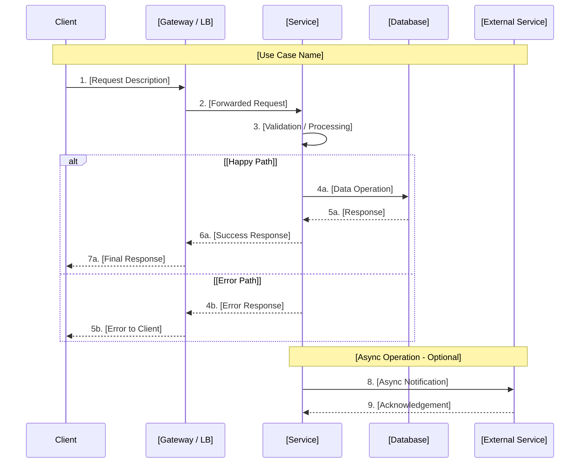
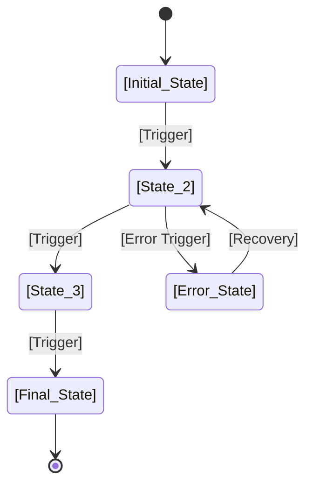

# 功能实现计划 (FIP) - [PROJECT_TITLE]

<!-- ==============================================================================
     指令：SPEC 编码模板 - 功能实现计划 (FIP)
     ==============================================================================
     本模板专为基础设施和平台工程项目设计。
     它记录了功能或系统组件的完整技术设计、实施方案、风险评估
     和上线计划。请在需求确定且架构决策完成后使用本模板。

     如何使用本模板：
     1. 将所有 [PLACEHOLDER] 标记替换为项目特定内容。
     2. 删除或调整不适用于您项目的章节。
     3. 遵循行内注释（<!-- 指令: ... -->）中的指导。
     4. 保持严重程度评级体系一致：
        - 🔴 严重  = 阻塞交付；必须在继续之前解决
        - 🟡 高    = 必需但不立即阻塞；计划解决
        - 🟢 中    = 重要但可以延后或渐进处理
     5. 已完成项使用 ✅，待完成项使用 ❌。
     6. 所有 Mermaid 图表均可在 GitHub 和大多数 Markdown 查看器中渲染。
     7. 目标读者：实施该功能的工程师和审批设计的审查人员。
     ============================================================================ -->

**文档编号**: FIP_[PROJECT_NAME]
<!-- 指令：使用简短的、大写的、下划线分隔的标识符。
     示例：FIP_ALB_Fargate_java_service, FIP_1928_pipeline_improvement -->

**Issue**: #[ISSUE_NUMBER] - [Issue 标题]
<!-- 指令：引用 GitHub/Jira issue 编号及其标题。
     示例：#1880 - ALB + Fargate Infrastructure for Java Container Deployment -->

**创建日期**: [DATE]
<!-- 指令：使用本文档首次创建的日期。
     示例：2025-01-15 -->

**分支**: [BRANCH_NAME]
<!-- 指令：实施工作所在的功能分支名称。
     示例：feature/1880-alb-fargate-java-card-service -->

**状态**: [DOCUMENT_STATUS]
<!-- 指令：跟踪文档生命周期：
     - "草稿" (初始创建)
     - "审查中" (同行审查阶段)
     - "已批准" (设计签字确认)
     - "实施中" (构建阶段)
     - "已完成" (交付后) -->

**作者**: [AUTHOR_NAME]
<!-- 指令：负责本文档的主要作者。
     示例：arthurren -->

**审查人**: [REVIEWER_1], [REVIEWER_2]
<!-- 指令：列出应审查此 FIP 的工程师或负责人。
     示例：alice, bob, charlie -->

---

## 概述

<!-- 指令：本节必须能让技术负责人或工程经理在 2 分钟内读完。
     提供足够的上下文，让读者无需阅读完整文档即可理解
     要构建什么、为什么构建以及关键风险。 -->

### 概要

[PROJECT_TITLE] 实现了 [BRIEF_DESCRIPTION_OF_FEATURE]。该功能通过 [HIGH_LEVEL_SOLUTION_APPROACH] 解决 [PROBLEM_STATEMENT]。实施涵盖 [NUMBER] 个组件，横跨 [ENVIRONMENTS] 个环境，计划于 [TARGET_DATE] 前交付。

<!-- 指令：撰写 2-4 句话来回答以下问题：
     - 要构建什么？
     - 为什么需要（业务/技术论证）？
     - 如何构建（高层方案）？
     - 预计何时交付？ -->

### 关键技术决策

<!-- 指令：记录在设计阶段做出的最重要的技术决策。
     每行应记录一个逆转成本高昂的决策。限制在 5-8 条。 -->

| 决策 | 考虑方案 | 选定方案 | 理由 |
|------|---------|---------|------|
| [决策 1：例如，计算平台] | [方案 A, 方案 B, 方案 C] | [选定方案] | [为何选择此方案而非其他替代方案] |
| [决策 2：例如，数据存储] | [方案 A, 方案 B] | [选定方案] | [为何选择此方案而非其他替代方案] |
| [决策 3：例如，网络模型] | [方案 A, 方案 B] | [选定方案] | [为何选择此方案而非其他替代方案] |
| [决策 4：例如，认证机制] | [方案 A, 方案 B] | [选定方案] | [为何选择此方案而非其他替代方案] |
| [决策 5：例如，部署策略] | [方案 A, 方案 B] | [选定方案] | [为何选择此方案而非其他替代方案] |

### 风险评估摘要

<!-- 指令：提供主要风险的快速概览。这些风险应对应第 5 节中的
     详细条目。统一使用严重程度指示符。限制在 5-7 行。 -->

| 风险 | 严重程度 | 缓解措施 | 状态 |
|------|---------|---------|------|
| [风险 1 描述] | 🔴 严重 | [简要缓解策略] | [待处理 / 已缓解 / 已接受] |
| [风险 2 描述] | 🟡 高 | [简要缓解策略] | [待处理 / 已缓解 / 已接受] |
| [风险 3 描述] | 🟡 高 | [简要缓解策略] | [待处理 / 已缓解 / 已接受] |
| [风险 4 描述] | 🟢 中 | [简要缓解策略] | [待处理 / 已缓解 / 已接受] |
| [风险 5 描述] | 🟢 中 | [简要缓解策略] | [待处理 / 已缓解 / 已接受] |

---

## 第 1 节：架构设计

<!-- 指令：本节提供功能的完整技术架构。图表为必填项。
     使用 Mermaid 绘制详细架构，使用 ASCII 绘制较简单的组件视图。
     确保后续章节提到的所有组件在此处可见。 -->

### 1.1 系统架构

<!-- 指令：提供高层 Mermaid 图表，展示所有主要系统组件及其关系。
     包括外部依赖、数据存储和网络边界。使用子图对相关组件进行分组。 -->

```mermaid
graph TB
    subgraph "Client Layer"
        CL[Client / SDK<br/>[Description]]
    end

    subgraph "Network Layer"
        NLB[Network Load Balancer<br/>[Description]]
        ALB[Application Load Balancer<br/>[Description]]
    end

    subgraph "Compute Layer"
        SVC[Service / Container<br/>[Description]]
        WORKER[Worker / Background<br/>[Description]]
    end

    subgraph "Data Layer"
        DB[(Database<br/>[Type])]
        CACHE[(Cache<br/>[Type])]
        S3[Object Store<br/>[Description]]
    end

    subgraph "External Services"
        EXT[External API<br/>[Description]]
        AUTH[Auth Provider<br/>[Description]]
    end

    CL --> NLB
    NLB --> ALB
    ALB --> SVC
    SVC --> DB
    SVC --> CACHE
    SVC --> S3
    SVC --> EXT
    SVC --> AUTH
    WORKER --> DB
    WORKER --> CACHE

    style CL fill:#e1f5ff
    style NLB fill:#fff4e1
    style ALB fill:#fff4e1
    style SVC fill:#e8f5e9
    style WORKER fill:#e8f5e9
    style DB fill:#fce4ec
    style CACHE fill:#fce4ec
    style S3 fill:#fce4ec
    style EXT fill:#f3e5f5
    style AUTH fill:#f3e5f5
```

### 1.2 组件架构

<!-- 指令：提供内部组件结构的 ASCII 图表。展示模块、包或服务
     在系统边界内的相互关系。保持图表在标准终端宽度（约 80 字符）内可读。 -->

```
┌─────────────────────────────────────────────────────────────┐
│                    [System Name]                             │
│                                                              │
│  ┌──────────────┐  ┌──────────────┐  ┌──────────────┐       │
│  │ [Module A]   │  │ [Module B]   │  │ [Module C]   │       │
│  │ [Detail]     │  │ [Detail]     │  │ [Detail]     │       │
│  └──────┬───────┘  └──────┬───────┘  └──────┬───────┘       │
│         │                 │                 │                │
│         └────────┬────────┘─────────────────┘                │
│                  │                                           │
│                  ▼                                           │
│         ┌────────────────┐                                   │
│         │ [Core Module]  │                                   │
│         │ [Detail]       │                                   │
│         └───────┬────────┘                                   │
│                 │                                             │
│         ┌───────┴────────┐                                   │
│         │                │                                   │
│         ▼                ▼                                   │
│  ┌──────────────┐  ┌──────────────┐                         │
│  │ [Adapter A]  │  │ [Adapter B]  │                         │
│  │ [Detail]     │  │ [Detail]     │                         │
│  └──────────────┘  └──────────────┘                         │
└─────────────────────────────────────────────────────────────┘
```

### 1.3 数据流

<!-- 指令：提供 Mermaid 时序图，展示主要用例的数据在系统中的流转方式。
     如果错误路径具有架构意义，请将其纳入。对步骤进行编号，
     以便在后续章节中引用。 -->



### 1.4 API 设计

<!-- 指令：定义此功能的所有 API 端点。包括 HTTP 方法、路径、
     简要描述、认证要求以及端点是否幂等。根据需要增删行。 -->

| 方法 | 路径 | 描述 | 认证 | 幂等 |
|------|------|------|------|------|
| GET | `/api/v1/[resource]` | [列出资源] | [认证类型] | 是 |
| GET | `/api/v1/[resource]/{id}` | [获取单个资源] | [认证类型] | 是 |
| POST | `/api/v1/[resource]` | [创建资源] | [认证类型] | 否 |
| PUT | `/api/v1/[resource]/{id}` | [更新资源] | [认证类型] | 是 |
| PATCH | `/api/v1/[resource]/{id}` | [部分更新] | [认证类型] | 否 |
| DELETE | `/api/v1/[resource]/{id}` | [删除资源] | [认证类型] | 是 |
| POST | `/api/v1/[resource]/{id}/[action]` | [自定义操作] | [认证类型] | 否 |

<!-- 指令：对于复杂 API，为每个端点添加子节，包含请求/响应 JSON 模式。示例：

#### POST /api/v1/[resource]
**请求**: `{"field1": "[TYPE]", "field2": "[TYPE]"}`
**响应 200**: `{"id": "[TYPE]", "field1": "[TYPE]", "created_at": "[TIMESTAMP]"}`
-->

---

## 第 2 节：详细设计

<!-- 指令：本节包含系统中每个组件的详细设计。提供足够的细节，
     使工程师无需额外设计会议即可实施组件。每个组件应有自己的
     子节。根据需要增删组件子节。 -->

### 2.1 [组件 1 名称] 设计

<!-- 指令：将 [Component 1 Name] 替换为主要组件的名称
     （例如 "API Gateway"、"Data Processor"、"Terraform Module"）。
     这应是最复杂或架构上最关键的组件。 -->

#### 类 / 模块图

<!-- 指令：提供 Mermaid 类图，展示此组件的内部结构。
     包括关键类、其属性、方法和关系。 -->

```mermaid
classDiagram
    class [ClassName1] {
        +[attribute1]: [type]
        +[attribute2]: [type]
        +[method1](params): [return_type]
        +[method2](params): [return_type]
    }

    class [ClassName2] {
        +[attribute1]: [type]
        +[method1](params): [return_type]
    }

    class [InterfaceName] {
        <<interface>>
        +[method1](params): [return_type]
    }

    [ClassName1] --> [ClassName2] : [relationship]
    [ClassName1] ..|> [InterfaceName] : implements
```

#### 配置

<!-- 指令：提供此组件的配置模式。根据技术栈使用适当的格式
     （YAML、JSON、TOML、HCL）。包含行内注释解释每个字段。 -->

```yaml
# [Component 1] 配置
component_1:
  name: "[INSTANCE_NAME]"
  # 指令：描述下面的每个配置字段

  # [字段描述]
  enabled: [true|false]

  # [字段描述] - 有效范围：[MIN]-[MAX]
  retry_count: [NUMBER]

  # [字段描述] - 格式：[TIME_FORMAT]
  timeout: "[DURATION]"

  # [字段描述]
  endpoints:
    - name: "[ENDPOINT_NAME]"
      url: "[ENDPOINT_URL]"
      # 指令：健康检查配置
      health_check:
        interval: "[DURATION]"
        timeout: "[DURATION]"
        healthy_threshold: [NUMBER]
        unhealthy_threshold: [NUMBER]
```

#### 错误处理

<!-- 指令：定义此组件的错误处理策略。记录错误码、恢复操作和升级路径。
     使用表格来结构化定义错误码。 -->

| 错误码 | 描述 | 恢复操作 | 升级条件 |
|--------|------|---------|---------|
| `[ERR_CODE_1]` | [错误描述] | [自动恢复步骤] | [何时升级] |
| `[ERR_CODE_2]` | [错误描述] | [自动恢复步骤] | [何时升级] |
| `[ERR_CODE_3]` | [错误描述] | [自动恢复步骤] | [何时升级] |

<!-- 指令：描述通用错误处理模式：

**错误处理模式**：
- [重试策略：指数退避、熔断器等]
- [重试耗尽后的降级行为]
- [不可恢复错误的日志记录和告警]
-->

### 2.2 [组件 2 名称] 设计

<!-- 指令：将 [Component 2 Name] 替换为第二个主要组件的名称
     （例如 "Database Layer"、"Queue Processor"、"Auth Module"）。 -->

#### 接口定义

<!-- 指令：定义此组件的公共接口。可以是 API 契约、函数签名集
     或协议规范。其他组件依赖此接口，因此它必须稳定且有良好的文档。 -->

```
Interface: [InterfaceName]

Methods:
  [method_name](param1: [type], param2: [type]) -> [return_type]
    Description: [此方法的功能]
    Preconditions: [调用前必须满足的条件]
    Postconditions: [调用后保证的结果]
    Raises: [异常类型]

  [method_name](param1: [type]) -> [return_type]
    Description: [此方法的功能]
    Preconditions: [调用前必须满足的条件]
    Postconditions: [调用后保证的结果]
    Raises: [异常类型]
```

#### 状态管理

<!-- 指令：描述此组件如何管理状态。这对于理解一致性保证、
     故障模式和恢复行为至关重要。 -->

- **状态类型**：[无状态 / 有状态 / 混合]
- **持久化**：[内存 / 数据库 / 文件 / 无]
- **一致性模型**：[强一致性 / 最终一致性 / 因果一致性]
- **状态转换**：

<!-- 指令：如果组件具有显著的状态转换，请提供 Mermaid 状态图：


-->

### 2.3 [组件 3 名称] 设计

<!-- 指令：将 [Component 3 Name] 替换为第三个主要组件的名称。
     如果您的系统多于或少于三个组件，请相应增删子节。
     遵循与 2.1 和 2.2 相同的模式：接口、配置和错误处理细节。 -->

[组件 3 的详细设计内容 - 遵循与 2.1 和 2.2 相同的模式]

---

## 第 3 节：安全设计

<!-- 指令：安全必须从一开始就考虑，而不是最后附加。本节记录
     设计中内置的安全措施。所有条目应由具备安全意识的工程师审查。 -->

### 3.1 认证与授权

<!-- 指令：描述用户和服务如何向本系统认证以及它们的授权范围。 -->

- **认证方式**：[例如，OAuth 2.0、IAM 角色、API 密钥、mTLS]
- **授权模型**：[例如，RBAC、ABAC、ACL]
- **令牌管理**：[例如，带轮换的 JWT、会话令牌]
- **服务间认证**：[例如，IAM 角色、服务账户]

**角色定义**：

| 角色 | 权限 | 范围 |
|------|------|------|
| [角色 1] | [权限列表] | [范围描述] |
| [角色 2] | [权限列表] | [范围描述] |
| [角色 3] | [权限列表] | [范围描述] |

### 3.2 数据保护

<!-- 指令：描述数据在传输中和静态存储时的保护方式。包括加密标准、
     密钥管理和数据分类。 -->

- **传输中数据**：[例如，TLS 1.2+，服务间 mTLS]
- **静态数据**：[例如，AES-256，AWS KMS 托管密钥]
- **PII 处理**：[例如，字段级加密、令牌化]
- **数据保留**：[例如，日志保留 90 天，审计数据保留 7 年]
- **数据分类**：[例如，公开、内部、机密、受限]

### 3.3 密钥管理

<!-- 指令：描述密钥（API 密钥、密码、证书）的存储、轮换和访问方式。 -->

- **密钥存储**：[例如，AWS Secrets Manager、HashiCorp Vault]
- **轮换策略**：[例如，90 天自动轮换]
- **访问模式**：[例如，基于 IAM 角色、服务账户]
- **审计日志**：[例如，CloudTrail 记录所有密钥访问]

### 3.4 安全检查清单

<!-- 指令：在设计审查期间完成此检查清单。将每项标记为 ✅（已处理）、
     ❌（未处理）或 🟡（部分处理）。所有 ❌ 项必须在实施开始前有处理计划。 -->

| 检查项 | 状态 | 备注 |
|--------|------|------|
| 所有端点的输入验证 | [STATUS] | [备注或 N/A] |
| 输出编码防止注入攻击 | [STATUS] | [备注或 N/A] |
| 所有受保护路由的认证 | [STATUS] | [备注或 N/A] |
| 每个操作的授权检查 | [STATUS] | [备注或 N/A] |
| 所有网络通信使用 TLS | [STATUS] | [备注或 N/A] |
| 敏感数据静态加密 | [STATUS] | [备注或 N/A] |
| 密钥不在源代码中 | [STATUS] | [备注或 N/A] |
| 公开端点的速率限制 | [STATUS] | [备注或 N/A] |
| 安全事件日志记录 | [STATUS] | [备注或 N/A] |
| 依赖项漏洞扫描 | [STATUS] | [备注或 N/A] |
| 最小权限 IAM 策略 | [STATUS] | [备注或 N/A] |
| 网络分段已实施 | [STATUS] | [备注或 N/A] |

---

## 第 4 节：性能设计

<!-- 指令：记录性能需求和为满足这些需求所做的设计决策。
     使用具体数字——"快"或"响应迅速"等模糊目标不可操作。 -->

### 4.1 性能需求

<!-- 指令：定义可衡量的性能目标。每个指标应有目标值、测量方法和验收标准。 -->

| 指标 | 目标 | 测量方法 | 验收标准 |
|------|------|---------|---------|
| API 响应时间 (p50) | [例如，< 100ms] | [例如，CloudWatch 延迟] | [例如，必须满足 99% 的请求] |
| API 响应时间 (p99) | [例如，< 500ms] | [例如，CloudWatch 延迟] | [例如，必须满足 99% 的请求] |
| 吞吐量 | [例如，1000 req/s] | [例如，使用 k6 负载测试] | [例如，持续 5 分钟] |
| 数据库查询时间 | [例如，< 50ms] | [例如，查询执行日志] | [例如，第 95 百分位] |
| 冷启动时间 | [例如，< 2s] | [例如，容器启动日志] | [例如，首个请求就绪] |
| 内存使用量 | [例如，< 512MB] | [例如，容器指标] | [例如，正常负载下] |
| CPU 使用率（稳态） | [例如，< 40%] | [例如，CloudWatch CPU] | [例如，1 小时平均值] |

### 4.2 缓存策略

<!-- 指令：描述缓存使用位置、缓存内容、失效策略和 TTL 值。
     如果不需要缓存，说明原因并删除子节。 -->

- **缓存层**：[例如，Redis、ElastiCache、CDN、内存缓存]
- **缓存数据**：[缓存的数据类型列表]
- **失效策略**：[例如，基于 TTL、事件驱动、手动]
- **TTL 值**：[例如，配置 5 分钟，静态数据 1 小时]

| 缓存键模式 | 数据 | TTL | 失效触发条件 |
|-----------|------|-----|------------|
| `[key_pattern_1]` | [描述] | [时长] | [触发条件] |
| `[key_pattern_2]` | [描述] | [时长] | [触发条件] |
| `[key_pattern_3]` | [描述] | [时长] | [触发条件] |

### 4.3 优化模式

<!-- 指令：列出设计中应用的具体优化技术。这些应对应上述性能需求。
     删除不适用的条目。 -->

- **连接池**：[例如，HikariCP 最大 20 个连接]
- **批处理**：[例如，批量插入批次大小 100]
- **异步操作**：[例如，非关键写入使用 SQS]
- **分页**：[例如，基于游标，默认每页 50 条]
- **压缩**：[例如，响应大于 1KB 时使用 gzip]
- **索引**：[例如，在 [列名] 上建 B-tree 索引用于 [查询模式]]

---

## 第 5 节：风险评估

<!-- 指令：本节识别并分类所有已知风险。每个风险必须有唯一编号、
     清晰描述、影响和概率评估以及具体的缓解计划。风险按严重程度分类。 -->

### 5.1 风险登记

<!-- 指令：在下方记录所有已识别的风险。每个风险必须有唯一编号、
     清晰描述、影响和概率评估以及具体的缓解计划。使用严重程度级别：
     🔴 严重 = 阻塞交付，必须在继续之前解决
     🟡 高   = 重要但不立即阻塞
     🟢 中   = 可以延后或渐进处理
     根据需要添加行。复制表格结构用于每个新风险。 -->

#### RISK-001：[风险标题]

| 字段 | 值 |
|------|-----|
| **风险编号** | RISK-001 |
| **描述** | [清晰、具体的风险描述] |
| **影响** | [如果风险发生会有什么后果] |
| **概率** | [高 / 中 / 低] |
| **严重程度** | [🔴 严重 / 🟡 高 / 🟢 中] |
| **缓解措施** | [降低概率或影响的具体步骤] |
| **应急预案** | [如果缓解措施不足以应对风险发生时的应对方案] |
| **负责人** | [负责人或团队] |
| **状态** | [待处理 / 已缓解 / 已接受 / 已关闭] |

<!-- 指令：复制 RISK-001 表格结构用于额外风险。
     第二个风险的示例：

#### RISK-002：[风险标题]

| 字段 | 值 |
|------|-----|
| **风险编号** | RISK-002 |
| **描述** | [描述] |
| **影响** | [影响] |
| **概率** | [高/中/低] |
| **严重程度** | [🔴/🟡/🟢] |
| **缓解措施** | [缓解计划] |
| **应急预案** | [备用方案] |
| **负责人** | [负责人] |
| **状态** | [状态] |
-->

#### RISK-002：[风险标题]

| 字段 | 值 |
|------|-----|
| **风险编号** | RISK-002 |
| **描述** | [清晰、具体的风险描述] |
| **影响** | [如果风险发生会有什么后果] |
| **概率** | [高 / 中 / 低] |
| **严重程度** | [🔴 严重 / 🟡 高 / 🟢 中] |
| **缓解措施** | [降低概率或影响的具体步骤] |
| **应急预案** | [如果缓解措施不足以应对风险发生时的应对方案] |
| **负责人** | [负责人或团队] |
| **状态** | [待处理 / 已缓解 / 已接受 / 已关闭] |

---

## 第 6 节：实施计划

<!-- 指令：将实施分解为多个阶段，包含具体任务、依赖关系和工作量估算。
     本节作为工程领导层跟踪进度的项目计划。 -->

### 阶段 1：[阶段名称 - 例如，基础设施 / 基础搭建]

<!-- 指令：第一阶段通常涵盖基础设施配置、项目脚手架和其他阶段
     所依赖的基础组件。 -->

| 任务编号 | 任务描述 | 依赖 | 工作量 | 负责人 | 状态 |
|---------|---------|------|--------|--------|------|
| T-101 | [任务描述] | 无 | [例如，2d] | [姓名] | ❌ |
| T-102 | [任务描述] | T-101 | [例如，1d] | [姓名] | ❌ |
| T-103 | [任务描述] | T-101 | [例如，3d] | [姓名] | ❌ |
| T-104 | [任务描述] | T-102, T-103 | [例如，1d] | [姓名] | ❌ |

### 阶段 2：[阶段名称 - 例如，核心功能实施]

<!-- 指令：第二阶段通常涵盖主要功能逻辑、API 实现和数据存储集成。 -->

| 任务编号 | 任务描述 | 依赖 | 工作量 | 负责人 | 状态 |
|---------|---------|------|--------|--------|------|
| T-201 | [任务描述] | T-104 | [例如，3d] | [姓名] | ❌ |
| T-202 | [任务描述] | T-104 | [例如，2d] | [姓名] | ❌ |
| T-203 | [任务描述] | T-201 | [例如，2d] | [姓名] | ❌ |
| T-204 | [任务描述] | T-201, T-202 | [例如，1d] | [姓名] | ❌ |

### 阶段 3：[阶段名称 - 例如，测试、加固与部署]

<!-- 指令：第三阶段通常涵盖测试、安全加固、监控配置和生产部署。 -->

| 任务编号 | 任务描述 | 依赖 | 工作量 | 负责人 | 状态 |
|---------|---------|------|--------|--------|------|
| T-301 | [任务描述] | T-204 | [例如，2d] | [姓名] | ❌ |
| T-302 | [任务描述] | T-301 | [例如，1d] | [姓名] | ❌ |
| T-303 | [任务描述] | T-302 | [例如，2d] | [姓名] | ❌ |
| T-304 | [任务描述] | T-303 | [例如，1d] | [姓名] | ❌ |

### 依赖关系图

<!-- 指令：提供 Mermaid 图表展示任务依赖关系。
     这有助于可视化关键路径和并行工作机会。 -->

```mermaid
graph LR
    T101[T-101: [Task Name]] --> T102[T-102: [Task Name]]
    T101 --> T103[T-103: [Task Name]]
    T102 --> T104[T-104: [Task Name]]
    T103 --> T104
    T104 --> T201[T-201: [Task Name]]
    T104 --> T202[T-202: [Task Name]]
    T201 --> T203[T-203: [Task Name]]
    T201 --> T204[T-204: [Task Name]]
    T202 --> T204
    T204 --> T301[T-301: [Task Name]]
    T301 --> T302[T-302: [Task Name]]
    T302 --> T303[T-303: [Task Name]]
    T303 --> T304[T-304: [Task Name]]

    style T101 fill:#e1f5ff
    style T201 fill:#e8f5e9
    style T301 fill:#fff4e1
```

### 工作量估算

<!-- 指令：提供各阶段总工作量汇总和整体时间线。如有必要，
     附注关键路径。 -->

| 阶段 | 任务数 | 总工作量 | 关键路径 |
|------|--------|---------|---------|
| 阶段 1：[名称] | [数量] | [总天数] | [是/否 + 哪些任务] |
| 阶段 2：[名称] | [数量] | [总天数] | [是/否 + 哪些任务] |
| 阶段 3：[名称] | [数量] | [总天数] | [是/否 + 哪些任务] |
| **合计** | **[总数]** | **[总天数]** | **[关键路径摘要]** |

**关键路径**：T-101 → T-102 → T-104 → T-201 → T-204 → T-301 → T-303 → T-304
<!-- 指令：识别最长的依赖任务链。这决定了项目的最短工期。 -->

**预计时间线**：[START_DATE] 至 [END_DATE]（[WEEKS] 周）
<!-- 指令：估算时间线时考虑并行工作。总工作量天数不等于日历天数，
     因为存在并行执行。 -->

---

## 第 7 节：测试策略

<!-- 指令：定义此功能的测试方法。每种测试类型应有明确的范围、
     工具和验收标准。本节确保质量是内建的，而非后期附加的。 -->

### 单元测试

<!-- 指令：单元测试在隔离环境中验证单个函数和类。记录范围、工具和覆盖率目标。 -->

- **范围**：[例如，所有公共方法、工具函数、数据转换]
- **工具**：[例如，JUnit 5、pytest、Go testing]
- **覆盖率目标**：[例如，80% 行覆盖率，关键路径 90% 分支覆盖率]
- **Mock 策略**：[例如，使用 Mockito 模拟外部依赖]

### 集成测试

<!-- 指令：集成测试验证组件之间的正确协作。重点关注 API 契约、
     数据库交互和服务间通信。 -->

- **范围**：[例如，API 端点、数据库操作、消息队列消费者]
- **工具**：[例如，Testcontainers、LocalStack、WireMock]
- **环境**：[例如，Docker Compose 本地环境、CI 流水线]

**关键集成场景**：

1. [场景：例如，创建资源 -> 在数据库中验证 -> 通过 API 回读]
2. [场景：例如，发布事件 -> 验证消费者正确处理]
3. [场景：例如，服务 A 调用服务 B -> 验证认证传播]

### 端到端 (E2E) 测试

<!-- 指令：E2E 测试验证通过系统的完整用户工作流。应覆盖
     绝对不能出故障的关键路径。 -->

- **范围**：[例如，完整用户旅程、支付流程、数据管道]
- **工具**：[例如，Playwright、Cypress、k6]
- **环境**：[例如，Staging 环境、专用测试环境]

### 性能测试

<!-- 指令：性能测试验证系统是否满足第 4 节定义的性能需求。
     引用第 4.1 节中的具体指标。 -->

- **范围**：[例如，负载下的 API 端点、数据库查询性能]
- **工具**：[例如，k6、JMeter、Locust、Gatling]
- **基线指标**：[参考第 4.1 节目标]

**负载测试场景**：

| 场景 | 并发用户数 | 持续时间 | 成功标准 |
|------|-----------|---------|---------|
| [基线负载] | [数量] | [时长] | [p99 < Xms，0 错误] |
| [峰值负载] | [数量] | [时长] | [p99 < Xms，< 1% 错误] |
| [压力测试] | [数量] | [时长] | [优雅降级] |

### 测试覆盖摘要

<!-- 指令：提供综合覆盖矩阵，展示哪些测试类型覆盖哪些组件。
     这有助于识别测试策略中的盲点。 -->

| 组件 | 单元测试 | 集成测试 | E2E 测试 | 性能测试 |
|------|---------|---------|---------|---------|
| [组件 1] | ✅ / ❌ | ✅ / ❌ | ✅ / ❌ | ✅ / ❌ |
| [组件 2] | ✅ / ❌ | ✅ / ❌ | ✅ / ❌ | ✅ / ❌ |
| [组件 3] | ✅ / ❌ | ✅ / ❌ | ✅ / ❌ | ✅ / ❌ |
| [API 层] | ✅ / ❌ | ✅ / ❌ | ✅ / ❌ | ✅ / ❌ |
| [数据层] | ✅ / ❌ | ✅ / ❌ | ✅ / ❌ | ✅ / ❌ |

---

## 第 8 节：监控与可观测性

<!-- 指令：可观测性不是可选的。本节定义要监控什么、如何告警
     以及要构建哪些仪表盘。目标是赶在用户报告之前发现问题。 -->

### 监控指标

<!-- 指令：列出将收集的所有指标。按类别分组（RED 指标、USE 指标、业务指标）。
     RED = 速率 (Rate)、错误 (Errors)、延迟 (Duration)。
     USE = 利用率 (Utilization)、饱和度 (Saturation)、错误 (Errors)。 -->

**RED 指标（面向请求）**：

| 指标 | 类型 | 来源 | 告警阈值 |
|------|------|------|---------|
| [请求速率] | Counter | [例如，ALB 访问日志] | [例如，下降 > 50%] |
| [错误率] | Counter | [例如，应用日志] | [例如，> 请求的 1%] |
| [延迟 p50/p99] | Histogram | [例如，CloudWatch] | [例如，p99 > 500ms] |

**USE 指标（面向资源）**：

| 指标 | 类型 | 来源 | 告警阈值 |
|------|------|------|---------|
| [CPU 利用率] | Gauge | [例如，CloudWatch] | [例如，持续 > 80%] |
| [内存利用率] | Gauge | [例如，CloudWatch] | [例如，持续 > 85%] |
| [磁盘 I/O] | Gauge | [例如，CloudWatch] | [例如，利用率 > 90%] |
| [连接池] | Gauge | [例如，应用指标] | [例如，使用率 > 80%] |

**业务指标**：

| 指标 | 类型 | 来源 | 告警阈值 |
|------|------|------|---------|
| [业务指标 1] | [类型] | [来源] | [阈值] |
| [业务指标 2] | [类型] | [来源] | [阈值] |

### 告警规则

<!-- 指令：定义带严重程度级别的告警规则、通知渠道和响应期望。 -->

| 告警名称 | 条件 | 严重程度 | 通知渠道 | 响应时间 |
|---------|------|---------|---------|---------|
| [告警名称-严重] | [条件表达式] | 🔴 P1 | [例如，PagerDuty] | [例如，15 分钟] |
| [告警名称-高] | [条件表达式] | 🟡 P2 | [例如，Slack #alerts] | [例如，1 小时] |
| [告警名称-中] | [条件表达式] | 🟢 P3 | [例如，Slack #alerts] | [例如，下一个工作日] |

<!-- 指令：对于每个严重告警，记录运维手册：

**运维手册：[告警名称-严重]**
1. **症状**：[告警含义]
2. **排查**：[诊断步骤]
3. **解决**：[修复步骤]
4. **升级**：[未解决时联系谁]
-->

### 仪表盘设计

<!-- 指令：描述监控仪表盘布局。包括要显示的小部件、组织方式和时间范围。
     引用上述表格中的具体指标。提供 ASCII 线框图或小部件列表。 -->

**仪表盘**：[仪表盘名称 - 例如，"[项目] - 服务健康"]

**小部件布局**：
- **第 1 行**：[请求速率折线图] | [带阈值的错误率折线图]
- **第 2 行**：[延迟 p50/p99 折线图] | [CPU/内存堆叠面积图]
- **第 3 行**：[活跃告警列表] | [最近部署时间线]
- **第 4 行**：[Top 错误表格：时间 | 错误码 | 数量 | 端点]

---

## 第 9 节：依赖

<!-- 指令：记录所有内部和外部依赖。本节帮助识别潜在阻塞因素并规划集成工作。
     路径保持相对于项目根目录。 -->

### 内部依赖

<!-- 指令：列出对本仓库或组织内其他组件的所有依赖。包含代码依赖的文件路径，
     以便工程师快速定位。 -->

| 依赖项 | 类型 | 路径 / 位置 | 负责人 | 状态 |
|--------|------|------------|--------|------|
| [内部依赖 1 - 例如，认证模块] | 代码 | `[relative/path/to/module/]` | [团队/人员] | ✅ 就绪 / ❌ 待处理 |
| [内部依赖 2 - 例如，数据库迁移] | Schema | `[relative/path/to/migrations/]` | [团队/人员] | ✅ 就绪 / ❌ 待处理 |
| [内部依赖 3 - 例如，共享库] | 库 | `[relative/path/to/library/]` | [团队/人员] | ✅ 就绪 / ❌ 待处理 |
| [内部依赖 4 - 例如，Terraform 模块] | 基础设施 | `[relative/path/to/terraform/]` | [团队/人员] | ✅ 就绪 / ❌ 待处理 |
| [内部依赖 5 - 例如，CI 流水线] | 流水线 | `[relative/path/to/ci/config]` | [团队/人员] | ✅ 就绪 / ❌ 待处理 |

### 外部依赖

<!-- 指令：列出此功能依赖的所有第三方服务、库和 API。
     包括版本约束和依赖不可用时的降级行为。 -->

| 依赖项 | 版本 | 用途 | 降级方案 | 许可证 |
|--------|------|------|---------|--------|
| [AWS SDK] | [例如，2.x] | [例如，S3、DynamoDB 访问] | [例如，不适用 - 必需] | [例如，Apache 2.0] |
| [框架] | [例如，Spring Boot 3.x] | [例如，HTTP 服务器] | [例如，不适用 - 必需] | [例如，Apache 2.0] |
| [外部 API] | [例如，v2] | [例如，支付处理] | [例如，排队重试] | [例如，专有] |
| [数据库驱动] | [例如，42.x] | [例如，PostgreSQL 连接] | [例如，不适用 - 必需] | [例如，BSD] |

---

## 第 10 节：上线计划

<!-- 指令：定义功能如何部署到生产环境。包括分阶段上线、回滚程序
     和功能开关配置（如适用）。目标是最小化影响范围并实现快速回滚。 -->

### 分阶段上线

<!-- 指令：描述跨环境的部署顺序。每个阶段应有明确的进入标准和成功指标，
     在进入下一阶段前需达标。调整阶段数量以匹配您的部署流水线。 -->

| 阶段 | 目标 | 进入标准 | 验证方式 | 持续时间 |
|------|------|---------|---------|---------|
| 1 | [例如，开发环境] | [例如，单元测试通过，代码审查已批准] | [例如，冒烟测试] | [例如，1-2 天] |
| 2 | [例如，测试 / Staging] | [例如，开发环境验证完成，集成测试通过] | [例如，完整 E2E 套件，性能基线] | [例如，2-3 天] |
| 3 | [例如，生产金丝雀 10%] | [例如，Staging 签字确认，仪表盘就绪] | [例如，错误率 < 0.1%，延迟在目标范围内] | [例如，24 小时] |
| 4 | [例如，生产全量 100%] | [例如，金丝雀指标健康持续 24 小时] | [例如，持续错误率，业务指标] | [例如，永久] |

### 回滚策略

<!-- 指令：定义每个阶段的回滚程序。包括自动和手动回滚选项。 -->

| 触发条件 | 回滚操作 | 执行时间 | 数据影响 |
|---------|---------|---------|---------|
| [错误率 > 阈值] | [例如，流量切换到前一版本] | [例如，< 5 分钟] | [例如，无] |
| [延迟 > 阈值] | [例如，关闭功能开关] | [例如，< 1 分钟] | [例如，无] |
| [检测到数据损坏] | [例如，从备份恢复] | [例如，< 30 分钟] | [例如，可能有 X 分钟窗口的数据丢失] |
| [依赖故障] | [例如，激活熔断器] | [例如，自动] | [例如，降级模式] |

**回滚程序**：

1. [步骤 1：例如，通过配置关闭功能开关]
2. [步骤 2：例如，验证流量已重定向]
3. [步骤 3：例如，监控错误率 10 分钟]
4. [步骤 4：例如，在 Slack #incidents 通知团队]
5. [步骤 5：例如，24 小时内进行复盘]

### 功能开关

<!-- 指令：如果使用功能开关，记录每个开关的用途和默认状态。
     如果不使用功能开关，删除本节。 -->

| 开关名称 | 用途 | 默认值 | 类型 | 移除计划 |
|---------|------|--------|------|---------|
| `[FLAG_NAME_1]` | [此开关控制的内容] | [例如，false] | [例如，布尔型] | [例如，全量上线后 2 周移除] |
| `[FLAG_NAME_2]` | [此开关控制的内容] | [例如，0] | [例如，百分比型] | [例如，全量上线后 2 周移除] |

---

## 相关文档

<!-- 指令：链接到支持文档、之前的分析或外部参考。
     内部文档使用相对路径，外部资源使用完整 URL。 -->

- **差距分析**：`[relative/path/to/gap-analysis.md]`
- **需求文档**：`[relative/path/to/requirements.md]`
- **架构决策记录**：`[relative/path/to/adr.md]`
- **GitHub Issue**：#[ISSUE_NUMBER] - [Issue URL]
- **外部参考**：[相关文档或 RFC 的 URL]

---

**文档版本**：1.0
**最后更新**：[DATE]
**变更说明**：[此版本的变更描述]
<!-- 指令：跟踪文档历史。每次重大更新时递增版本号。示例：
     版本 1.0 - FIP 初稿
     版本 1.1 - 添加性能需求，更新风险评估
     版本 2.0 - 设计审查完成，批准实施
     版本 3.0 - 实施完成，交付后更新 -->

### 审查历史

<!-- 指令：跟踪本文档的所有审查记录。每次审查应记录审查人、时间、
     以及审查期间的任何重要反馈或决策。 -->

| 版本 | 日期 | 审查人 | 结果 | 备注 |
|------|------|--------|------|------|
| 1.0 | [DATE] | [审查人姓名] | [已批准 / 需修改] | [反馈摘要] |
| 1.0 | [DATE] | [审查人姓名] | [已批准 / 需修改] | [反馈摘要] |
