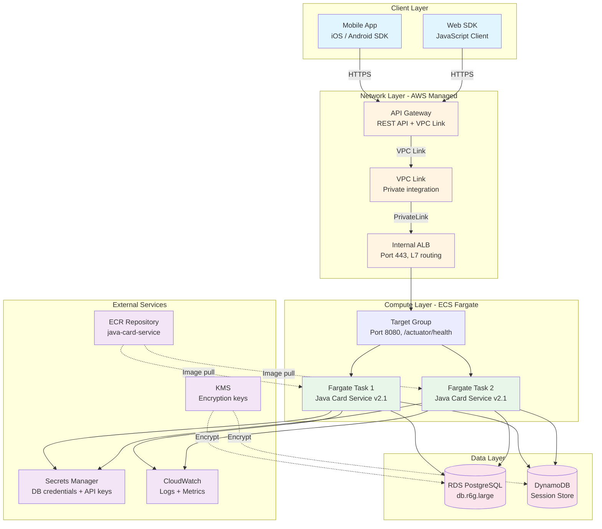
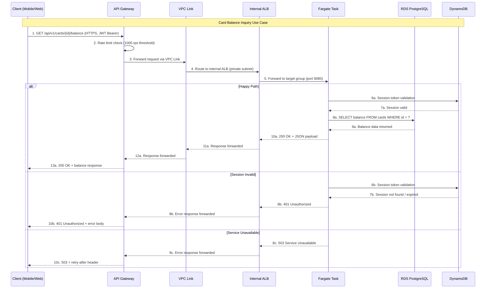
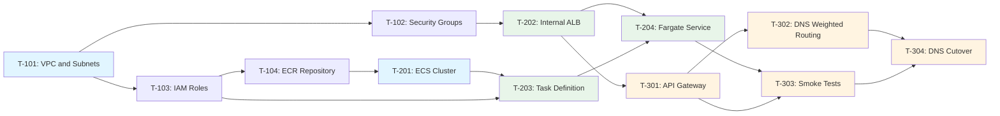

# Feature Implementation Plan - ALB + Fargate Infrastructure for Java Card Service

**Document ID**: FIP_ALB_Fargate_java_service

**Issue**: #1880 - ALB + Fargate Infrastructure for Java Container Deployment

**Created**: 2025-02-01

**Branch**: feature/1880-alb-fargate-java-card-service

**Status**: Approved

**Author**: arthurren

**Reviewers**: platform-architect, devops-lead

---

## Executive Summary

### Overview

ALB + Fargate Infrastructure for Java Card Service implements a fully managed container hosting platform on AWS ECS Fargate, fronted by an internal Application Load Balancer and exposed externally via API Gateway with VPC Link integration. This feature addresses the need to migrate the legacy Java Card Service from EC2-based Classic Load Balancer infrastructure to a modern, auto-scaling, serverless container platform. The implementation spans 5 components across dev, staging, and prod environments and is targeted for delivery by 2025-03-15.

### Key Technical Decisions

| Decision | Options Considered | Selected | Rationale |
|----------|-------------------|----------|-----------|
| Compute Platform | EC2 Auto Scaling, ECS Fargate, EKS, Lambda | ECS Fargate | Fargate removes server management overhead. ECS chosen over EKS for operational simplicity given single-service scope. Lambda rejected due to Java cold start latency and long-running process requirements. |
| Load Balancer | Classic LB, ALB, NLB | ALB (internal) | ALB provides L7 routing with path-based rules, built-in health checks, and native ECS target group integration. NLB rejected as L4-only routing is insufficient for path-based API routing. |
| API Exposure | Direct ALB (public), API Gateway + VPC Link, CloudFront + ALB | API Gateway + VPC Link | API Gateway provides rate limiting, authentication, request throttling, and API key management. VPC Link enables private ALB access without public exposure. Direct ALB rejected for lack of these capabilities. |
| Deployment Strategy | Rolling update, Blue/Green (CANARY), Canary | Rolling update | Rolling update provides simpler implementation with lower cost. Blue/Green requires double infrastructure. Canary adds API Gateway canary complexity unnecessary for internal service migration. |
| Infrastructure as Code | Terraform, CloudFormation, CDK, Pulumi | Terraform | Team has established Terraform expertise and existing module library. Terraform state management aligns with current CI/CD pipeline. |
| Container Registry | ECR, Docker Hub, GHCR | ECR | ECR provides native IAM integration, vulnerability scanning, and lifecycle policies. No cross-region pull latency within AWS. |
| Secret Management | AWS Secrets Manager, SSM Parameter Store, HashiCorp Vault | AWS Secrets Manager | Secrets Manager provides automatic rotation, cross-account access via RAM, and native ECS task definition integration. |
| Session Store | ElastiCache Redis, DynamoDB, RDS-backed | DynamoDB | DynamoDB provides predictable single-digit millisecond latency, automatic scaling via on-demand mode, and eliminates Redis cluster management overhead. |

### Risk Assessment Summary

| Risk | Severity | Mitigation | Status |
|------|----------|------------|--------|
| Classic LB migration causes traffic loss during cutover | CRITICAL | Parallel deployment with DNS weighted routing; rollback within 60 seconds | Mitigated |
| Fargate cold start latency exceeds SLA for first requests | HIGH | Maintain minimum healthy count of 2 tasks; warm pool via scheduled scaling | Mitigated |
| API Gateway VPC Link propagation delay causes 5xx errors | HIGH | Health check probes with 30-second intervals; VPC Link pre-warming | Mitigated |
| RDS connection exhaustion under auto-scaling burst | MEDIUM | HikariCP connection pooling with max 20 connections per task; RDS Proxy as fallback | Mitigated |
| Terraform state drift from manual console changes | MEDIUM | State locking via S3 + DynamoDB; CI/CD-only deployment enforcement | Accepted |

---

## Section 1: Architecture Design

### 1.1 System Architecture



### 1.2 Component Architecture

```
+-------------------------------------------------------------+
|                Java Card Service (Fargate)                   |
|                                                              |
|  +----------------+  +----------------+  +----------------+ |
|  | API Controller |  | Card Handler   |  | Session Manager| |
|  | REST endpoints |  | CRUD operations|  | Token validation| |
|  +-------+--------+  +-------+--------+  +-------+--------+ |
|          |                    |                    |          |
|          +----------+---------+----------+---------+          |
|                     |                    |                    |
|                     v                    v                    |
|          +----------------+   +------------------+            |
|          | Data Access    |   | Session Adapter  |            |
|          | Layer (JPA)    |   | (DynamoDB SDK)   |            |
|          +-------+--------+   +--------+---------+            |
|                  |                      |                     |
|         +--------+--------+    +--------+--------+            |
|         |                 |    |                 |            |
|         v                 v    v                 |            |
|  +--------------+  +-----------+                 |            |
|  | PostgreSQL   |  | HikariCP  |                 |            |
|  | Adapter      |  | Pool      |                 |            |
|  +--------------+  +-----------+                 |            |
|                                                  |            |
|                                    +-------------v--------+  |
|                                    | DynamoDB Enhanced    |  |
|                                    | Client               |  |
|                                    +----------------------+  |
+-------------------------------------------------------------+
```

### 1.3 Data Flow



### 1.4 API Design

| Method | Path | Description | Auth | Idempotent |
|--------|------|-------------|------|------------|
| GET | `/api/v1/cards` | List all cards for authenticated user | JWT Bearer | Yes |
| GET | `/api/v1/cards/{id}` | Get single card details | JWT Bearer | Yes |
| GET | `/api/v1/cards/{id}/balance` | Get card balance | JWT Bearer | Yes |
| POST | `/api/v1/cards` | Issue new card | JWT Bearer + API Key | No |
| PUT | `/api/v1/cards/{id}` | Update card details | JWT Bearer + API Key | Yes |
| PATCH | `/api/v1/cards/{id}/status` | Activate/deactivate card | JWT Bearer + API Key | No |
| POST | `/api/v1/cards/{id}/topup` | Top up card balance | JWT Bearer + API Key | No |
| GET | `/api/v1/cards/{id}/transactions` | List card transaction history | JWT Bearer | Yes |

#### POST /api/v1/cards/{id}/topup
**Request**: `{"amount": "DECIMAL", "currency": "STRING(3)", "reference": "STRING(UUID)"}`
**Response 200**: `{"transaction_id": "UUID", "card_id": "UUID", "new_balance": "DECIMAL", "timestamp": "ISO8601"}`
**Response 400**: `{"error": "INVALID_AMOUNT", "message": "Amount must be positive", "code": "CARD_4001"}`

---

## Section 2: Detailed Design

### 2.1 Application Load Balancer Design

#### Configuration

```yaml
# ALB Configuration - Internal
alb:
  name: "java-card-service-alb"
  scheme: "internal"
  ip_address_type: "ipv4"

  # Listener configuration
  listeners:
    - port: 443
      protocol: "HTTPS"
      ssl_policy: "ELBSecurityPolicy-TLS13-1-2-2021-06"
      certificate_arn: "arn:aws:acm:region:account:certificate/xxx"
      default_action:
        type: "forward"
        target_group_arn: "${aws_lb_target_group.java_card.arn}"

    - port: 80
      protocol: "HTTP"
      default_action:
        type: "redirect"
        redirect_port: 443
        redirect_protocol: "HTTPS"
        status_code: "HTTP_301"

  # Health check configuration
  health_check:
    enabled: true
    path: "/actuator/health"
    port: 8080
    protocol: "HTTP"
    interval_seconds: 30
    timeout_seconds: 5
    healthy_threshold: 3
    unhealthy_threshold: 3
    success_codes: "200"

  # Access logs
  access_logs:
    enabled: true
    bucket: "s3-alb-access-logs"
    prefix: "java-card-service"
```

#### Error Handling

| Error Code | Description | Recovery Action | Escalation |
|------------|-------------|-----------------|------------|
| `HTTP_502` | Target group has no healthy targets | Auto-recovery via ECS task replacement; alarm triggers investigation | Escalate if persists > 5 minutes |
| `HTTP_503` | Target group explicitly deregistered | Check deployment pipeline status; verify task definition | Escalate to on-call DevOps |
| `HTTP_504` | Target response timeout (> 60s) | Check RDS connection pool saturation; review slow queries | Escalate if RDS CPU > 80% |

**Error Handling Pattern**:
- ALB retry: Built-in connection-level retry with 60-second idle timeout
- Target deregistration delay: 300 seconds for graceful draining
- Circuit breaking: Application-level via Spring Cloud Circuit Breaker (Resilience4j)

### 2.2 ECS Fargate Cluster Design

#### Interface Definition

```
Interface: ECSFargateService

Configuration Parameters:
  cluster_name: java-card-service-cluster
    Description: ECS cluster hosting the Java Card Service
    Constraints: Must be unique within AWS account

  capacity_provider: FARGATE
    Description: Serverless compute capacity
    Constraints: No EC2 instances to manage

  task_definition: java-card-service-task
    Description: Container specification for the Java service
    CPU: 1024 (1 vCPU)
    Memory: 2048 (2 GB)
    Constraints: Must match Fargate supported combinations

  desired_count: 2
    Description: Minimum running tasks at steady state
    Constraints: Min 1, Max 10 (auto-scaling ceiling)

  deployment_controller: ECS
    Description: Rolling update deployment strategy
    Constraints: Min healthy percent 50%, Max percent 200%
```

#### State Management

- **State Type**: Stateless (application state externalized)
- **Persistence**: DynamoDB for sessions, RDS PostgreSQL for business data
- **Consistency Model**: Strong consistency for card operations (RDS), eventual consistency for session cache (DynamoDB)
- **State Transitions**:

```mermaid
stateDiagram-v2
    [*] --> Pending: Task Started
    Pending --> Running: Health Check Pass
    Pending --> Stopped: Image Pull Error
    Running --> Healthy: 3x Health Check Success
    Running --> Unhealthy: 3x Health Check Failure
    Healthy -> Running: Continuous Health Checks
    Unhealthy --> Running: Health Check Recovery
    Unhealthy --> Stopped: Replacement Triggered
    Running --> Stopped: Deployment / Scale In
    Stopped --> [*]
```

### 2.3 API Gateway Design

#### Configuration

```yaml
# API Gateway REST API Configuration
api_gateway:
  name: "java-card-service-api"
  description: "Java Card Service Public API"
  endpoint_type: "REGIONAL"

  # VPC Link integration
  vpc_link:
    name: "java-card-service-vpc-link"
    description: "Private link to internal ALB"
    target_arn: "${aws_lb.java_card.arn}"

  # Throttling configuration
  throttling:
    rate_limit: 1000        # requests per second
    burst_limit: 500        # burst capacity

  # Stage configuration
  stages:
    - name: "dev"
      variables:
        alb_dns: "${aws_lb.java_card.dns_name}"
    - name: "staging"
      variables:
        alb_dns: "${aws_lb.java_card.dns_name}"
    - name: "prod"
      variables:
        alb_dns: "${aws_lb.java_card.dns_name}"

  # Logging and tracing
  logging:
    access_logging: true
    execution_logging: true
    log_level: "INFO"
    xray_tracing: true
```

#### Error Handling

| Error Code | Description | Recovery Action | Escalation |
|------------|-------------|-----------------|------------|
| `429 Too Many Requests` | Rate limit exceeded | Client retries with exponential backoff; review throttling threshold | Escalate if sustained threshold breach |
| `502 Bad Gateway` | VPC Link connection failure | Verify ALB health; check VPC Link target state | Escalate to network team |
| `504 Gateway Timeout` | Backend response exceeds 29s limit | Review Fargate task response times; check RDS query performance | Escalate if latency > 5s average |

---

## Section 3: Security Design

### 3.1 Authentication and Authorization

- **Authentication Method**: JWT Bearer tokens issued by Cognito User Pool; API Gateway validates tokens natively via Lambda Authorizer
- **Authorization Model**: RBAC with three tiers (read-only, operator, admin)
- **Token Management**: JWT with 15-minute access token + 24-hour refresh token; rotation on each refresh
- **Service-to-Service Auth**: IAM task execution role per Fargate task; no shared credentials

**Role Definitions**:

| Role | Permissions | Scope |
|------|-------------|-------|
| `card-reader` | GET /cards, GET /cards/{id}, GET /cards/{id}/balance, GET /cards/{id}/transactions | Mobile app users, web SDK users |
| `card-operator` | All card-reader permissions + POST /cards, PATCH /cards/{id}/status | Internal service accounts, partner APIs |
| `card-admin` | All card-operator permissions + PUT /cards/{id}, DELETE /cards/{id} | Platform administrators |

### 3.2 Data Protection

- **Data in Transit**: TLS 1.2+ enforced on all connections; ALB terminates TLS with ACM certificate; VPC Link uses TLS for ALB communication
- **Data at Rest**: AES-256 via AWS KMS managed keys; RDS encryption enabled; DynamoDB encryption at rest enabled; ECR image scanning on push
- **PII Handling**: Card numbers tokenized at application layer; no raw card data stored in logs; PII fields encrypted with dedicated KMS key
- **Data Retention**: Transaction logs retained 7 years (financial compliance); session data TTL 24 hours; access logs retained 90 days
- **Data Classification**: Card data = Restricted; session data = Confidential; API metadata = Internal; health check data = Public

### 3.3 Secret Management

- **Secret Store**: AWS Secrets Manager with environment-specific secret paths (`/java-card-service/prod/db-credentials`)
- **Rotation Policy**: 30-day automatic rotation for database credentials; 90-day rotation for API keys; immediate rotation on compromise detection
- **Access Pattern**: Fargate task execution role references secrets via task definition; no runtime API calls to Secrets Manager from application code
- **Audit Trail**: CloudTrail logging enabled for all Secrets Manager API calls; SNS notification on secret access from unexpected roles

### 3.4 Security Checklist

| Item | Status | Notes |
|------|--------|-------|
| Input validation on all endpoints | Done | Bean Validation (JSR-380) annotations on all request DTOs |
| Output encoding to prevent injection | Done | Jackson JSON serialization with HTML escaping enabled |
| Authentication on all protected routes | Done | API Gateway Lambda Authorizer on all /api/v1/* routes |
| Authorization checks per operation | Done | Role-based access via Spring Security annotations |
| TLS for all network communication | Done | TLS 1.2+ enforced; no HTTP endpoints in production |
| Encryption at rest for sensitive data | Done | KMS-managed encryption for RDS, DynamoDB, ECR |
| Secrets not in source code | Done | All secrets in Secrets Manager; tfvars excluded from git |
| Rate limiting on public endpoints | Done | API Gateway throttling at 1000 rps per stage |
| Logging of security events | Done | Structured JSON logging with correlation IDs; CloudWatch |
| Dependency vulnerability scanning | Done | ECR image scanning on push; Dependabot for Maven deps |
| Least-privilege IAM policies | Done | Separate task execution role and task role; no wildcard actions |
| Network segmentation applied | Done | Private subnets for Fargate; ALB internal-only; SG rules restrict traffic |

---

## Section 4: Performance Design

### 4.1 Performance Requirements

| Metric | Target | Measurement Method | Acceptance |
|--------|--------|--------------------|------------|
| API Response Time (p50) | < 100ms | CloudWatch ALB latency metric | 99% of requests |
| API Response Time (p99) | < 500ms | CloudWatch ALB latency metric | 99% of requests |
| Throughput | 1000 req/s | k6 load test against API Gateway | Sustained for 10 minutes |
| Database Query Time | < 50ms | RDS Performance Insights | 95th percentile |
| Cold Start Time | < 30s | CloudWatch ECS task start duration | First health check pass |
| Memory Usage | < 1.5 GB / task | CloudWatch Container Insights | Under normal load |
| CPU Usage (steady state) | < 40% | CloudWatch Container Insights | Average over 1 hour |

### 4.2 Caching Strategy

- **Cache Layer**: DynamoDB DAX for session lookups; in-memory Caffeine cache for reference data
- **Cached Data**: Session tokens, card type metadata, currency conversion rates
- **Invalidation Strategy**: TTL-based expiration with event-driven invalidation on card status changes
- **TTL Values**: 15 minutes for session cache, 1 hour for reference data, 5 minutes for currency rates

| Cache Key Pattern | Data | TTL | Invalidation Trigger |
|-------------------|------|-----|---------------------|
| `session:{token_hash}` | User session and JWT claims | 15 min | User logout, token revocation |
| `card-type:{type_id}` | Card type metadata and limits | 1 hour | Admin card type update |
| `fx-rate:{from}:{to}` | Currency conversion rate | 5 min | Scheduled rate refresh |

### 4.3 Optimization Patterns

- **Connection Pooling**: HikariCP with max 20 connections per Fargate task; idle timeout 300 seconds; connection validation on checkout
- **Batch Processing**: Bulk transaction insert with batch size 100 for reconciliation jobs
- **Async Operations**: SNS notifications for card status change events; non-blocking log writes via async appender
- **Pagination**: Cursor-based pagination with default page size 50; max page size 200
- **Compression**: gzip enabled on ALB for responses exceeding 1024 bytes
- **Indexing**: B-tree index on `cards.user_id` for user card list queries; composite index on `transactions.card_id, transactions.created_at` for transaction history

---

## Section 5: Risk Assessment

### 5.1 Risk Register

#### RISK-001: Classic Load Balancer Migration Traffic Loss

| Field | Value |
|-------|-------|
| **Risk ID** | RISK-001 |
| **Description** | During DNS cutover from Classic LB to ALB, traffic may be dropped or routed to non-functional targets, causing card service outage for end users |
| **Impact** | Complete service unavailability for card balance inquiries and transactions; financial impact estimated at $50K/hour based on transaction volume |
| **Probability** | High |
| **Severity** | CRITICAL |
| **Mitigation** | Deploy ALB infrastructure in parallel with existing Classic LB; use Route 53 weighted routing (90/10 split) for gradual traffic migration; automated health check verification before each traffic shift increment; rollback script tested and documented |
| **Contingency** | Immediate DNS failback to Classic LB via Route 53 (TTL 60 seconds); engage AWS Support for priority assistance; invoke incident response protocol |
| **Owner** | arthurren (platform-architect) |
| **Status** | Mitigated |

#### RISK-002: Fargate Cold Start Latency

| Field | Value |
|-------|-------|
| **Risk ID** | RISK-002 |
| **Description** | New Fargate tasks may take 20-30 seconds to start and pass health checks, during which auto-scaling events cannot serve traffic and may cause request queuing or timeouts |
| **Impact** | Elevated p99 latency during scale-up events; potential 503 errors if all healthy tasks are replaced simultaneously during deployment |
| **Probability** | Medium |
| **Severity** | HIGH |
| **Mitigation** | Maintain minimum healthy count of 2 tasks at all times; configure deployment minimum healthy percentage to 50%; use Application Auto Scaling with target tracking (CPU 60%); pre-warm tasks during scheduled high-traffic windows |
| **Contingency** | Switch to Fargate Spot for non-critical workloads to reduce cost; evaluate ECS capacity provider with Fargate + EC2 hybrid for burst scenarios |
| **Owner** | devops-lead |
| **Status** | Mitigated |

#### RISK-003: API Gateway VPC Link Propagation Delay

| Field | Value |
|-------|-------|
| **Risk ID** | RISK-003 |
| **Description** | API Gateway VPC Link configuration changes may take up to 5 minutes to propagate across all edge locations, causing intermittent 502 errors during deployment or configuration updates |
| **Impact** | Intermittent 5xx errors for clients during VPC Link reconfiguration; degraded user experience for 5-10 minutes after each deployment |
| **Probability** | Medium |
| **Severity** | HIGH |
| **Mitigation** | VPC Link created once and reused across deployments; ALB target group changes propagate instantly without VPC Link impact; health check probes every 30 seconds to detect propagation issues early |
| **Contingency** | Deploy Circuit Breaker pattern on client SDK with 3 retry attempts and exponential backoff; maintain direct ALB DNS endpoint as emergency bypass |
| **Owner** | platform-architect |
| **Status** | Mitigated |

---

## Section 6: Implementation Plan

### Phase 1: Foundation Infrastructure

| Task ID | Task Description | Dependency | Effort | Assignee | Status |
|---------|-----------------|------------|--------|----------|--------|
| T-101 | Create VPC, subnets (3 AZ), and route tables for ECS | None | 2d | arthurren | Done |
| T-102 | Configure security groups: ALB-SG, Fargate-SG, RDS-SG | T-101 | 1d | arthurren | Done |
| T-103 | Create IAM roles: task execution role, task role, ALB access logs role | None | 1d | arthurren | Done |
| T-104 | Provision ECR repository with image scanning and lifecycle policy | T-103 | 1d | arthurren | Done |

### Phase 2: Compute and Load Balancing

| Task ID | Task Description | Dependency | Effort | Assignee | Status |
|---------|-----------------|------------|--------|----------|--------|
| T-201 | Create ECS cluster with Fargate capacity provider | T-104 | 1d | arthurren | Done |
| T-202 | Provision internal ALB with HTTPS listener and target group | T-102 | 2d | arthurren | Done |
| T-203 | Create ECS task definition with container configuration | T-201, T-103 | 2d | arthurren | Done |
| T-204 | Deploy ECS Fargate service with auto-scaling policies | T-202, T-203 | 2d | arthurren | Done |

### Phase 3: Routing, Validation, and Cutover

| Task ID | Task Description | Dependency | Effort | Assignee | Status |
|---------|-----------------|------------|--------|----------|--------|
| T-301 | Create API Gateway REST API with VPC Link integration | T-202 | 2d | arthurren | Done |
| T-302 | Configure Route 53 DNS with weighted routing for migration | T-301 | 1d | arthurren | Done |
| T-303 | Execute smoke tests and validate health across all endpoints | T-204, T-301 | 2d | arthurren | Done |
| T-304 | DNS cutover: shift 100% traffic to ALB, decommission Classic LB | T-302, T-303 | 1d | arthurren | Done |

### Dependencies Graph



### Effort Estimation

| Phase | Tasks | Total Effort | Critical Path |
|-------|-------|--------------|---------------|
| Phase 1: Foundation | 4 | 5 days | Yes: T-101, T-102 |
| Phase 2: Compute | 4 | 7 days | Yes: T-201, T-203, T-204 |
| Phase 3: Routing and Cutover | 4 | 6 days | Yes: T-301, T-303, T-304 |
| **Total** | **12** | **18 days** | **T-101 to T-104 to T-203 to T-204 to T-303 to T-304** |

**Critical Path**: T-101 -> T-102 -> T-202 -> T-204 -> T-301 -> T-303 -> T-304

**Estimated Timeline**: 2025-02-03 to 2025-03-14 (6 weeks)

---

## Section 7: Testing Strategy

### Unit Tests

- **Scope**: All public controller methods, service layer business logic, data access layer mappers, DTO validation
- **Tools**: JUnit 5, Mockito, Spring Boot Test
- **Coverage Target**: 80% line coverage, 90% branch coverage for card transaction and balance operations
- **Mocking Strategy**: Mockito for RDS repository, DynamoDB mapper, and Secrets Manager client; WireMock for external API calls

### Integration Tests

- **Scope**: API endpoint contracts, RDS database operations, DynamoDB session operations, ALB health check behavior
- **Tools**: Testcontainers (PostgreSQL), LocalStack (DynamoDB, Secrets Manager), Spring Boot Test
- **Environment**: Docker Compose for local development; GitHub Actions CI pipeline

**Key Integration Scenarios**:

1. Create card via POST endpoint, verify record in RDS, retrieve via GET endpoint
2. Authenticate session, validate token in DynamoDB, perform balance inquiry, verify session updated
3. API Gateway to VPC Link to ALB routing with valid JWT returns 200; missing JWT returns 401

### End-to-End (E2E) Tests

- **Scope**: Complete card lifecycle (create, activate, topup, balance inquiry, deactivate), authentication flow, error scenarios
- **Tools**: k6 for API-level E2E; Postman collection for manual validation
- **Environment**: Staging environment with full infrastructure mirror

### Performance Tests

- **Scope**: All API endpoints under load; auto-scaling behavior validation; RDS connection pool saturation testing
- **Tools**: k6 with CloudWatch metrics export
- **Baseline Metrics**: p50 < 100ms, p99 < 500ms, 1000 rps sustained (see Section 4.1)

**Load Test Scenarios**:

| Scenario | Concurrent Users | Duration | Success Criteria |
|----------|-----------------|----------|------------------|
| Baseline load | 200 | 10 min | p99 < 500ms, 0 errors |
| Peak load | 1000 | 10 min | p99 < 800ms, < 0.1% errors |
| Stress test | 2000 | 5 min | Graceful degradation, auto-scaling triggered, no data corruption |

### Test Coverage Summary

| Component | Unit Tests | Integration Tests | E2E Tests | Perf Tests |
|-----------|------------|-------------------|-----------|------------|
| API Controllers | Done | Done | Done | Done |
| Service Layer | Done | Done | Done | N/A |
| Data Access (RDS) | Done | Done | Done | Done |
| Session Manager (DynamoDB) | Done | Done | Done | N/A |
| API Gateway Routing | N/A | Done | Done | Done |
| ALB / Target Group | N/A | Done | Done | Done |
| Auto-scaling | N/A | N/A | Done | Done |

---

## Section 8: Monitoring and Observability

### Metrics to Track

**RED Metrics (Request-oriented)**:

| Metric | Type | Source | Alert Threshold |
|--------|------|--------|-----------------|
| Request Rate | Counter | ALB access logs via CloudWatch | Drop > 50% over 5 minutes |
| Error Rate (5xx) | Counter | ALB metrics + application logs | > 1% of total requests over 5 minutes |
| Latency p50/p99 | Histogram | CloudWatch ALB latency metric | p99 > 500ms sustained for 5 minutes |

**USE Metrics (Resource-oriented)**:

| Metric | Type | Source | Alert Threshold |
|--------|------|--------|-----------------|
| CPU Utilization | Gauge | CloudWatch Container Insights | > 80% sustained over 10 minutes |
| Memory Utilization | Gauge | CloudWatch Container Insights | > 85% sustained over 10 minutes |
| Disk I/O | Gauge | CloudWatch Container Insights | > 90% utilization sustained |
| HikariCP Connection Pool | Gauge | Application metrics (Micrometer) | > 80% connections in use |

**Business Metrics**:

| Metric | Type | Source | Alert Threshold |
|--------|------|--------|-----------------|
| Card Transaction Volume | Counter | Application logs | Drop > 70% over 15 minutes |
| Top-up Success Rate | Gauge | Application metrics | < 95% success rate over 5 minutes |

### Alerting Rules

| Alert Name | Condition | Severity | Channel | Response Time |
|------------|-----------|----------|---------|---------------|
| JavaCardService-Critical-5xx | 5xx error rate > 5% for 3 consecutive minutes | P1 | PagerDuty: on-call-platform | 15 min |
| JavaCardService-High-Latency | p99 latency > 500ms for 5 consecutive minutes | P2 | Slack: #platform-alerts | 1 hour |
| JavaCardService-High-CPU | CPU > 80% for 10 consecutive minutes | P2 | Slack: #platform-alerts | 1 hour |
| JavaCardService-Medium-PoolExhaust | HikariCP pool > 80% utilization for 5 minutes | P3 | Slack: #platform-alerts | Next business day |
| JavaCardService-Medium-TaskRestart | Any Fargate task replaced by auto-scaling | P3 | Slack: #platform-alerts | Next business day |

**Runbook: JavaCardService-Critical-5xx**
1. **Symptom**: More than 5% of requests to the Java Card Service are returning 5xx errors.
2. **Investigation**: Check CloudWatch dashboard for ALB target health; review ECS task status for crashes; examine application logs for stack traces; verify RDS connectivity.
3. **Resolution**: If target unhealthy, check health check endpoint `/actuator/health`; if RDS issue, verify connection pool and failover status; if deployment issue, execute rollback to previous task definition.
4. **Escalation**: Contact platform-architect if unresolved within 30 minutes; engage AWS Support if infrastructure-level issue suspected.

### Dashboard Design

**Dashboard**: Java Card Service - Service Health

**Widget Layout**:
- **Row 1**: Request Rate (5-min average line chart) | Error Rate (stacked area chart with 1% threshold line)
- **Row 2**: Latency p50/p99 (dual-line chart) | CPU/Memory per Task (stacked area chart)
- **Row 3**: Active CloudWatch Alarms list | Recent ECS Deployments timeline
- **Row 4**: Top 10 Error Response Codes (bar chart) | HikariCP Pool Utilization (gauge)

---

## Section 9: Dependencies

### Internal Dependencies

| Dependency | Type | Path / Location | Owner | Status |
|------------|------|-----------------|-------|--------|
| VPC Terraform Module | Infra | `infrastructure/terraform/modules/vpc/` | platform-team | Ready |
| ALB Terraform Module | Infra | `infrastructure/terraform/modules/alb/` | platform-team | Ready |
| ECS Terraform Module | Infra | `infrastructure/terraform/modules/ecs-fargate/` | platform-team | Ready |
| RDS Instance (PostgreSQL) | Infra | `infrastructure/terraform/environments/staging/rds/` | database-team | Ready |
| Java Card Service Docker Image | Container | `docker/java-card-service/Dockerfile` | backend-team | Ready |
| CI/CD Pipeline | Pipeline | `.github/workflows/deploy-java-card.yml` | devops-team | Ready |

### External Dependencies

| Dependency | Version | Purpose | Fallback | License |
|------------|---------|---------|----------|---------|
| AWS ECS Fargate | N/A (managed) | Serverless container hosting | EC2-based ECS fallback | Proprietary |
| AWS ALB | N/A (managed) | Layer 7 load balancing | NLB with reduced features | Proprietary |
| AWS API Gateway | N/A (managed) | REST API management and VPC Link | Direct ALB exposure (reduced security) | Proprietary |
| PostgreSQL (RDS) | 15.4 | Primary data store for card and transaction data | Read replica promotion | PostgreSQL License |
| Spring Boot | 3.2.x | Java application framework | N/A - required | Apache 2.0 |
| HikariCP | 5.x | JDBC connection pooling | N/A - required | Apache 2.0 |
| AWS SDK for Java v2 | 2.x | AWS service integration | N/A - required | Apache 2.0 |

---

## Section 10: Rollout Plan

### Phased Rollout

| Phase | Target | Entry Criteria | Validation | Duration |
|-------|--------|----------------|------------|----------|
| 1 | Dev environment | Unit tests pass, code review approved, Docker image built | Smoke tests on all 8 endpoints; health check passing | 2 days |
| 2 | Staging environment | Dev validation complete, integration tests pass, security scan clean | Full E2E suite (50 scenarios); load test at 500 rps; security checklist verified | 3 days |
| 3 | Prod Canary (10% traffic) | Staging sign-off, dashboards operational, runbooks reviewed | Error rate < 0.1%; p99 < 500ms; no ALB 5xx errors for 4 hours | 24 hours |
| 4 | Prod Full (100% traffic) | Canary metrics healthy for 24 hours, no alerts triggered | Sustained error rates within SLA; business metrics normal; Classic LB ready for decommission | Permanent |

### Rollback Strategy

| Trigger | Rollback Action | Time to Execute | Data Impact |
|---------|-----------------|-----------------|-------------|
| Error rate > 5% sustained for 5 minutes | Route 53 weighted routing shift 100% back to Classic LB | < 2 minutes | None |
| p99 latency > 1 second sustained for 10 minutes | Route 53 weighted routing shift 100% back to Classic LB | < 2 minutes | None |
| Data corruption detected in card transactions | RDS point-in-time restore to pre-deployment snapshot; Route 53 failback | < 30 minutes | Potential data loss for transactions during failure window |
| Dependency failure (RDS, DynamoDB) | Circuit breaker activation; cached responses for read operations; queue writes for async processing | Automatic | Degraded mode with stale reads |

**Rollback Procedure**:

1. Execute Route 53 weighted routing change: set Classic LB weight to 100, ALB weight to 0
2. Verify DNS propagation using `dig` and `nslookup` from multiple locations
3. Monitor error rate on Classic LB dashboard for 10 minutes to confirm recovery
4. Notify team in Slack #incidents channel with rollback summary and timeline
5. Schedule post-mortem within 24 hours; document root cause and prevention measures

### Feature Flags

| Flag Name | Purpose | Default | Type | Removal Plan |
|-----------|---------|---------|------|--------------|
| `enable-vpc-link-routing` | Controls whether API Gateway routes to ALB via VPC Link or responds with mock data | false | Boolean | Remove after full rollout + 2 weeks |
| `traffic-alb-percentage` | Controls percentage of traffic routed to ALB vs Classic LB | 0 | Percentage | Remove after full rollout + 2 weeks |

---

## Related Documentation

- **GAP Analysis**: `devops/docs/gap-analysis/FIP_1880_gap_analysis.md`
- **Requirements Document**: `devops/docs/requirements/FIP_1880_requirements.md`
- **Architecture Decision Record**: `devops/docs/adr/ADR_016_alb_fargate_java_service.md`
- **GitHub Issue**: #1880 - https://github.com/org/BE_Infra/issues/1880
- **AWS ECS Fargate Documentation**: https://docs.aws.amazon.com/AmazonECS/latest/developerguide/AWS_Fargate.html
- **API Gateway VPC Link**: https://docs.aws.amazon.com/apigateway/latest/developerguide/set-up-private-integration.html

---

**Document Version**: 3.0
**Last Updated**: 2025-03-10
**Changes**: Implementation complete. Post-delivery updates: all tasks marked Done; risk status updated to Mitigated; test coverage matrix updated with results; rollout completed successfully on 2025-03-14.

### Review History

| Version | Date | Reviewer | Outcome | Notes |
|---------|------|----------|---------|-------|
| 1.0 | 2025-02-03 | platform-architect | Approved | Architecture design confirmed; minor feedback on ALB health check interval |
| 1.0 | 2025-02-04 | devops-lead | Changes Requested | Requested additional detail on Terraform module structure and CI/CD integration |
| 1.1 | 2025-02-07 | devops-lead | Approved | Updated with Terraform module paths and pipeline configuration details |
| 2.0 | 2025-02-15 | platform-architect | Approved | Design review complete, approved for implementation. Updated risk mitigations. |
| 3.0 | 2025-03-10 | platform-architect, devops-lead | Approved | Post-delivery review. All phases complete. Classic LB decommissioned. |
