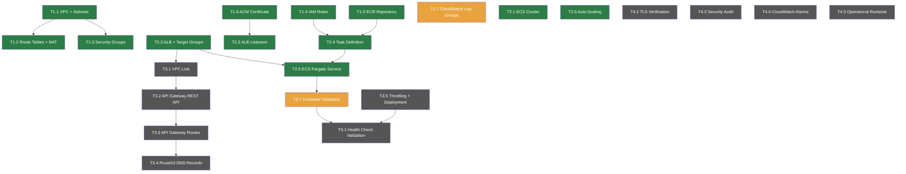

# ALB + Fargate Infrastructure for Java Card Service Task List

## Project Information

- **Project Name**: ALB + Fargate Infrastructure for Java Card Service
- **Branch**: feature/1880-alb-fargate-java-card-service
- **Issue**: #1880 - Provision ALB + Fargate Infrastructure for Java Container Deployment
- **Objective**: Deploy ECS Fargate cluster with ALB, API Gateway, and Route53 for the Java Card Service across dev/test/staging/prod environments
- **Priority**: High priority tasks executed first
- **Document ID**: TASK_LIST_1880_alb_fargate_java_service
- **Created**: 2025-02-05
- **Author**: arthurren
- **Reference Documents**:
  - DIP: `devops/docs/design/DIP_1880_alb_fargate_java_service.md`
  - Requirements: `devops/docs/requirements/FIP_1880_alb_fargate_java_service.md`

---

## Execution Rules

1. Execute tasks by priority (HIGH > MEDIUM > LOW) and dependency order
2. All phases must complete in order: Phase 1 -> Phase 2 -> Phase 3 -> Phase 4
3. Each task requires validation against acceptance criteria before marking as COMPLETED
4. Commit code after each task completion using conventional commit format
5. Mark task as BLOCKED immediately if encountering unresolvable issues and escalate within 4 hours to #devops-infra Slack channel
6. All infrastructure changes require `terraform plan` review before `terraform apply`
7. Deploy to environments in order: dev -> test -> staging -> prod

---

## Task Status Legend

- COMPLETED: Completed and validated
- IN_PROGRESS: Currently executing
- PENDING: Waiting to execute
- BLOCKED: Blocked, requires manual intervention
- CANCELLED: Cancelled or deprioritized

## Priority Legend

- HIGH: High priority, affects core functionality
- MEDIUM: Medium priority, important but not urgent
- LOW: Low priority, optimization and enhancement features

---

## Dependency Graph



---

## Phase 1: Network and Foundation Infrastructure

### Task 1.1: Create VPC with Public/Private Subnets Across 3 AZs
**Status**: COMPLETED
**Priority**: HIGH
**Estimated Time**: 1 day
**Completed**: 2025-02-06
**Description**: Provision a VPC (10.50.0.0/16) with 6 subnets across 3 availability zones (eu-central-1a, eu-central-1b, eu-central-1c). Public subnets for ALB and NAT Gateway placement. Private subnets for ECS tasks and database. Each subnet tagged with Name, Environment, and Service identifiers.

**Acceptance Criteria**:
- [x] VPC created with CIDR 10.50.0.0/16 and DNS hostnames enabled
- [x] 3 public subnets with auto-assign public IP enabled
- [x] 3 private subnets without public IP
- [x] All subnets span distinct availability zones
- [x] Subnet tagging follows naming convention: `{env}-card-{public|private}-{az}`

**Related Files**:
- `infrastructure/terraform/java-fargate-alb/modules/vpc/main.tf` (CREATE)
- `infrastructure/terraform/java-fargate-alb/modules/vpc/variables.tf` (CREATE)
- `infrastructure/terraform/java-fargate-alb/modules/vpc/outputs.tf` (CREATE)

**Commit Message**: `feat(vpc): create VPC with public/private subnets across 3 AZs`

**Dependencies**: None

---

### Task 1.2: Configure Route Tables, IGW, NAT Gateway
**Status**: COMPLETED
**Priority**: HIGH
**Estimated Time**: 1 day
**Completed**: 2025-02-07
**Description**: Attach Internet Gateway to the VPC for public subnet egress. Deploy NAT Gateway in each public AZ for private subnet outbound connectivity. Configure route tables so private subnets route 0.0.0.0/0 through NAT Gateway and public subnets route through Internet Gateway.

**Acceptance Criteria**:
- [x] Internet Gateway attached to VPC
- [x] NAT Gateway deployed in each public subnet (3 total)
- [x] Elastic IPs assigned to each NAT Gateway
- [x] Public route table routes 0.0.0.0/0 to IGW
- [x] Private route tables route 0.0.0.0/0 to respective NAT Gateway
- [x] Route table associations correct for all 6 subnets

**Related Files**:
- `infrastructure/terraform/java-fargate-alb/modules/vpc/routing.tf` (CREATE)
- `infrastructure/terraform/java-fargate-alb/modules/vpc/nat.tf` (CREATE)

**Commit Message**: `feat(networking): configure route tables, IGW, and NAT Gateways`

**Dependencies**: Task 1.1

---

### Task 1.3: Create Security Groups (ALB, ECS, DB)
**Status**: COMPLETED
**Priority**: HIGH
**Estimated Time**: 0.5 days
**Completed**: 2025-02-07
**Description**: Create three security groups with least-privilege ingress rules. ALB security group allows HTTPS (443) from corporate CIDR and API Gateway VPC Link. ECS security group allows traffic only from ALB security group on container port (8080). Database security group allows PostgreSQL (5432) only from ECS security group.

**Acceptance Criteria**:
- [x] ALB SG: ingress 443 from 10.0.0.0/8 and API Gateway VPC Link CIDR
- [x] ECS SG: ingress 8080 from ALB SG only (security group reference)
- [x] DB SG: ingress 5432 from ECS SG only (security group reference)
- [x] All SGs allow all egress (0.0.0.0/0)
- [x] Security group names follow `{env}-card-{component}-sg` convention

**Related Files**:
- `infrastructure/terraform/java-fargate-alb/modules/security-groups/main.tf` (CREATE)
- `infrastructure/terraform/java-fargate-alb/modules/security-groups/variables.tf` (CREATE)

**Commit Message**: `feat(security): create ALB, ECS, and DB security groups`

**Dependencies**: Task 1.1

---

### Task 1.4: Create IAM Roles (Task Execution, Task Role, CI/CD)
**Status**: COMPLETED
**Priority**: HIGH
**Estimated Time**: 1 day
**Completed**: 2025-02-08
**Description**: Create IAM roles required for ECS Fargate operations. Task execution role for ECR image pull and CloudWatch log writing. Task role for application-level AWS API calls (SSM Parameter Store, Secrets Manager). CI/CD role for GitHub Actions to assume for terraform deploy and ECR push.

**Acceptance Criteria**:
- [x] Task execution role with AmazonECSTaskExecutionRolePolicy
- [x] Task execution role allows ECR pull, CloudWatch Logs creation, Secrets Manager read
- [x] Task role with least-privilege policies for SSM and Secrets Manager
- [x] CI/CD role with trust policy for GitHub Actions OIDC
- [x] All roles tagged with Service=CardService, Environment variable

**Related Files**:
- `infrastructure/terraform/java-fargate-alb/modules/iam/main.tf` (CREATE)
- `infrastructure/terraform/java-fargate-alb/modules/iam/policies.tf` (CREATE)

**Commit Message**: `feat(iam): create ECS task execution, task, and CI/CD roles`

**Dependencies**: None

---

### Task 1.5: Create ECR Repository with Lifecycle Policy
**Status**: COMPLETED
**Priority**: HIGH
**Estimated Time**: 0.5 days
**Completed**: 2025-02-08
**Description**: Create an ECR repository for the Java Card Service container images. Configure lifecycle policy to retain the last 10 tagged images and expire untagged images after 7 days. Enable image scanning on push for vulnerability detection.

**Acceptance Criteria**:
- [x] ECR repository created with name `card-service`
- [x] Lifecycle policy retains last 10 tagged images
- [x] Untagged images expire after 7 days
- [x] Image scanning on push enabled
- [x] Repository policy allows CI/CD role push access

**Related Files**:
- `infrastructure/terraform/java-fargate-alb/modules/ecr/main.tf` (CREATE)
- `infrastructure/terraform/java-fargate-alb/modules/ecr/lifecycle-policy.json` (CREATE)

**Commit Message**: `feat(ecr): create ECR repository with lifecycle and scan policies`

**Dependencies**: None

---

### Task 1.6: Configure ACM Certificate with DNS Validation
**Status**: COMPLETED
**Priority**: HIGH
**Estimated Time**: 0.5 days
**Completed**: 2025-02-09
**Description**: Request an ACM TLS certificate for `card-service.dev.malai.cloud` (and environment-specific SANs). Configure DNS validation records in Route53. The certificate must be issued and validated before the ALB HTTPS listener can reference it.

**Acceptance Criteria**:
- [x] ACM certificate requested for `card-service.{env}.malai.cloud`
- [x] SAN includes wildcard `*.card-service.{env}.malai.cloud`
- [x] DNS validation CNAME records created in Route53
- [x] Certificate status is ISSUED
- [x] Certificate renewal set to automatic

**Related Files**:
- `infrastructure/terraform/java-fargate-alb/modules/acm/main.tf` (CREATE)
- `infrastructure/terraform/java-fargate-alb/modules/acm/dns-validation.tf` (CREATE)

**Commit Message**: `feat(acm): provision TLS certificate with DNS validation`

**Dependencies**: None

---

### Task 1.7: Create CloudWatch Log Groups
**Status**: IN_PROGRESS
**Priority**: MEDIUM
**Estimated Time**: 0.5 days
**Description**: Create CloudWatch log groups for ECS task container logs. Configure retention period of 30 days for dev/test and 90 days for staging/prod. Set up log stream prefix matching the task definition family name.

**Acceptance Criteria**:
- [ ] Log group `/ecs/card-service` created with correct retention
- [ ] Retention: 30 days (dev/test), 90 days (staging/prod)
- [ ] Log group tagged with Service and Environment
- [ ] IAM task execution role has logs:CreateLogStream and logs:PutLogEvents

**Related Files**:
- `infrastructure/terraform/java-fargate-alb/modules/cloudwatch/main.tf` (CREATE)
- `infrastructure/terraform/java-fargate-alb/modules/cloudwatch/variables.tf` (CREATE)

**Commit Message**: `feat(logs): create CloudWatch log groups with retention policies`

**Dependencies**: Task 1.4

---

### Phase 1 Checkpoint

**Validation Criteria**:
- [x] VPC and subnets provisioned across 3 AZs
- [x] Routing and NAT Gateways operational
- [x] Security groups enforce least-privilege access
- [x] IAM roles created with minimum required permissions
- [x] ECR repository active with lifecycle policy
- [x] ACM certificate issued and validated
- [ ] CloudWatch log groups pending retention configuration

**Risk Review Questions**:
1. Are all VPC resources created without errors? YES
2. Are NAT Gateways in healthy state? YES
3. Is the ACM certificate in ISSUED status? YES
4. Can we proceed to Phase 2? YES (T1.7 can complete in parallel)

---

## Phase 2: Compute Layer

### Task 2.1: Create ECS Cluster with Fargate Capacity Provider
**Status**: COMPLETED
**Priority**: HIGH
**Estimated Time**: 0.5 days
**Completed**: 2025-02-10
**Description**: Create an ECS cluster named `card-service-{env}` with Fargate as the default capacity provider. Enable Fargate Spot for non-production environments to reduce cost. Configure cluster setting to use CloudWatch Container Insights for enhanced observability.

**Acceptance Criteria**:
- [x] ECS cluster created with Fargate capacity provider
- [x] Default capacity provider set to FARGATE for prod, FARGATE_SPOT for dev/test/staging
- [x] Container Insights enabled
- [x] Cluster tagged with Service=CardService

**Related Files**:
- `infrastructure/terraform/java-fargate-alb/modules/ecs/cluster.tf` (CREATE)

**Commit Message**: `feat(ecs): create Fargate cluster with capacity provider strategy`

**Dependencies**: None

---

### Task 2.2: Create ALB with Target Groups and Health Checks
**Status**: COMPLETED
**Priority**: HIGH
**Estimated Time**: 1 day
**Completed**: 2025-02-11
**Description**: Provision an Application Load Balancer in public subnets with a target group for the Java Card Service. The target group uses health check path `/actuator/health` on port 8080 with a 30-second interval and 3 healthy threshold count. The ALB is internet-facing to receive API Gateway VPC Link traffic.

**Acceptance Criteria**:
- [x] ALB provisioned in public subnets across 3 AZs
- [x] Target group configured with target type `ip` and protocol `HTTP`
- [x] Health check path set to `/actuator/health`
- [x] Health check interval: 30s, healthy threshold: 3, unhealthy threshold: 3
- [x] Deregistration delay set to 60 seconds
- [x] ALB security group applied (from T1.3)

**Related Files**:
- `infrastructure/terraform/java-fargate-alb/modules/alb/main.tf` (CREATE)
- `infrastructure/terraform/java-fargate-alb/modules/alb/target-groups.tf` (CREATE)
- `infrastructure/terraform/java-fargate-alb/modules/alb/variables.tf` (CREATE)

**Commit Message**: `feat(alb): create ALB with target group and health check config`

**Dependencies**: Task 1.1, Task 1.3

---

### Task 2.3: Create ALB Listeners (HTTPS on 443, HTTP Redirect on 80)
**Status**: COMPLETED
**Priority**: HIGH
**Estimated Time**: 0.5 days
**Completed**: 2025-02-11
**Description**: Create HTTPS listener on port 443 using the ACM certificate provisioned in T1.6, forwarding to the target group. Create HTTP listener on port 80 that redirects all traffic to HTTPS with a 301 status code. This enforces TLS for all incoming requests.

**Acceptance Criteria**:
- [x] HTTPS listener on port 443 with ACM certificate ARN
- [x] HTTPS listener forwards to card-service target group
- [x] HTTP listener on port 80 with redirect to HTTPS (301)
- [x] No plaintext traffic reaches the ECS tasks

**Related Files**:
- `infrastructure/terraform/java-fargate-alb/modules/alb/listeners.tf` (CREATE)

**Commit Message**: `feat(alb): add HTTPS listener with HTTP-to-HTTPS redirect`

**Dependencies**: Task 1.6, Task 2.2

---

### Task 2.4: Create ECS Task Definition (1 vCPU, 2GB, Java Container)
**Status**: COMPLETED
**Priority**: HIGH
**Estimated Time**: 1 day
**Completed**: 2025-02-12
**Description**: Define the ECS Fargate task with 1 vCPU and 2GB memory for the Java Card Service container. Configure the container to use the ECR image from T1.5, expose port 8080, and set JVM heap limits to 1536MB. Include log configuration pointing to the CloudWatch log group. Reference IAM roles from T1.4.

**Acceptance Criteria**:
- [x] Task definition with `FARGATE` network mode and `LINUX` OS family
- [x] CPU: 1024 (1 vCPU), Memory: 2048 (2 GB)
- [x] Container image references ECR repository URI
- [x] Container port mapping: 8080 (TCP)
- [x] JVM heap options: `-Xms768m -Xmx1536m`
- [x] Log configuration points to `/ecs/card-service` log group
- [x] Task execution role and task role attached from T1.4
- [x] Environment variables sourced from SSM Parameter Store

**Related Files**:
- `infrastructure/terraform/java-fargate-alb/modules/ecs/task-definition.tf` (CREATE)
- `infrastructure/terraform/java-fargate-alb/modules/ecs/container-definitions.json` (CREATE)

**Commit Message**: `feat(ecs): create task definition for Java Card Service container`

**Dependencies**: Task 1.4, Task 1.5

---

### Task 2.5: Create ECS Fargate Service with ALB Integration
**Status**: COMPLETED
**Priority**: HIGH
**Estimated Time**: 1 day
**Completed**: 2025-02-13
**Description**: Create the ECS Fargate service that launches tasks from the task definition in private subnets. Integrate with the ALB target group so that the service registers containers as targets automatically. Configure deployment circuit breaker with rollback enabled. Set desired count to 2 for high availability.

**Acceptance Criteria**:
- [x] ECS service created in private subnets with Fargate launch type
- [x] Service registers targets in ALB target group
- [x] Deployment circuit breaker enabled with rollback
- [x] Desired count: 2 (minimum for HA)
- [x] Health check grace period: 90 seconds
- [x] Service linked to ECS cluster from T2.1

**Related Files**:
- `infrastructure/terraform/java-fargate-alb/modules/ecs/service.tf` (CREATE)

**Commit Message**: `feat(ecs): create Fargate service with ALB integration and circuit breaker`

**Dependencies**: Task 2.2, Task 2.4

---

### Task 2.6: Configure Auto-Scaling Policies (CPU 60%, Memory 70%)
**Status**: COMPLETED
**Priority**: MEDIUM
**Estimated Time**: 0.5 days
**Completed**: 2025-02-14
**Description**: Configure ECS service auto-scaling using target tracking policies. Scale out when CPU utilization exceeds 60% or memory utilization exceeds 70%. Set minimum task count to 2 and maximum to 8 for production, 4 for non-production. Cooldown period of 300 seconds between scaling events.

**Acceptance Criteria**:
- [x] Auto-scaling target registered with min=2, max=8 (prod), max=4 (non-prod)
- [x] CPU target tracking policy: scale at 60% utilization
- [x] Memory target tracking policy: scale at 70% utilization
- [x] Scale-in cooldown: 300s, scale-out cooldown: 300s
- [x] Auto-scaling role attached with correct permissions

**Related Files**:
- `infrastructure/terraform/java-fargate-alb/modules/ecs/autoscaling.tf` (CREATE)

**Commit Message**: `feat(ecs): configure auto-scaling with CPU and memory target tracking`

**Dependencies**: Task 2.5

---

### Task 2.7: Validate Container Deployment End-to-End
**Status**: IN_PROGRESS
**Priority**: HIGH
**Estimated Time**: 1 day
**Description**: Perform end-to-end validation of the container deployment in the dev environment. Push a test container image to ECR, verify the ECS service starts tasks, confirm the ALB health checks pass, and validate that the application responds on the expected endpoint. Document any issues encountered.

**Acceptance Criteria**:
- [ ] Test container image pushed to ECR successfully
- [ ] ECS tasks reach RUNNING state within 5 minutes
- [ ] ALB health checks return healthy for all targets
- [ ] Application responds HTTP 200 on `/actuator/health`
- [ ] CloudWatch logs show application startup without errors
- [ ] Container Insights metrics visible in ECS console

**Related Files**:
- `infrastructure/terraform/java-fargate-alb/environments/dev/terraform.tfvars` (UPDATE)
- `devops/scripts/validate-deployment.sh` (CREATE)

**Commit Message**: `test(ecs): validate end-to-end container deployment in dev`

**Dependencies**: Task 2.5

---

### Phase 2 Checkpoint

**Validation Criteria**:
- [x] ECS cluster operational with Fargate capacity provider
- [x] ALB created with working target group and listeners
- [x] Task definition correctly configured for Java container
- [x] ECS service running with 2 healthy tasks
- [x] Auto-scaling policies active
- [ ] End-to-end validation in progress (T2.7)

**Risk Review Questions**:
1. Are ECS tasks reaching RUNNING state consistently? YES
2. Is the ALB health check passing? YES (preliminary)
3. Is the service auto-scaling configuration correct? YES
4. Can we proceed to Phase 3? YES (T2.7 can complete in parallel)

---

## Phase 3: API Gateway and Routing

### Task 3.1: Create VPC Link Targeting Internal NLB
**Status**: PENDING
**Priority**: HIGH
**Estimated Time**: 1 day
**Description**: Create an API Gateway VPC Link that connects to an internal Network Load Balancer forwarding to the ALB created in Phase 2. The VPC Link allows API Gateway to route requests to private resources within the VPC without exposing the ALB directly to the internet.

**Acceptance Criteria**:
- [ ] VPC Link created targeting internal NLB
- [ ] NLB forwards traffic to ALB target group
- [ ] VPC Link status is AVAILABLE
- [ ] Network path: API Gateway -> VPC Link -> NLB -> ALB -> ECS

**Related Files**:
- `infrastructure/terraform/java-fargate-alb/modules/api-gateway/vpc-link.tf` (CREATE)
- `infrastructure/terraform/java-fargate-alb/modules/nlb/main.tf` (CREATE)

**Commit Message**: `feat(api-gateway): create VPC Link targeting internal NLB`

**Dependencies**: Task 2.2

---

### Task 3.2: Create API Gateway REST API with VPC Link Integration
**Status**: PENDING
**Priority**: HIGH
**Estimated Time**: 1 day
**Description**: Create an API Gateway REST API with VPC Link integration type. The integration connects to the VPC Link created in T3.1 and forwards requests to the ALB endpoint. Configure the integration to use proxy mode so all paths and query parameters are passed through to the backend service.

**Acceptance Criteria**:
- [ ] API Gateway REST API created
- [ ] VPC Link integration configured with proxy type
- [ ] Integration forwards to ALB DNS name on port 443
- [ ] Request/response passthrough configured
- [ ] API Gateway logs enabled to CloudWatch

**Related Files**:
- `infrastructure/terraform/java-fargate-alb/modules/api-gateway/rest-api.tf` (CREATE)
- `infrastructure/terraform/java-fargate-alb/modules/api-gateway/integrations.tf` (CREATE)

**Commit Message**: `feat(api-gateway): create REST API with VPC Link integration`

**Dependencies**: Task 3.1

---

### Task 3.3: Configure API Gateway Routes (/card/v1/*)
**Status**: PENDING
**Priority**: HIGH
**Estimated Time**: 0.5 days
**Description**: Configure API Gateway resource paths and methods for the Card Service API. Define routes under `/card/v1/*` with ANY method to proxy all HTTP methods to the backend. Add request validator and configure CORS headers for cross-origin access from the frontend application.

**Acceptance Criteria**:
- [ ] Resource path `/card/v1` created with `{proxy+}` catch-all
- [ ] ANY method attached to VPC Link integration
- [ ] CORS headers configured (Access-Control-Allow-Origin, Methods, Headers)
- [ ] OPTIONS preflight method returns 200 with CORS headers
- [ ] Request parameters forwarded correctly

**Related Files**:
- `infrastructure/terraform/java-fargate-alb/modules/api-gateway/routes.tf` (CREATE)
- `infrastructure/terraform/java-fargate-alb/modules/api-gateway/cors.tf` (CREATE)

**Commit Message**: `feat(api-gateway): configure /card/v1/* routes with CORS`

**Dependencies**: Task 3.2

---

### Task 3.4: Create Route53 DNS Records (Alias to API Gateway)
**Status**: PENDING
**Priority**: MEDIUM
**Estimated Time**: 0.5 days
**Description**: Create Route53 DNS A-records (alias) pointing `card-service.{env}.malai.cloud` to the API Gateway regional endpoint. Use alias records rather than CNAME for root domain support. Verify DNS resolution returns the correct API Gateway IP addresses.

**Acceptance Criteria**:
- [ ] Route53 alias A-record created in the hosted zone
- [ ] Record points to API Gateway regional domain name
- [ ] DNS resolution returns API Gateway endpoint IPs
- [ ] TTL set to 60 seconds for failover flexibility
- [ ] Record validated with `dig` or `nslookup`

**Related Files**:
- `infrastructure/terraform/java-fargate-alb/modules/route53/main.tf` (CREATE)

**Commit Message**: `feat(dns): create Route53 alias record to API Gateway`

**Dependencies**: Task 3.3

---

### Task 3.5: Configure API Gateway Throttling and Deployment
**Status**: PENDING
**Priority**: MEDIUM
**Estimated Time**: 1 day
**Description**: Configure API Gateway throttling to protect the backend service from traffic spikes. Set rate limit to 100 requests per second with a burst of 200. Deploy the API to a named stage (`v1`) and create a deployment resource. Enable access logging to CloudWatch for audit and debugging.

**Acceptance Criteria**:
- [ ] Throttling: rate limit 100 rps, burst 200
- [ ] API deployed to stage `v1`
- [ ] Stage variables configured for environment-specific endpoints
- [ ] Access logging enabled with JSON format
- [ ] Deployment triggered and stage URL returns 200

**Related Files**:
- `infrastructure/terraform/java-fargate-alb/modules/api-gateway/throttling.tf` (CREATE)
- `infrastructure/terraform/java-fargate-alb/modules/api-gateway/deployment.tf` (CREATE)

**Commit Message**: `feat(api-gateway): configure throttling and deploy to v1 stage`

**Dependencies**: Task 3.3

---

### Phase 3 Checkpoint

**Validation Criteria**:
- [ ] VPC Link operational and connecting to NLB
- [ ] API Gateway REST API responding to requests
- [ ] Routes correctly proxy to backend service
- [ ] DNS resolves to API Gateway endpoint
- [ ] Throttling policies active

**Risk Review Questions**:
1. Is the VPC Link connection stable? TBD
2. Are API Gateway latencies within 100ms overhead? TBD
3. Can we proceed to validation and hardening? TBD

---

## Phase 4: Validation and Hardening

### Task 4.1: Run End-to-End Health Check Validation
**Status**: PENDING
**Priority**: HIGH
**Estimated Time**: 0.5 days
**Description**: Execute comprehensive end-to-end health checks across the full request path: DNS -> API Gateway -> VPC Link -> NLB -> ALB -> ECS. Validate that the complete routing chain is functional, response times meet SLA targets, and error rates are within acceptable thresholds.

**Acceptance Criteria**:
- [ ] Full path request returns HTTP 200 within 2 seconds
- [ ] Health check passes through all components
- [ ] No 5xx errors in any component logs
- [ ] Latency breakdown: DNS <50ms, API Gateway <100ms, ALB <50ms, ECS <500ms
- [ ] Validation documented in deployment checklist

**Related Files**:
- `devops/scripts/e2e-health-check.sh` (CREATE)

**Commit Message**: `test: run end-to-end health check validation`

**Dependencies**: Task 2.7, Task 3.5

---

### Task 4.2: Verify TLS Certificate and HTTPS Enforcement
**Status**: PENDING
**Priority**: HIGH
**Estimated Time**: 0.5 days
**Description**: Verify that TLS is enforced end-to-end. Confirm the ACM certificate is valid and correctly configured on the ALB. Verify HTTP-to-HTTPS redirect is functioning. Check TLS version (minimum 1.2) and cipher suite configuration. Validate certificate chain completeness.

**Acceptance Criteria**:
- [ ] Certificate valid and not expiring within 30 days
- [ ] HTTPS returns valid certificate chain
- [ ] HTTP requests redirect to HTTPS (301)
- [ ] TLS 1.0 and 1.1 rejected, TLS 1.2+ accepted
- [ ] SSL Labs test achieves A or A+ rating

**Related Files**:
- `devops/scripts/verify-tls.sh` (CREATE)

**Commit Message**: `test(security): verify TLS certificate and HTTPS enforcement`

**Dependencies**: Task 2.3

---

### Task 4.3: Run Security Group Audit (tfsec/checkov)
**Status**: PENDING
**Priority**: HIGH
**Estimated Time**: 1 day
**Description**: Run automated security scanning with tfsec and checkov against the Terraform codebase. Review findings for overly permissive security group rules, IAM policies, and resource configurations. Remediate any HIGH or CRITICAL findings. Document accepted MEDIUM/LOW risks with justification.

**Acceptance Criteria**:
- [ ] tfsec scan returns 0 HIGH/CRITICAL findings
- [ ] checkov scan returns 0 HIGH/CRITICAL findings
- [ ] All security groups reviewed for least-privilege
- [ ] IAM policies reviewed for minimum permissions
- [ ] Accepted risks documented with justification

**Related Files**:
- `infrastructure/terraform/java-fargate-alb/.tfsec.yml` (CREATE)
- `infrastructure/terraform/java-fargate-alb/.checkov.yml` (CREATE)

**Commit Message**: `test(security): run tfsec and checkov security audit`

**Dependencies**: None (can run in parallel with other Phase 4 tasks)

---

### Task 4.4: Configure CloudWatch Alarms and Dashboards
**Status**: PENDING
**Priority**: MEDIUM
**Estimated Time**: 1 day
**Description**: Create CloudWatch alarms for critical infrastructure metrics. Configure alarm actions to notify the #devops-oncall Slack channel via SNS. Build a CloudWatch dashboard showing ALB request count, target response time, ECS CPU/memory utilization, and 5xx error rates.

**Acceptance Criteria**:
- [ ] Alarm: ALB 5xx rate > 5% for 5 minutes
- [ ] Alarm: ECS CPU utilization > 80% for 10 minutes
- [ ] Alarm: ECS memory utilization > 85% for 10 minutes
- [ ] Alarm: Target health check failures > 1 for 3 minutes
- [ ] Dashboard created with 4 metric widgets
- [ ] SNS topic notifies #devops-oncall Slack channel

**Related Files**:
- `infrastructure/terraform/java-fargate-alb/modules/cloudwatch/alarms.tf` (CREATE)
- `infrastructure/terraform/java-fargate-alb/modules/cloudwatch/dashboard.json` (CREATE)
- `infrastructure/terraform/java-fargate-alb/modules/sns/main.tf` (CREATE)

**Commit Message**: `feat(monitoring): create CloudWatch alarms and operational dashboard`

**Dependencies**: Task 2.5

---

### Task 4.5: Create Operational Runbook and Rollback Procedure
**Status**: PENDING
**Priority**: MEDIUM
**Estimated Time**: 1 day
**Description**: Create an operational runbook covering common operational scenarios: deployment, scaling, failover, and rollback. Document step-by-step rollback procedures using terraform state management. Include escalation paths, contact information, and post-incident review templates.

**Acceptance Criteria**:
- [ ] Deployment runbook with step-by-step procedure
- [ ] Rollback procedure with exact terraform commands
- [ ] Troubleshooting guide for common failure scenarios
- [ ] Escalation paths and contact information documented
- [ ] Runbook reviewed by team lead

**Related Files**:
- `devops/docs/runbooks/card-service-runbook.md` (CREATE)
- `devops/docs/runbooks/card-service-rollback.md` (CREATE)

**Commit Message**: `docs: add operational runbook and rollback procedure`

**Dependencies**: Task 4.4

---

### Phase 4 Checkpoint

**Validation Criteria**:
- [ ] End-to-end health checks passing
- [ ] TLS enforcement verified
- [ ] Security audit clean with no HIGH/CRITICAL findings
- [ ] CloudWatch alarms active and routing to on-call
- [ ] Operational runbook reviewed and approved

---

## Summary Statistics

| Phase | Tasks | Estimated Time | Actual Time | Status |
|-------|-------|----------------|-------------|--------|
| Phase 1: Network and Foundation | 7 | 4.5 days | 4 days | IN_PROGRESS (6/7) |
| Phase 2: Compute Layer | 7 | 5 days | 4.5 days | IN_PROGRESS (6/7) |
| Phase 3: API Gateway and Routing | 5 | 4 days | - days | PENDING |
| Phase 4: Validation and Hardening | 5 | 4 days | - days | PENDING |
| **Total** | **24** | **17.5 days** | **8.5 days** | **IN_PROGRESS** |

---

## Critical Path

1. Task 1.1: VPC + Subnets -> Task 1.2: Route Tables + NAT
2. Task 1.1: VPC + Subnets -> Task 1.3: Security Groups -> Task 2.2: ALB + Target Groups
3. Task 1.6: ACM Certificate -> Task 2.3: ALB Listeners
4. Task 1.4: IAM Roles -> Task 2.4: Task Definition -> Task 2.5: ECS Fargate Service
5. Task 2.2: ALB -> Task 2.5: ECS Fargate Service -> Task 2.7: Container Validation
6. Task 2.2: ALB -> Task 3.1: VPC Link -> Task 3.2: API Gateway -> Task 3.3: Routes -> Task 3.4: DNS
7. Task 3.5: Throttling + Deployment -> Task 4.1: Health Check Validation
8. Task 2.7: Container Validation -> Task 4.1: Health Check Validation

**Critical Path Duration**: 15 working days (with 20% buffer: ~18 days)

---

## Environment Promotion

| Environment | Entry Criteria | Validation | Approver |
|-------------|---------------|------------|----------|
| dev | Phase 1-2 complete | Health check + smoke test | Developer |
| test | Dev validated | Full integration test suite | QA Engineer |
| staging | Test validated | Prod-parity config, load test at 50% | Team Lead |
| prod | Staging validated | Smoke test + monitoring verification | Engineering Manager |

---

## Risk Mitigation

### High Risk Tasks

1. **Task 2.7: Validate Container Deployment End-to-End**
   - **Risk**: Container fails to start due to JVM memory configuration or missing environment variables
   - **Probability**: MEDIUM
   - **Impact**: HIGH
   - **Mitigation**: Test container image locally with docker-compose before ECR push; validate environment variables in SSM Parameter Store
   - **Fallback Plan**: Roll back task definition to previous working version, troubleshoot in isolation
   - **Owner**: arthurren

2. **Task 3.1: Create VPC Link Targeting Internal NLB**
   - **Risk**: VPC Link creation can take up to 30 minutes and may fail if NLB configuration is incorrect
   - **Probability**: MEDIUM
   - **Impact**: HIGH
   - **Mitigation**: Verify NLB listeners and target group before creating VPC Link; test NLB independently
   - **Fallback Plan**: Use direct ALB integration as alternative, bypassing API Gateway for initial release
   - **Owner**: arthurren

3. **Task 4.3: Run Security Group Audit**
   - **Risk**: tfsec/checkov may find security group rules that are required for functionality but flagged as overly permissive
   - **Probability**: HIGH
   - **Impact**: MEDIUM
   - **Mitigation**: Review findings with security team before remediation; document justified exceptions
   - **Fallback Plan**: Accept documented risks with security team sign-off; schedule remediation for next sprint
   - **Owner**: arthurren

### Medium Risk Tasks

1. **Task 2.6: Configure Auto-Scaling Policies**
   - **Risk**: Target tracking thresholds may cause premature scaling or delayed scale-out under load
   - **Mitigation**: Start with conservative thresholds (CPU 60%, memory 70%) and adjust based on load test results
   - **Owner**: arthurren

2. **Task 3.5: Configure API Gateway Throttling**
   - **Risk**: Throttling limits may be too aggressive for peak traffic or too lenient for cost control
   - **Mitigation**: Set initial limits based on expected traffic patterns; review CloudWatch metrics after 1 week
   - **Owner**: arthurren

3. **Task 4.5: Operational Runbook**
   - **Risk**: Documentation may become outdated as infrastructure evolves during active development
   - **Mitigation**: Schedule runbook review at each sprint boundary; include in definition of done for infrastructure changes
   - **Owner**: arthurren

---

## Automatic Execution Statistics

- **Total Tasks**: 24
- **Completed**: 12
- **In Progress**: 2
- **Pending**: 10
- **Blocked**: 0
- **Cancelled**: 0
- **Estimated Total Time**: 17.5 days (140 hours)
- **Actual Elapsed Time**: 8.5 days (68 hours)
- **Current Progress**: 50% (by task count), 56% (by estimated time)

---

## Quick Reference Commands

### Daily Workflow
```bash
cd /Users/arthurren/projects/BE_Infra
terraform -chdir=infrastructure/terraform/java-fargate-alb/environments/dev init
terraform -chdir=infrastructure/terraform/java-fargate-alb/environments/dev plan
terraform -chdir=infrastructure/terraform/java-fargate-alb/environments/dev apply
aws ecs describe-services --cluster card-service-dev --services card-service
aws elbv2 describe-target-health --target-group-arn $(terraform -chdir=infrastructure/terraform/java-fargate-alb/environments/dev output -raw target_group_arn)
```

### Debugging
```bash
terraform -chdir=infrastructure/terraform/java-fargate-alb/environments/dev plan -destroy
aws ecs describe-tasks --cluster card-service-dev --tasks $(aws ecs list-tasks --cluster card-service-dev --query 'taskArns[*]' --output text)
aws logs tail /ecs/card-service --since 1h
```

### Git Workflow
```bash
git add infrastructure/terraform/java-fargate-alb/
git commit -m "feat(component): descriptive conventional commit message"
git push origin feature/1880-alb-fargate-java-card-service
```

---

*Last Updated: 2025-02-14*
*Project Status: IN_PROGRESS*
*Automatic Execution Mode: Enabled*
*Next Milestone: Phase 2 Checkpoint - Complete T2.7 container validation*
